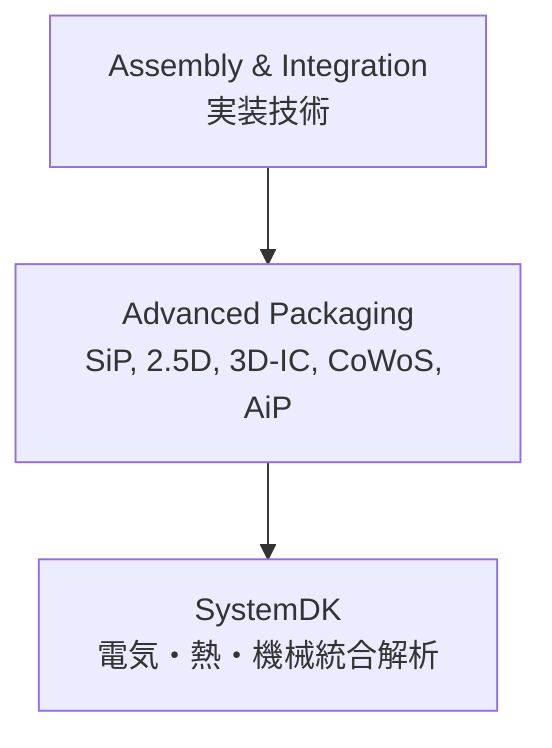

# 📦 Advanced Packaging / 先端実装技術

## 🏗 概要 / Overview
- 先端実装技術 (Advanced Packaging) は、従来のパッケージを超えて半導体を高密度かつ高性能に統合するための技術群です。  
- SiP (System-in-Package)、2.5D/3D-IC、CoWoS、Foveros、AiP などが含まれ、ムーアの法則の延長として機能拡張を可能にします。  
- **SystemDK** では電気・熱・機械の三領域での複合解析が不可欠です。  

---

## 📂 サブトピック / Subtopics
```
Advanced-Packaging/
 ├── SiP.md            ← システム・イン・パッケージ
 ├── 2.5D_3DIC.md      ← 2.5D / 3D-IC
 ├── CoWoS_Foveros.md  ← CoWoS / Foveros
 └── AiP.md            ← アンテナ・イン・パッケージ
```

---

## 🔑 キートピック / Key Topics
- **SiP (System-in-Package)**  
  - 複数チップを一つのパッケージに統合  
  - 小型化・多機能化・短配線による高性能化  
- **2.5D / 3D-IC**  
  - TSV (Through Silicon Via)、インターポーザ技術  
  - 高帯域・低消費電力のインターコネクト  
- **CoWoS / Foveros**  
  - TSMC CoWoS、Intel Foveros など先端実装プロセス  
- **AiP (Antenna-in-Package)**  
  - ミリ波/サブTHz通信向けアンテナ統合技術  

---

## 🌐 教材ポジション / Position in Assembly & Integration


---

## ✅ 学習目標 / Learning Goals
- SiP, 2.5D/3D-IC などの先端実装技術の特徴を理解する  
- TSV, インターポーザ, AiP などの具体技術を体系的に学ぶ  
- パッケージ技術がシステム全体の性能・信頼性に与える影響を理解する  
- **SystemDK** を用いたマルチドメイン解析に適用できる  
