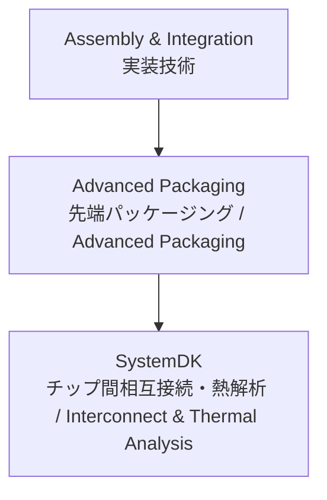

# 📦 Advanced Packaging / 先端パッケージング技術

## 🏗 概要 / Overview
先端パッケージング (Advanced Packaging) は、複数のチップやモジュールを高密度に集積し、システム性能を最大化する技術群です。  
*Advanced Packaging refers to technologies that integrate multiple chips and modules at high density to maximize system performance.*  

代表的な方式として、2.5D/3D積層、TSV (Through-Silicon Via)、Fan-Out、CoWoS、InFO などがあります。  
*Representative methods include 2.5D/3D stacking, TSV (Through-Silicon Via), Fan-Out, CoWoS, and InFO.*  

---

## 📂 サブトピック / Subtopics
```
Advanced-Packaging/
 ├── 2.5D-3D.md       ← 2.5D/3D積層 / 2.5D & 3D Stacking
 ├── TSV.md           ← 貫通シリコンビア / TSV
 ├── FanOut.md        ← Fan-Outパッケージ / Fan-Out
 ├── CoWoS.md         ← CoWoS / Chip-on-Wafer-on-Substrate
 └── InFO.md          ← InFO / Integrated Fan-Out
```

---

## 🔑 キートピック / Key Topics
2.5D/3D積層：シリコンインターポーザ、熱管理、バンプ設計。  
*2.5D/3D stacking: silicon interposers, thermal management, bump design.*  

TSV：低抵抗化、ストレス管理、歩留まり。  
*TSV: low resistance, stress management, yield challenges.*  

Fan-Out：パッケージ厚低減、再配線層 (RDL) 技術。  
*Fan-Out: package thinning, redistribution layer (RDL) technology.*  

CoWoS：HBMメモリ統合、高帯域幅、GPU/AI応用。  
*CoWoS: HBM memory integration, high bandwidth, GPU/AI applications.*  

InFO：スマートフォン向けSoC、薄型・低コスト化。  
*InFO: SoCs for smartphones, thin form factor, cost-effective integration.*  

---

## 🌐 教材ポジション / Position


---

## ✅ 学習目標 / Learning Goals
2.5D/3D, TSV, Fan-Out などの主要な先端パッケージ技術を理解する。  
*Understand key advanced packaging technologies such as 2.5D/3D, TSV, and Fan-Out.*  

設計・製造上の課題（歩留まり、熱、信号遅延）を把握する。  
*Identify design and manufacturing challenges including yield, thermal issues, and signal delay.*  

各方式の応用領域 (スマホ、GPU、AI) を整理する。  
*Organize application domains for each method (smartphones, GPUs, AI).*  

**SystemDK** による相互接続・熱シミュレーションを応用する。  
*Apply **SystemDK** interconnect and thermal simulations.*  

---

[⬆️ Back to Assembly & Integration](../)
