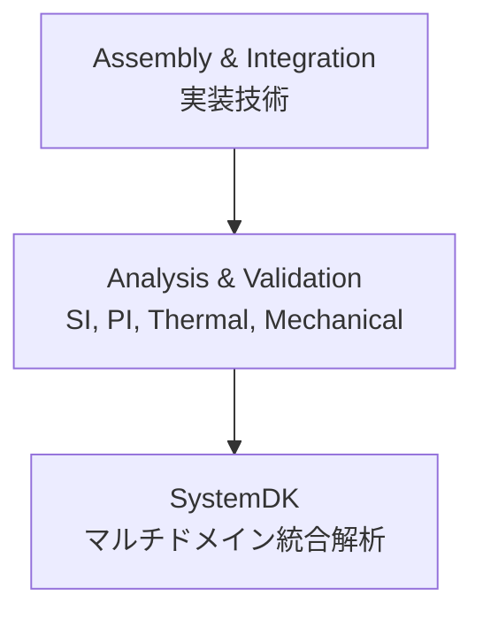

# 📊 Analysis & Validation / 解析・検証

## 🏗 概要 / Overview
- 解析・検証 (Analysis & Validation) は、実装設計の妥当性を確認し、システムの信頼性を保証するための領域です。  
- 信号品質 (SI)、電源安定性 (PI)、熱解析、機械的強度評価などを含みます。  
- **SystemDK** との連携により、実装要素を回路・熱・構造モデル化して、システムレベルで統合的に検証できます。  

---

## 📂 サブトピック / Subtopics
```
Analysis-Validation/
 ├── SI_PI.md        ← 信号・電源インテグリティ
 ├── Thermal.md      ← 熱解析・放熱設計
 ├── Mechanical.md   ← 機械強度・信頼性評価
 └── SystemDK_Link.md← SystemDK連携
```

---

## 🔑 キートピック / Key Topics
- **信号インテグリティ (SI)**  
  - 伝送線路モデル、リフレクション、クロストーク、ジッタ解析  
- **電源インテグリティ (PI)**  
  - PDN設計、デカップリング、インピーダンス解析  
- **熱解析 / Thermal**  
  - 熱伝導・対流モデル、基板・パッケージ放熱設計  
- **機械解析 / Mechanical**  
  - 振動、応力、熱膨張 (CTE) による信頼性解析  
- **SystemDK連携**  
  - 回路 (SPICE)、電磁界 (FEM)、熱 (CFD) の統合解析  

---

## 🌐 教材ポジション / Position in Assembly & Integration


---

## ✅ 学習目標 / Learning Goals
- SI/PI の基本概念を理解し、設計段階でのシミュレーションに活用できる  
- PCB・実装の熱・機械的制約を理解し、信頼性設計に反映できる  
- FEM/CFD/回路解析を組み合わせた統合的手法を学ぶ  
- **SystemDK** を通じて実装要素をシステム全体の設計検証に結びつけられる  
