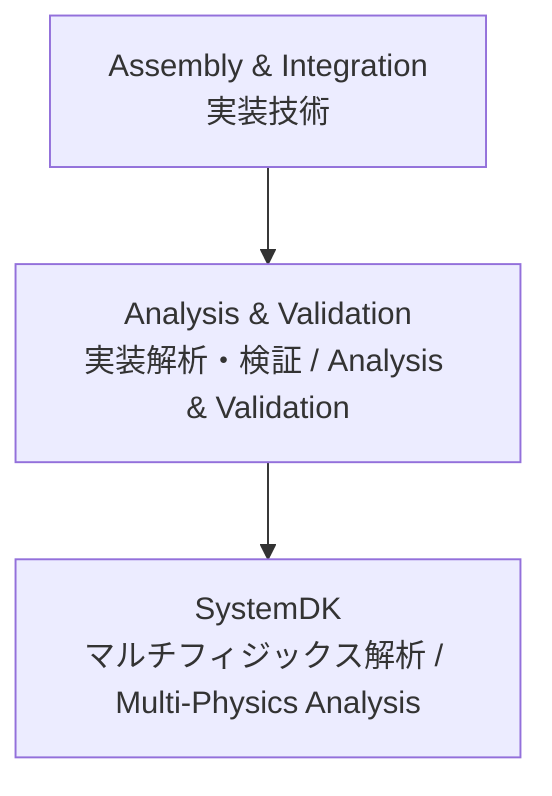

---

# 📊 Analysis & Validation / 実装解析・検証技術

## 🏗 概要 / Overview
実装解析・検証 (Analysis & Validation) は、設計された基板・パッケージ・実装方式が要求仕様を満たすかを確認するプロセスです。  
*Analysis & Validation is the process of confirming whether designed PCBs, packages, and mounting methods meet the required specifications.*  

SI (Signal Integrity)、PI (Power Integrity)、Thermal (熱)、EMC (電磁両立性) の観点で多面的な解析・検証が行われます。  
*It involves multi-domain analysis and validation from perspectives such as SI (Signal Integrity), PI (Power Integrity), Thermal, and EMC.*  

**SystemDK** 環境と連携し、設計初期段階からのフィードバックループを形成します。  
*It collaborates with the **SystemDK** environment to form a feedback loop from the early stages of design.*  

---

## 📂 サブトピック / Subtopics
```
Analysis-Validation/
 ├── SI.md        ← 信号完全性解析 / Signal Integrity
 ├── PI.md        ← 電源完全性解析 / Power Integrity
 ├── Thermal.md   ← 熱解析 / Thermal
 └── EMC.md       ← 電磁両立性解析 / EMC
```

---

## 🔑 キートピック / Key Topics
SI解析：反射・クロストーク・ジッタ解析、アイダイアグラム。  
*SI: reflection, crosstalk, jitter analysis, eye diagrams.*  

PI解析：電源ネットワークインピーダンス、デカップリング効果。  
*PI: power distribution network impedance, decoupling effects.*  

熱解析：部品発熱、熱伝導・放射、冷却設計。  
*Thermal: component heating, conduction/radiation, cooling design.*  

EMC解析：放射ノイズ、伝導ノイズ、規格準拠試験。  
*EMC: radiated and conducted noise, regulatory compliance testing.*  

---

## 🌐 教材ポジション / Position


---

## ✅ 学習目標 / Learning Goals
SI/PI/熱/EMC の各解析手法を理解し、設計に応用できる。  
*Understand SI/PI/Thermal/EMC analysis methods and apply them to design.*  

解析結果を設計改善へとフィードバックするスキルを習得する。  
*Develop skills to feed back analysis results into design improvements.*  

SystemDK との統合解析により、システムレベルの最適化を実現する。  
*Achieve system-level optimization through integrated analysis with SystemDK.*  

---

[⬆️ Back to Assembly & Integration](../)
