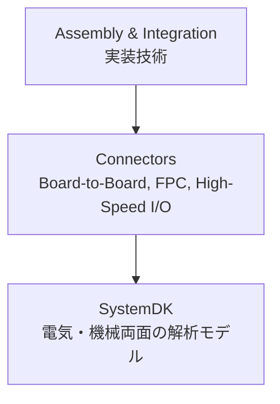

# 🔌 Connectors / コネクタ技術

## 🏗 概要 / Overview
- コネクタは、基板間・モジュール間・外部I/Oを接続するための重要な要素技術です。  
- 電源供給から高速信号伝送 (PCIe, USB, HDMI, Ethernet 等) まで幅広く利用され、信号品質や機械的信頼性に直結します。  
- **SystemDK** では、コネクタの電気特性 (インピーダンス, Sパラメータ) と機械的強度の両面を解析対象とします。  

---

## 📂 サブトピック / Subtopics
```
Connectors/
 ├── BoardToBoard.md   ← ボード間コネクタ
 ├── FPC.md            ← フレキシブル基板コネクタ
 └── HighSpeedIO.md    ← 高速I/Oコネクタ (PCIe, USB, HDMI 等)
```

---

## 🔑 キートピック / Key Topics
- **ボード間コネクタ / Board-to-Board**  
  - 多層基板間の接続、スタッキング、ピッチ制御  
  - 耐振動性・機械的信頼性  
- **フレキシブル基板コネクタ / FPC Connectors**  
  - 薄型デバイス向け、可撓性と接触信頼性  
- **高速I/Oコネクタ / High-Speed I/O**  
  - PCIe, USB, HDMI, Ethernet, DisplayPort など  
  - インピーダンス整合、リターンパス設計、EMI抑制  

---

## 🌐 教材ポジション / Position in Assembly & Integration


---

## ✅ 学習目標 / Learning Goals
- 各種コネクタの構造と特性を理解し、用途ごとに最適な選定ができる  
- 高速I/O設計における信号品質・EMIへの影響を理解する  
- PCB・パッケージ設計とのインターフェースを整理できる  
- **SystemDK** を活用し、コネクタの電気的・機械的解析をシステム設計に反映できる  
