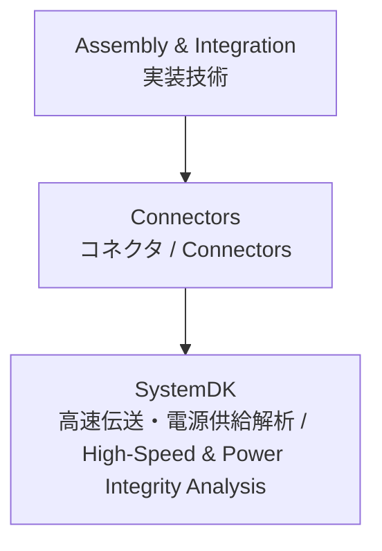

---

# 🔌 Connectors / コネクタ技術

## 🏗 概要 / Overview
コネクタは、基板と基板、基板と外部機器、モジュール間を接続する重要な要素です。  
*Connectors are critical elements that link board-to-board, board-to-device, and inter-module interfaces.*  

信号伝送の品質、電源供給の安定性、機械的信頼性を同時に確保する必要があります。  
*They must ensure signal transmission quality, stable power delivery, and mechanical reliability simultaneously.*  

高速化・小型化が進み、差動伝送対応コネクタ、FPC/FFC、同軸、光モジュールなど多様な形態が存在します。  
*With miniaturization and higher speeds, various forms exist, including differential connectors, FPC/FFC, coaxial, and optical modules.*  

---

## 📂 サブトピック / Subtopics
```
Connectors/
 ├── BoardToBoard.md    ← 基板対基板コネクタ / Board-to-Board
 ├── WireToBoard.md     ← ワイヤ対基板コネクタ / Wire-to-Board
 ├── HighSpeed.md       ← 高速信号用コネクタ / High-Speed
 └── PowerConnectors.md ← 電源用コネクタ / Power
```

---

## 🔑 キートピック / Key Topics
基板対基板コネクタ：スタッキング構造、ピッチ、SI/PI設計との関係。  
*Board-to-Board connectors: stacking structure, pitch, relation to SI/PI design.*  

ワイヤ対基板コネクタ：嵌合信頼性、電流容量、ロック機構。  
*Wire-to-Board connectors: mating reliability, current capacity, locking mechanisms.*  

高速コネクタ：差動伝送、インピーダンス制御、アイパターン劣化の最小化。  
*High-speed connectors: differential signaling, impedance control, minimizing eye diagram degradation.*  

電源コネクタ：高電流対応、低接触抵抗、熱設計との連携。  
*Power connectors: high current support, low contact resistance, integration with thermal design.*  

---

## 🌐 教材ポジション / Position


---

## ✅ 学習目標 / Learning Goals
主要なコネクタ種別の特徴を理解し、設計要件に応じて適切に選定できる。  
*Understand the characteristics of major connector types and select them according to design requirements.*  

信号品質 (SI)・電源品質 (PI) を保証するための設計手法を習得する。  
*Learn design methodologies to ensure Signal Integrity (SI) and Power Integrity (PI).*  

コネクタの機械的信頼性と電気的特性を両立させる設計を実現する。  
*Achieve designs that balance mechanical reliability with electrical performance.*  

**SystemDK** による高速伝送・電源解析を通じ、システム全体の最適化に活用する。  
*Utilize **SystemDK** high-speed and power analysis for system-level optimization.*  

---

[⬆️ Back to Assembly & Integration](../)
