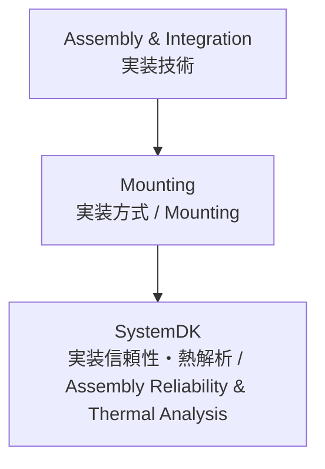

---

# 🛠 Mounting / 実装方式技術

## 🏗 概要 / Overview
実装方式 (Mounting) は、電子部品を基板へ搭載し、電気的・機械的に接続するためのプロセスです。  
*Mounting refers to the processes of attaching electronic components to PCBs, ensuring both electrical and mechanical connections.*  

代表的な方式には SMT (Surface Mount Technology)、CSP (Chip Scale Package)、BGA (Ball Grid Array) などがあり、実装密度・放熱・信頼性の観点で最適化が求められます。  
*Representative methods include SMT (Surface Mount Technology), CSP (Chip Scale Package), and BGA (Ball Grid Array), requiring optimization for density, thermal management, and reliability.*  

---

## 📂 サブトピック / Subtopics
```
Mounting/
 ├── SMT.md       ← 表面実装技術 / SMT
 ├── CSP.md       ← チップスケールパッケージ / CSP
 ├── BGA.md       ← ボールグリッドアレイ / BGA
 └── Advanced.md  ← 先端実装方式 / Advanced Mounting
```

---

## 🔑 キートピック / Key Topics
表面実装 (SMT)：リフローはんだ付け、クリームはんだ印刷、実装機の精度管理。  
*SMT: reflow soldering, solder paste printing, placement machine accuracy control.*  

CSP実装：小型・高密度化、ワイヤボンド vs フリップチップ、実装歩留まり。  
*CSP: miniaturization, wire bonding vs. flip-chip, assembly yield.*  

BGA実装：はんだボール配列設計、熱膨張差によるストレス、X線検査。  
*BGA: solder ball array design, stress due to CTE mismatch, X-ray inspection.*  

先端実装方式：PoP (Package on Package)、SiP (System in Package)、3D実装。  
*Advanced methods: PoP (Package on Package), SiP (System in Package), 3D integration.*  

---

## 🌐 教材ポジション / Position


---

## ✅ 学習目標 / Learning Goals
SMT, CSP, BGA の各実装方式の特徴を理解し、設計や製造条件に応じて適切に選定できる。  
*Understand the characteristics of SMT, CSP, and BGA, and select appropriately according to design and manufacturing conditions.*  

実装方式が信号品質・放熱・信頼性に与える影響を理解する。  
*Understand the impact of mounting methods on signal quality, thermal management, and reliability.*  

先端実装技術 (PoP, SiP, 3D) を通じてシステム集積度を高める方法を習得する。  
*Learn methods to enhance system integration through advanced mounting technologies (PoP, SiP, 3D).*  

**SystemDK** 解析により、実装信頼性・熱影響をモデル化・検証できる。  
*Model and validate assembly reliability and thermal effects through **SystemDK** analysis.*  

---

[⬆️ Back to Assembly & Integration](../)
