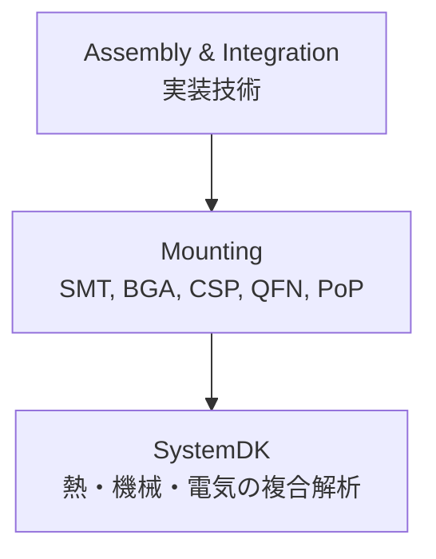

# 🏗 Mounting / 実装方式

## 🏗 概要 / Overview
- 実装方式 (Mounting) は、半導体デバイスや受動部品を基板上に固定し、電気的・機械的に接続する技術領域です。  
- 代表的な方式には SMT (表面実装技術)、BGA、CSP、QFN、PoP などがあり、用途や実装密度に応じて選択されます。  
- リフローはんだ付け、フリップチップ実装などの工法も含まれ、**SystemDK** では熱・機械・電気の複合解析が重要となります。  

---

## 📂 サブトピック / Subtopics
```
Mounting/
 ├── SMT.md              ← 表面実装技術
 ├── BGA_CSP.md          ← BGA・CSP実装
 ├── QFN_PoP.md          ← QFN・PoP実装
 └── Reflow_Soldering.md ← リフローはんだ付け
```

---

## 🔑 キートピック / Key Topics
- **表面実装技術 / SMT (Surface Mount Technology)**  
  - チップ部品の高密度実装、リフロー工法  
- **BGA / CSP 実装**  
  - 高ピン数対応、インピーダンス制御、放熱性  
- **QFN / PoP 実装**  
  - 小型パッケージ、PoPによる多層積層構造  
- **リフローはんだ付け / Reflow Soldering**  
  - はんだペースト、プロファイル制御、接合信頼性  

---

## 🌐 教材ポジション / Position in Assembly & Integration


---

## ✅ 学習目標 / Learning Goals
- 各種実装方式の特徴と適用分野を理解する  
- SMT・BGA・CSP などの実装工程を体系的に学ぶ  
- 熱・機械的な信頼性評価を設計段階で考慮できる  
- **SystemDK** を用いて実装方式がシステム全体に与える影響を解析できる  
