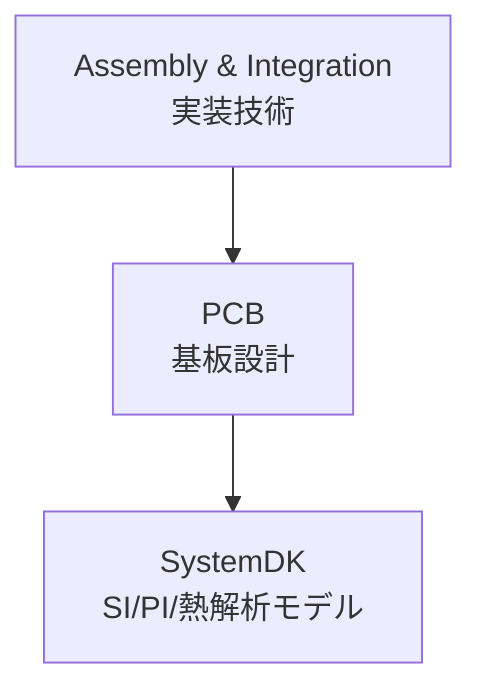

# 🧩 PCB / プリント基板技術

## 🏗 概要 / Overview
- プリント基板 (PCB) は、半導体素子・受動部品・コネクタを相互接続し、システムを構成する基盤技術です。  
- 材料選定、層構成、配線設計、電源分配 (PDN)、信号整合 (SI)、放熱・EMI 対策など多岐にわたります。  
- PCB設計は **SystemDK** との連携により、電気・熱・機械の複合解析が求められる分野です。  

---

## 📂 サブトピック / Subtopics
```
PCB/
 ├── Materials.md     ← 基板材料 (FR-4, BT, LCP, セラミック)
 ├── Design.md        ← 配線設計・インピーダンス制御・SI/PI
 ├── Thermal.md       ← 放熱・熱解析
 └── EMC.md           ← ノイズ・電磁両立性設計
```

---

## 🔑 キートピック / Key Topics
- **基板材料 / Materials**
  - FR-4、BTレジン、LCP、セラミックなど
  - 誘電率 (εr)、損失正接 (tanδ)、熱伝導率  
- **設計手法 / Design**
  - インピーダンス制御、差動ペア、クロストーク対策
  - 電源分配ネットワーク (PDN) 設計  
- **放熱設計 / Thermal**
  - ビア・銅プレーン・サーマルパッドによる熱拡散
  - ヒートシンクや筐体との連携  
- **EMI/EMC対策 / EMI & EMC**
  - グラウンド設計、シールド、フィルタリング  

---

## 🌐 教材ポジション / Position in Assembly & Integration


---

## ✅ 学習目標 / Learning Goals
- PCB材料の物理特性を理解し、設計選定に活用できる  
- 配線設計と電源設計の基礎を体系的に習得する  
- 熱設計・EMC設計を通じてシステム信頼性を確保する  
- **SystemDK解析**により、システムレベルでの最適化に応用できる  
