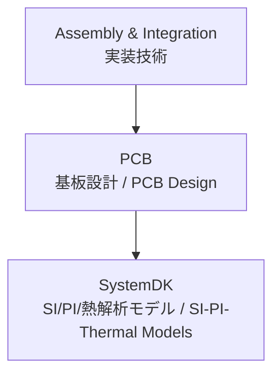

# 🧩 PCB / プリント基板技術

## 🏗 概要 / Overview
- **JP:** プリント基板 (PCB) は、半導体素子・受動部品・コネクタを相互接続し、システムを構成する基盤技術です。  
- **EN:** Printed Circuit Board (PCB) is the foundation technology that interconnects semiconductors, passive components, and connectors to form a system.  

---

## 📂 サブトピック / Subtopics
```
PCB/
 ├── Materials.md     ← 基板材料 / Materials
 ├── Design.md        ← 配線設計・インピーダンス制御 / Design & SI/PI
 ├── Thermal.md       ← 放熱・熱解析 / Thermal Design
 └── EMC.md           ← ノイズ・電磁両立性設計 / EMC
```

---

## 🔑 キートピック / Key Topics
- **JP:** 基板材料（FR-4、BT、LCP、セラミック）、誘電率や損失正接の制御。  
- **EN:** PCB materials (FR-4, BT, LCP, ceramics), control of dielectric constant (εr) and loss tangent (tanδ).  

- **JP:** 配線設計（差動ペア、クロストーク、PDN設計）。  
- **EN:** Layout design (differential pairs, crosstalk, PDN design).  

- **JP:** 放熱設計（ビア、銅プレーン、ヒートシンク連携）。  
- **EN:** Thermal design (vias, copper planes, heatsinks).  

- **JP:** EMC対策（グラウンド設計、シールド）。  
- **EN:** EMC countermeasures (ground design, shielding).  

---

## 🌐 教材ポジション / Position


---

## ✅ 学習目標 / Learning Goals
- **JP:** PCB材料の特性を理解し、設計選定に活用できる  
- **EN:** Understand PCB material properties and apply them in design selection  

- **JP:** 配線設計・電源設計の基礎を体系的に習得する  
- **EN:** Acquire systematic knowledge of routing and PDN design fundamentals  

- **JP:** 熱設計・EMC設計を通じてシステム信頼性を確保する  
- **EN:** Ensure system reliability through thermal and EMC design  

- **JP:** SystemDK解析を通じてシステム全体の最適化に応用する  
- **EN:** Apply SystemDK analysis to optimize system-level performance  
