---

# 🧩 PCB / プリント基板技術

## 🏗 概要 / Overview
プリント基板 (PCB) は、半導体素子・受動部品・コネクタを相互接続し、システムを構成する基盤技術です。  
*Printed Circuit Board (PCB) is the foundation technology that interconnects semiconductors, passive components, and connectors to form a system.*  

---

## 📂 サブトピック / Subtopics
```
PCB/
 ├── Materials.md     ← 基板材料 / Materials
 ├── Design.md        ← 配線設計・インピーダンス制御 / Design & SI/PI
 ├── Thermal.md       ← 放熱・熱解析 / Thermal Design
 └── EMC.md           ← ノイズ・電磁両立性設計 / EMC
```

---

## 🔑 キートピック / Key Topics
基板材料（FR-4、BT、LCP、セラミック）、誘電率や損失正接の制御。  
*PCB materials (FR-4, BT, LCP, ceramics), control of dielectric constant (εr) and loss tangent (tanδ).*  

配線設計（差動ペア、クロストーク、PDN設計）。  
*Layout design (differential pairs, crosstalk, PDN design).*  

放熱設計（ビア、銅プレーン、ヒートシンク連携）。  
*Thermal design (vias, copper planes, heatsinks).*  

EMC対策（グラウンド設計、シールド）。  
*EMC countermeasures (ground design, shielding).*  

---

## 🌐 教材ポジション / Position

```mermaid
graph TD
  A[Assembly & Integration<br/>実装技術] --> B[PCB<br/>基板設計 / PCB Design]
  B --> C[SystemDK<br/>SI/PI/熱解析モデル / SI-PI-Thermal Models]
```


---

## ✅ 学習目標 / Learning Goals
PCB材料の特性を理解し、設計選定に活用できる。  
*Understand PCB material properties and apply them in design selection.*  

配線設計・電源設計の基礎を体系的に習得する。  
*Acquire systematic knowledge of routing and PDN design fundamentals.*  

熱設計・EMC設計を通じてシステム信頼性を確保する。  
*Ensure system reliability through thermal and EMC design.*  

SystemDK解析を通じてシステム全体の最適化に応用する。  
*Apply SystemDK analysis to optimize system-level performance.*  
