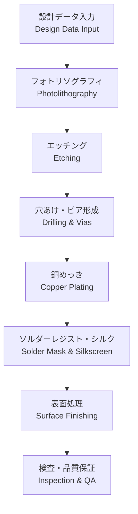

---

# 🏭 PCB Fabrication / 製造プロセス

---

## 🏗 概要 / Overview

PCBの製造プロセスは、設計データを基に基板を物理的に形成する工程です。  
*The PCB fabrication process is the sequence of steps to physically create the board from design data.*  

フォトリソグラフィ、エッチング、メッキ、穴あけ、ソルダーレジスト、表面処理などの工程が含まれます。  
*It includes processes such as photolithography, etching, plating, drilling, solder resist, and surface finishing.*  

---

## 🔑 キートピック / Key Topics

- **フォトリソグラフィとエッチング**  
  *Photolithography and etching*  
- **スルーホールおよびビア形成**  
  *Through-hole and via formation*  
- **銅めっきと配線形成**  
  *Copper plating and trace formation*  
- **ソルダーレジスト塗布とシルク印刷**  
  *Solder mask coating and silkscreen printing*  
- **表面処理（HASL, ENIG, OSP など）**  
  *Surface finishes (HASL, ENIG, OSP, etc.)*  
- **製造歩留まりと品質管理**  
  *Yield and quality control in fabrication*  

---

## ⚙️ 製造フロー / Fabrication Flow

---

## ✅ 学習目標 / Learning Goals

- PCB製造における主要工程を理解する。  
  *Understand the main steps of PCB fabrication.*  
- 表面処理や材料選定が信頼性に与える影響を把握する。  
  *Recognize how surface finishes and material choices affect reliability.*  
- 製造歩留まり改善のための設計配慮を理解する。  
  *Understand design considerations to improve manufacturing yield.*  

---

## 🔗 関連リンク / Related Links

- [📖 Materials](./materials.md)  
- [📖 Via Design](./via-design.md)  
- [📖 Assembly](./assembly.md)  

---

## ⬆️ Back to PCB

  

