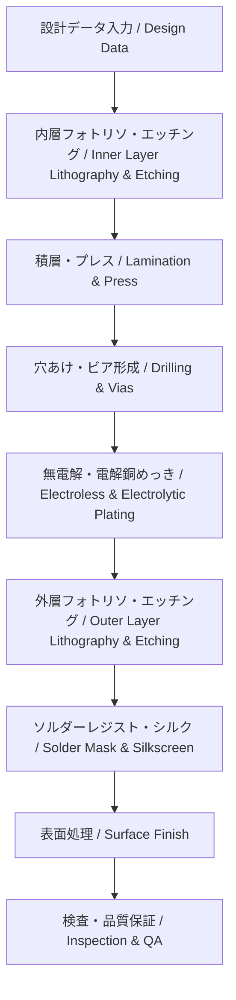

---

# 🏭 PCB Fabrication / 製造プロセス

---

## 🔗 リンク / Links

| Link | Badge |
|---|---|
| 🌐 View Site |  |
| 📂 View Repo |  |

---

## 📑 目次 / Table of Contents
- [🏗 概要 / Overview](#-概要--overview)  
- [🎯 設計ゴール / Design-Targets](#-設計ゴール--design-targets)  
- [🔑 キートピック / Key-Topics](#-キートピック--key-topics)  
- [⚙️ 製造フロー / Fabrication-Flow](#️-製造フロー--fabrication-flow)  
- [🧱 工程詳細 / Process-Details](#-工程詳細--process-details)  
- [🧮 公差と設計考慮 / Tolerances--DFM-Considerations](#-公差と設計考慮--tolerances--dfm-considerations)  
- [🔧 表面処理の比較 / Surface-Finishes](#-表面処理の比較--surface-finishes)  
- [✅ チェックリスト / Checklist](#-チェックリスト--checklist)  
- [🧭 ドキュメント雛形 / Handoff-Template](#-ドキュメント雛形--handoff-template)  
- [🔗 関連リンク / Related-Links](#-関連リンク--related-links)  
- [⬆️ Back to PCB](#️-back-to-pcb)  

---

## 🏗 概要 / Overview
PCB製造は **データ入力から完成基板出荷までの一連の物理プロセス** であり、**層構成、材料、表面処理**の選択が信頼性と歩留まりに直結します。  
*PCB fabrication is the complete sequence from design data to finished boards, where stack-up, materials, and finishes directly impact reliability and yield.*

---

## 🎯 設計ゴール / Design Targets
- 高歩留まりかつ低コストで製造可能な設計  
- 公差を考慮した寸法指定（線幅、銅厚、穴径）  
- 製造業者の標準プロセスに適合する設計  

---

## 🔑 キートピック / Key Topics
- **内層形成 (Inner Layer)**: フォトリソ + エッチング  
- **積層・プレス (Lamination)**: コアとプリプレグを圧着  
- **穴あけ (Drilling)**: メカ穴・レーザービア形成  
- **銅めっき (Plating)**: 穴壁メタライゼーション  
- **ソルダーレジスト (Solder Mask)**: 絶縁保護  
- **表面処理 (Finishes)**: HASL, ENIG, OSP, ImmAg, ImmSn  
- **検査・品質保証 (QA)**: 電気検査、X線、外観  

---

## ⚙️ 製造フロー / Fabrication Flow

---

## 🧱 工程詳細 / Process Details
- **フォトリソグラフィ**: 配線パターン形成  
- **エッチング**: 不要銅を化学除去  
- **積層**: 内層 + プリプレグ固化  
- **穴あけ**: メカ穴（0.2–0.3 mm）、レーザービア（0.1 mm以下）  
- **銅めっき**: 無電解 → 電解プロセス  
- **ソルダーレジスト**: 絶縁保護膜  
- **シルク印刷**: マークや文字印字  
- **表面処理**: 酸化防止・実装性改善  

---

## 🧮 公差と設計考慮 / Tolerances & DFM Considerations
- **線幅/間隔**: ±10〜15%  
- **穴径**: メカ穴 ±0.05 mm、レーザー ±0.025 mm  
- **銅厚**: ±10–15%  
- **位置合わせ (Registration)**: ±50 µm  

---

## 🔧 表面処理の比較 / Surface Finishes

| 表面処理 / Finish | 特徴 / Features | 適用 / Applications |
|--------------------|-----------------|----------------------|
| **HASL** | 低コスト、厚み不均一 | 一般品 |
| **ENIG** | 平坦、BGA適合、高信頼性 | 高密度基板 |
| **OSP** | 低コスト、寿命短い | 量産品 |
| **ImmAg** | 高周波特性良好 | RF基板 |
| **ImmSn** | 平坦、リフロー性良 | 一般多層 |

---

## ✅ チェックリスト / Checklist
- [ ] 線幅/間隔・穴径はファブ仕様範囲内か？  
- [ ] 材料と積層は標準プロセスか？  
- [ ] 表面処理は用途（BGA, RF, 低コスト）に適合？  
- [ ] 歩留まりを考慮した設計か？  
- [ ] IPC-6012/6013 に準拠？  

---

## 🧭 ドキュメント雛形 / Handoff Template
| 項目 / Item | 指定 / Spec |
|---|---|
| 線幅/間隔 | 4/4 mil |
| 穴径 / Min Drill | 0.20 mm (Mech), 0.10 mm (Laser) |
| 材料 | FR-4 Tg170 |
| 銅厚 | 外層 1 oz, 内層 0.5 oz |
| 表面処理 | ENIG |
| ソルダーレジスト | Green, LPI |
| シルク | White |
| 検査 | 100% AOI + 電気検査 |

---

## 🔗 関連リンク / Related Links

| 項目 / Item | 説明 / Description | Links |
|-------------|-------------------|-------|
| 📖 Materials | 基板材料と特性 *PCB materials and properties* |   |
| 📖 Via Design | ビア構造と加工技術 *Via structures & processing* |   |
| 📖 Assembly | 実装プロセスと実装技術 *Assembly processes & techniques* |   |

---

## ⬆️ Back to PCB

| Link | Badge |
|---|---|
| 🌐 Back to Site |  |
| 📂 Back to Repo |  |
