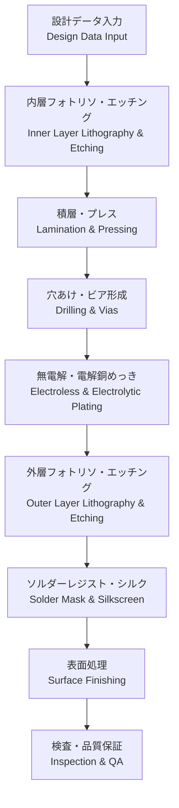

---

# 🏭 PCB Fabrication / 製造プロセス

---

## 📑 目次 / Table of Contents
- [🏗 概要 / Overview](#-概要--overview)  
- [🎯 設計ゴール / Design Targets](#-設計ゴール--design-targets)  
- [🔑 キートピック / Key Topics](#-キートピック--key-topics)  
- [⚙️ 製造フロー / Fabrication Flow](#️-製造フロー--fabrication-flow)  
- [🧱 工程詳細 / Process Details](#-工程詳細--process-details)  
- [🧮 公差と設計考慮 / Tolerances & DFM Considerations](#-公差と設計考慮--tolerances--dfm-considerations)  
- [🔧 表面処理の比較 / Surface Finishes](#-表面処理の比較--surface-finishes)  
- [✅ チェックリスト / Checklist](#-チェックリスト--checklist)  
- [🧭 ドキュメント雛形 / Handoff Template](#-ドキュメント雛形--handoff-template)  
- [🔗 関連リンク / Related Links](#-関連リンク--related-links)  
- [⬆️ Back to PCB](#️-back-to-pcb)  

---

## 🏗 概要 / Overview
PCB製造は **データ入力から完成基板出荷までの一連の物理プロセス** であり、**層構成、材料、表面処理**の選択が信頼性と歩留まりに直結します。  
*PCB fabrication is the complete sequence from design data to finished boards, where stack-up, materials, and finishes directly impact reliability and yield.*

---

## 🎯 設計ゴール / Design Targets
- 高歩留まりかつ低コストで製造可能な設計  
  *Design for manufacturability and cost-efficiency*  
- 公差を考慮した寸法指定（線幅、銅厚、穴径）  
  *Dimensions specified with tolerances (trace width, copper thickness, hole size)*  
- 製造業者の標準プロセスに適合する設計  
  *Match fab house’s standard capabilities*  

---

## 🔑 キートピック / Key Topics
- **内層形成 (Inner Layer)**: フォトリソ + エッチング  
- **積層・プレス (Lamination)**: コアとプリプレグを高温高圧で圧着  
- **穴あけ (Drilling)**: メカ穴・レーザービア形成  
- **無電解/電解銅めっき (Plating)**: 穴壁メタライゼーション  
- **ソルダーレジスト (Solder Mask)**: 絶縁保護・ブリッジ防止  
- **表面処理 (Finishes)**: HASL, ENIG, OSP, ImmAg, ImmSn  
- **検査・品質保証 (QA)**: 電気検査、X線、外観  

---

## ⚙️ 製造フロー / Fabrication Flow

---

## 🧱 工程詳細 / Process Details
- **フォトリソグラフィ**: 感光フィルムで配線パターンを形成  
- **エッチング**: 不要銅を化学除去し導体パターンを形成  
- **積層**: 内層 + プリプレグをプレスで固化  
- **穴あけ**: メカ穴（φ0.2–0.3 mm）、レーザービア（φ0.1 mm以下）  
- **銅めっき**: 無電解 → 電解でスルーホール壁を導電化  
- **ソルダーレジスト**: グリーンなど、露出銅を保護  
- **シルク印刷**: 文字・マークを印字  
- **表面処理**: はんだ付け性・酸化防止のための最終処理  

---

## 🧮 公差と設計考慮 / Tolerances & DFM Considerations
- **線幅/間隔**: ±10〜15%（例: 4 mil設計 → 製造で3.6–4.4 mil）  
- **穴径**: メカ穴 ±0.05 mm、レーザー ±0.025 mm  
- **銅厚**: 内層/外層の公差 ±10–15%  
- **位置合わせ (Registration)**: ±50 µm 程度  

---

## 🔧 表面処理の比較 / Surface Finishes

| 表面処理 / Finish | 特徴 / Features | 適用 / Applications |
|--------------------|-----------------|----------------------|
| **HASL** (Hot Air Solder Leveling) | 低コスト、厚さ不均一 | 一般品 |
| **ENIG** (Electroless Ni/Immersion Au) | 平坦、BGA適合、高信頼性 | 高密度基板、サーバ |
| **OSP** (Organic Solderability Preservative) | 低コスト、短寿命 | 一般品、量産品 |
| **ImmAg** (Immersion Silver) | 低コスト、高周波特性良 | RF基板 |
| **ImmSn** (Immersion Tin) | 平坦、リフロー性良 | 一般多層基板 |

---

## ✅ チェックリスト / Checklist
- [ ] 線幅/間隔・穴径はファブ仕様範囲内か？  
- [ ] 材料と積層はメーカー標準を活用しているか？  
- [ ] 表面処理は用途（BGA, RF, 低コスト）に合致しているか？  
- [ ] 製造歩留まりを考慮した設計か？  
- [ ] IPC規格（IPC-6012/6013）準拠を確認したか？  

---

## 🧭 ドキュメント雛形 / Handoff Template
| 項目 / Item | 指定 / Spec |
|---|---|
| 線幅/間隔 / Min W/S | 4/4 mil |
| 穴径 / Min Drill | 0.20 mm メカ穴, 0.10 mm レーザービア |
| 材料 / Material | FR-4 Tg170 |
| 銅厚 / Copper Thickness | 外層 1 oz, 内層 0.5 oz |
| 表面処理 / Finish | ENIG |
| ソルダーレジスト / Solder Mask | Green, LPI |
| シルク / Silkscreen | White |
| 検査 / Inspection | 100% AOI + 電気検査 |

---

## 🔗 関連リンク / Related Links
- [📖 Materials](./materials.md)  
- [📖 Via Design](./via-design.md)  
- [📖 Assembly](./assembly.md)  

---

## ⬆️ Back to PCB
  

