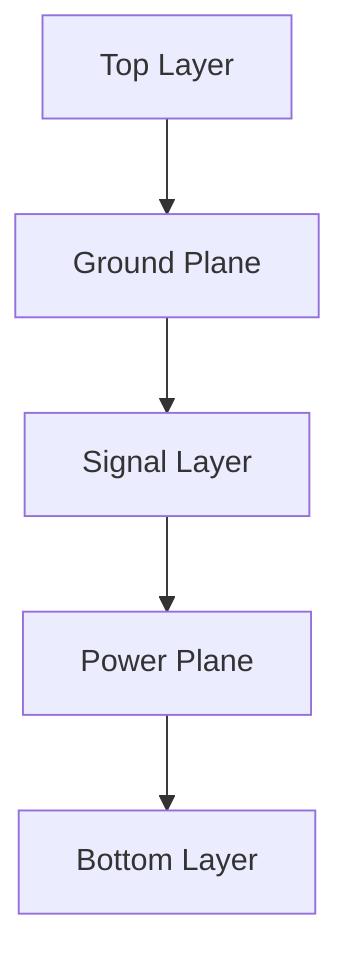

# 📐 PCB - Stack-up / 層構成  

---

## 📖 概要 / Overview
PCBの層構成は、信号品質・電源分配・熱設計に大きな影響を与えます。  
*Stack-up design strongly affects signal integrity, power distribution, and thermal design.*  

---

## 🔑 キートピック / Key Topics
- 層構成の基本 (Signal, Power, Ground)  
- 高速信号用の層分離  
- 電源/グラウンドプレーンの最適化  
- 熱拡散設計  

---

## 📊 図解 / Diagram

---

## ⬆️ Back to PCB
| Link | Badge |
|---|---|
| 🌐 Back to PCB Site |  |
| 📂 Back to PCB Repo |  |
