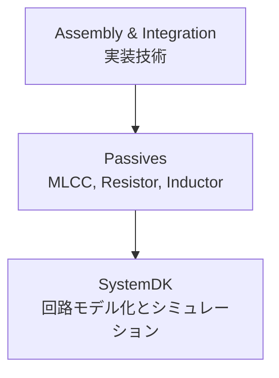

# 🎛 Passives / 受動部品技術

## 🏗 概要 / Overview
- 受動部品 (Passives) は、半導体システムを安定に動作させるために不可欠な要素です。  
- MLCC、チップ抵抗、インダクタ、フィルタなどが含まれ、電源安定化、信号調整、ノイズ低減に大きく貢献します。  
- PCB設計と密接に関わり、**SystemDK** では電気的モデル化 (SPICE, Sパラメータ) による検証が行われます。  

---

## 📂 サブトピック / Subtopics
```
Passives/
 ├── MLCC.md        ← 積層セラミックコンデンサ
 ├── Resistors.md   ← チップ抵抗
 ├── Inductors.md   ← インダクタ・コイル
 └── Filters.md     ← フィルタ・ノイズ対策部品
```

---

## 🔑 キートピック / Key Topics
- **MLCC (Multi-Layer Ceramic Capacitor)**  
  - 誘電体材料 (BaTiO₃ 系)、容量レンジ、ESR/ESL特性  
  - 電源バイパス、デカップリング用途  
- **チップ抵抗 / Chip Resistors**  
  - 厚膜・薄膜抵抗、精度グレード (1%, 0.1%)  
  - 電流検出用・高電力対応品  
- **インダクタ / Inductors**  
  - 電源回路用チョーク、RF用途インダクタ  
  - コア材 (フェライト、メタル系) と周波数特性  
- **フィルタ / Filters**  
  - EMI/EMC対策、LCフィルタ、共振抑制設計  

---

## 🌐 教材ポジション / Position in Assembly & Integration


---

## ✅ 学習目標 / Learning Goals
- MLCC・抵抗・インダクタの特性を理解し、用途に応じた適切な選定ができる  
- 受動部品の実装がシステムの安定性 (SI/PI, EMC) に与える影響を理解する  
- PCB設計と連携し、部品配置やバイパス設計を最適化できる  
- **SystemDK** の解析を通じて、回路モデル化・システム検証に応用できる  
