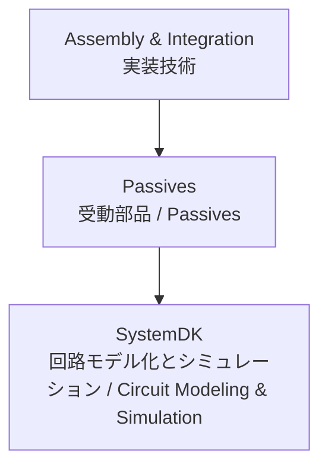

---

# 🎛 Passives / 受動部品技術

## 🏗 概要 / Overview
受動部品 (Passives) は、半導体システムを安定に動作させるために不可欠な要素です。  
*Passive components are essential elements for stabilizing the operation of semiconductor systems.*  

MLCC、チップ抵抗、インダクタ、フィルタなどが含まれ、電源安定化、信号調整、ノイズ低減に大きく貢献します。  
*They include MLCCs, chip resistors, inductors, and filters, contributing significantly to power stabilization, signal conditioning, and noise reduction.*  

PCB設計と密接に関わり、**SystemDK** では電気的モデル化 (SPICE, Sパラメータ) による検証が行われます。  
*Closely related to PCB design, in **SystemDK** they are validated through electrical modeling (SPICE, S-parameters).*  

---

## 📂 サブトピック / Subtopics
```
Passives/
 ├── MLCC.md        ← 積層セラミックコンデンサ / MLCC
 ├── Resistors.md   ← チップ抵抗 / Chip Resistors
 ├── Inductors.md   ← インダクタ・コイル / Inductors
 └── Filters.md     ← フィルタ・ノイズ対策部品 / Filters
```

---

## 🔑 キートピック / Key Topics
MLCC（積層セラミックコンデンサ）：誘電体材料 (BaTiO₃ 系)、容量レンジ、ESR/ESL特性。  
*MLCC (Multi-Layer Ceramic Capacitor): dielectric materials (BaTiO₃-based), capacitance range, ESR/ESL characteristics.*  

チップ抵抗：厚膜・薄膜抵抗、精度グレード (1%, 0.1%)、電流検出用・高電力対応品。  
*Chip resistors: thick film and thin film types, accuracy grades (1%, 0.1%), current sensing and high power versions.*  

インダクタ：電源回路用チョーク、RF用途インダクタ、コア材 (フェライト、メタル系)。  
*Inductors: power choke inductors, RF inductors, core materials (ferrite, metal-based).*  

フィルタ：EMI/EMC対策、LCフィルタ、共振抑制設計。  
*Filters: EMI/EMC suppression, LC filters, resonance suppression design.*  

---

## 🌐 教材ポジション / Position


---

## ✅ 学習目標 / Learning Goals
MLCC・抵抗・インダクタの特性を理解し、用途に応じた適切な選定ができる。  
*Understand the characteristics of MLCCs, resistors, and inductors, and select them appropriately for the application.*  

受動部品の実装がシステムの安定性 (SI/PI, EMC) に与える影響を理解する。  
*Understand the impact of passive component implementation on system stability (SI/PI, EMC).*  

PCB設計と連携し、部品配置やバイパス設計を最適化できる。  
*Collaborate with PCB design to optimize component placement and bypass design.*  

**SystemDK** の解析を通じて、回路モデル化・システム検証に応用できる。  
*Apply circuit modeling and system validation through **SystemDK** analysis.*  

---

[⬆️ Back to Assembly & Integration](../)
