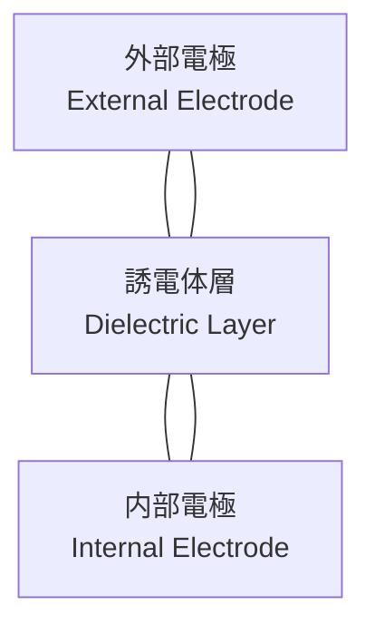

---

# 🔋 MLCC / 積層セラミックコンデンサ
*Multi-Layer Ceramic Capacitors*

---

## 🔗 リンク / Links

| 項目 / Item | 説明 / Description | Links |
|-------------|-------------------|-------|
| 🌐 View Site | ページ表示 / *View this page on site* |  |
| 📂 View Repo | GitHubリポジトリ / *View source on GitHub* |  |

---

## 📑 目次 / Table of Contents
1. [概要 / Overview](#-概要--overview)  
2. [構造イメージ / Structure Image](#-構造イメージ--structure-image)  
3. [特性と課題 / Characteristics & Issues](#-特性と課題--characteristics--issues)  
4. [デカップリング設計 / Decoupling Design](#-デカップリング設計--decoupling-design)  
5. [直流バイアス特性 / DC Bias Effects](#-直流バイアス特性--dc-bias-effects)  
6. [等価回路モデル / Equivalent Circuit Model](#-等価回路モデル--equivalent-circuit-model)  
7. [実装・レイアウト考慮 / Layout Considerations](#-実装レイアウト考慮--layout-considerations)  
8. [信頼性と試験 / Reliability & Testing](#-信頼性と試験--reliability--testing)  
9. [国際規格 / Standards](#-国際規格--standards)  
10. [チェックリスト / Checklist](#-チェックリスト--checklist)  
11. [関連リンク / Related Links](#-関連リンク--related-links)  
12. [⬆️ Back to Passives](#️-back-to-passives)  

---

## 🏗 概要 / Overview
MLCC（Multi-Layer Ceramic Capacitor, 積層セラミックコンデンサ）は、**電源デカップリング・フィルタ・高周波回路**で最も多用される受動部品です。  
*MLCCs are the most widely used passive components for decoupling, filtering, and RF circuits.*  

- サイズ範囲：0201 (0.6×0.3 mm) ～ 1210 (3.2×2.5 mm)  
- 誘電体クラス：高誘電率系（X5R/X7R） vs 安定系（C0G/NPO）  
- DCバイアス・温度特性により容量は実効値が大きく変動  

---

## 🧱 構造イメージ / Structure Image
MLCCはセラミック誘電体と内部電極を交互に積層して構成されます。  

---

## 📊 特性と課題 / Characteristics & Issues

| 分類 | 温度係数 / Temp Coefficient | 特徴 / Characteristics | 課題 / Issues |
|------|-----------------------------|-------------------------|----------------|
| **C0G / NP0** | ±30 ppm/°C | 高安定・低損失・RF用途 | 容量小（pF〜nF） |
| **X7R** | ±15% (-55〜125°C) | 広く使用、容量密度大 | DCバイアスで容量劣化 |
| **X5R** | ±15% (-55〜85°C) | 小型化に適す | 温度範囲狭い |
| **Y5V** | -82〜+22% | 超大容量MLCC | 温度/電圧安定性悪い |

---

## ⚡ デカップリング設計 / Decoupling Design
複数容量の並列配置で広帯域ノイズ除去を実現します。  

- **低周波域** → 大容量（10–100 µF）  
- **中周波域** → 中容量（1–4.7 µF）  
- **高周波域** → 小容量（0.01–0.1 µF, C0G系推奨）  

---

## 📉 直流バイアス特性 / DC Bias Effects
- 公称 10 µF (X5R, 6.3 V) → Vdd=3.3 V で実効 3–4 µF  
- 高電圧定格品を選ぶことで劣化を緩和可能  
- メーカー提供の **Capacitance vs DC Bias 曲線**参照必須  

---

## 🔌 等価回路モデル / Equivalent Circuit Model
MLCCは**理想キャパシタ**ではなく、ESR・ESLを含むRLCモデルで表現されます。  

$$
Z(f) \approx \sqrt{(ESR)^2 + \left(2\pi f L - \frac{1}{2\pi f C}\right)^2 }
$$

- **ESR**: 損失による直列抵抗  
- **ESL**: 配線・端子による寄生インダクタンス  

> 実効インピーダンスは「V字カーブ」を描き、自己共振周波数 (SRF) で最小化。  

---

## 🛠 実装・レイアウト考慮 / Layout Considerations
- IC電源ピン直近に配置（ループ最小化）  
- 複数の GND via 接続で ESL低減  
- サイズ混在で広帯域カバー（0402＋0201 など）  
- BGA下配置は有効だがリワーク性に注意  

---

## 🧪 信頼性と試験 / Reliability & Testing

| 試験 / Test | 条件 / Condition | 主な不具合 / Failure Mode |
|-------------|------------------|---------------------------|
| 熱衝撃 / Thermal shock | -55 ↔ +125 °C, 1000 cycles | クラック発生 |
| 曲げ試験 / Bending | 基板たわみ 2 mm | 端部クラック |
| 高湿バイアス / 85/85 | 85 °C / 85 %RH, 1000 h | 絶縁抵抗劣化 |
| 寿命推定 / Lifetime | Arrhenius式 | 温度加速劣化のモデル化 |

---

## 📏 国際規格 / Standards
- **IEC 60384-1**: 固定コンデンサ一般規格  
- **EIA-198**: MLCCサイズコード（0201, 0402, 0603...）  
- **JEITA RC-5325**: セラミックコンデンサ特性分類  
- **AEC-Q200**: 自動車用途信頼性規格  
- **ISO 16750-3**: 車載用耐環境試験規格  

---

## ✅ チェックリスト / Checklist
- [ ] DCバイアスを加味した実効容量を選定したか？  
- [ ] 高周波特性に合わせたサイズ混在を検討したか？  
- [ ] 熱衝撃・基板応力への対策を行ったか？  
- [ ] 車載用途では AEC-Q200/ISO規格を確認したか？  
- [ ] BGA下配置時のリワーク性を考慮したか？  

---

## 🔗 関連リンク / Related Links

| 項目 / Item | 説明 / Description | Links |
|-------------|-------------------|-------|
| 📏 Resistors | 抵抗器の種類と特性 *Types and properties of resistors* |   |
| 🌀 Inductors | インダクタ設計と損失要因 *Inductor design and loss mechanisms* |   |
| ⚡ Capacitors | アルミ/タンタル/フィルム *Aluminum/Tantalum/Film capacitors* |   |

---

## ⬆️ Back to Passives

| 項目 / Item | 説明 / Description | Links |
|-------------|-------------------|-------|
| 🌐 Back to Site | Passives全体ページへ戻る *Back to Passives site* |  |
| 📂 Back to Repo | GitHubリポジトリに戻る *Back to GitHub repo* |  |
