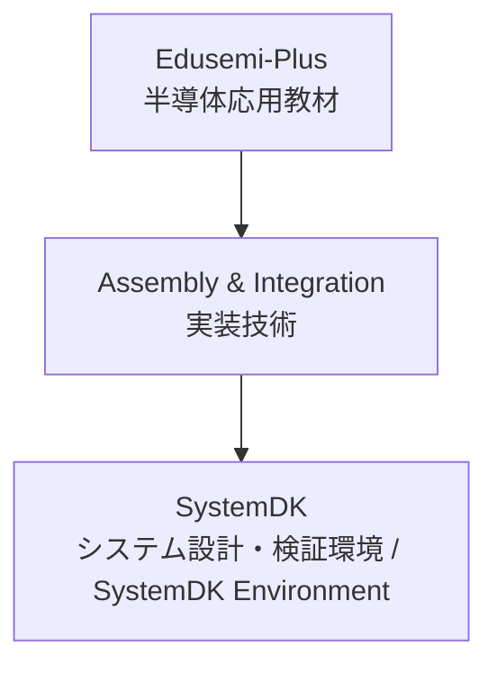

---

# 🧩 Assembly & Integration / 実装技術

## 🏗 概要 / Overview
Assembly & Integration は、半導体デバイス・受動部品・コネクタ・パッケージを基板上で統合し、システムを構築するための技術領域です。  
*Assembly & Integration is the domain of technologies that integrate semiconductor devices, passives, connectors, and packages on a PCB to build systems.*  

PCB設計、受動部品、コネクタ、実装方式 (SMT, CSP, BGA)、先端パッケージング (2.5D, 3D, Fan-Out)、解析・検証 (SI/PI/熱/EMC) を含みます。  
*It covers PCB design, passives, connectors, mounting methods (SMT, CSP, BGA), advanced packaging (2.5D, 3D, Fan-Out), and analysis/validation (SI/PI/Thermal/EMC).*  

---

## 📂 サブカテゴリ / Subcategories

| サブカテゴリ / Subcategory | 概要 (JP) | Summary (EN) | Links |
|---|---|---|---|
| 📐 PCB | プリント基板 | *Printed Circuit Boards (PCB)* |   |
| 🧩 Passives | 受動部品 (MLCC, 抵抗, インダクタ) | *Passive Components (MLCC, Resistors, Inductors)* |   |
| 🔌 Connectors | コネクタ | *Connectors for high-speed and power delivery* |   |
| ⚙️ Mounting | 実装方式 (SMT, CSP, BGA) | *Mounting technologies such as SMT, CSP, BGA* |   |
| 📦 Advanced Packaging | 先端パッケージング (2.5D, 3D, Fan-Out) | *Advanced packaging such as 2.5D, 3D, Fan-Out, CoWoS, InFO* |   |
| 📊 Analysis & Validation | 実装解析・検証 (SI/PI/熱/EMC) | *Analysis & validation of SI, PI, Thermal, and EMC* |   |

---

## 🔑 キートピック / Key Topics
PCB設計と基板材料の最適化。  
*Optimization of PCB design and board materials.*  

MLCC・抵抗・インダクタなどの受動部品の特性と配置。  
*Characteristics and placement of passives such as MLCCs, resistors, and inductors.*  

高速伝送・電源供給に対応するコネクタ設計。  
*Connector design for high-speed transmission and power delivery.*  

実装方式 (SMT, CSP, BGA) による信頼性・歩留まりへの影響。  
*Impact of mounting methods (SMT, CSP, BGA) on reliability and yield.*  

先端パッケージングによる高帯域・高集積化。  
*High-bandwidth and high-integration via advanced packaging.*  

解析・検証 (SI/PI/熱/EMC) に基づく設計改善。  
*Design improvements through SI/PI/Thermal/EMC validation.*  

---

## 🌐 教材ポジション / Position

---

## ✅ 学習目標 / Learning Goals
実装技術の主要分野を体系的に理解する。  
*Systematically understand the major domains of assembly and integration.*  

システム設計における部品・実装・パッケージ・検証の相互関係を把握する。  
*Grasp the interrelations of components, assembly, packaging, and validation in system design.*  

SystemDKと連携し、設計・実装・検証の統合プロセスを習得する。  
*Learn the integrated process of design, assembly, and validation through collaboration with SystemDK.*  

---

---
layout: default
title: "Assembly & Integration | 実装技術"
---

# 🧩 Assembly & Integration / 実装技術

| リンク / Link | Badge |
|---|---|
| 🌐 View Site |  |
| 📂 View Repo |  |
| ⬆️ Back to Edusemi-Plus |   |

