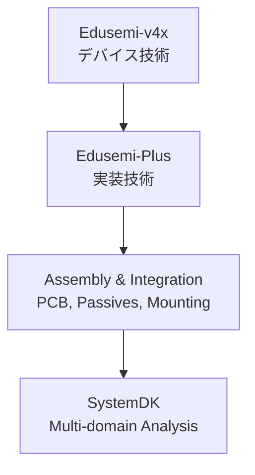

---

# 📘 Assembly & Integration / 実装技術

---

## 🏗 概要 / Overview
- **実装技術 (Assembly & Integration)** は、半導体素子をシステムとして機能させるために不可欠な領域です。  
- プリント基板（PCB）、受動部品（MLCC, 抵抗, インダクタ）、コネクタ、実装方式（SMT, CSP, 2.5D/3D-IC など）を体系的に整理します。  
- **SystemDK** との連携により、電気・熱・機械のマルチドメイン解析を統合的に扱います。  

---

## 📂 ディレクトリ構成 / Directory Structure
```
Assembly-Integration/
 ├── PCB/                  ← 基板材料・設計
 ├── Passives/             ← 受動部品 (MLCC, Resistor, Inductor...)
 ├── Connectors/           ← コネクタ技術
 ├── Mounting/             ← 実装方式 (SMT, BGA, CSP, QFN...)
 ├── Advanced-Packaging/   ← 先端実装 (SiP, 2.5D/3D-IC, CoWoS, AiP)
 └── Analysis-Validation/  ← 解析・検証 (SI/PI, Thermal, Mechanical, SystemDK)
```

---

## 🔑 キートピック / Key Topics
- **PCB設計 / PCB Design**  
  - 材料（FR-4, BT, LCP, セラミック）  
  - 多層配線、SI/PI、熱設計、EMI対策  
- **受動部品 / Passives**  
  - MLCC（積層セラミックコンデンサ）、チップ抵抗、インダクタ、フィルタ  
- **コネクタ技術 / Connectors**  
  - Board-to-Board, FPC, 高速I/Oコネクタ  
- **実装方式 / Mounting**  
  - SMT, BGA, CSP, QFN, PoP, リフロー実装  
- **先端実装 / Advanced Packaging**  
  - SiP, 2.5D, 3D-IC, CoWoS, Foveros, AiP  
- **解析・検証 / Analysis & Validation**  
  - SI/PI, 熱解析, 機械強度, SystemDK連携  

---

## 🌐 教材ポジション / Position in Edusemi-Plus


---

## ✅ 学習目標 / Learning Goals
- 半導体素子とシステムをつなぐ **実装技術の基盤**を理解する  
- PCB・受動部品・コネクタの役割を体系的に整理する  
- **先端実装技術**（2.5D, 3D-IC, SiP など）の位置づけを把握する  
- **SystemDK** で実装要素をモデリングし、システムレベルで解析できるようにする  

