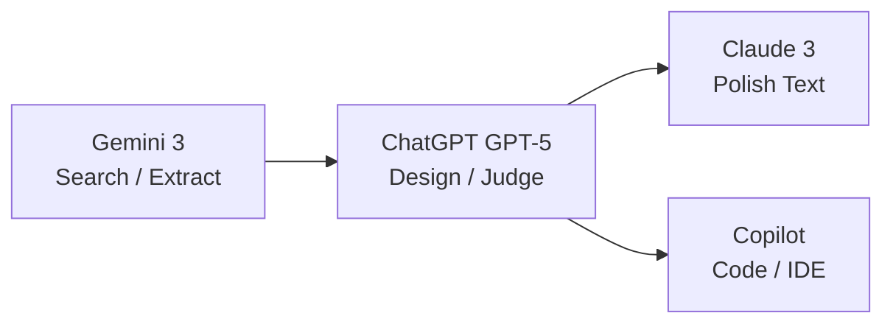

# 🤖 AIツール比較と使い分けガイド（Edusemi-Plus版）
**AI Tools Comparison & Usage Guide (Edusemi-Plus Edition / 2025-12)**

Edusemi-Plusでは、  
**半導体技術教育・制御設計・PoC検証・教材体系化** を主目的として生成AIを活用しています。

本ページは、2025年末時点における  
> **「どのAIを、どの工程で使うと設計効率と再現性が最大になるか」**  

を **実運用ベース** で整理した最新版ガイドです。

📌 **Last Update: 2025-12**

---

## 🧠 基本方針（最重要）

### Edusemi-PlusにおけるAIの考え方

- AIは「万能な知能」ではなく **設計工程に組み込む部品**
- **設計方針・構成判断の責任は常に人間＋主軸AI**
- 検索・文章整形・実装補助は **役割特化AIに分離**

> ❗ 本ガイドでは  
> **「AIに考えさせる」＝「AIに設計責任を持たせる」ではない**  
> という立場を取ります。

---

## 🧩 推奨AI構成（2025年末・確定）

### ▶ 四層モデル（設計 → 情報 → 表現 → 実装）

| 層 | 役割 | 主AI | 主な用途 |
|----|----|----|----|
| 🧠 設計層 | 構成・判断・統合 | **ChatGPT（GPT-5）** | 教材設計、FSM、PoC構成 |
| 🔍 情報層 | 検索・抽出 | **Gemini 3** | 最新動向、企業・装置調査 |
| ✒️ 表現層 | 文章品質 | **Claude 3** | 冗長除去、校正 |
| ⚙ 実装層 | 実装補助 | **Copilot** | コーディング、IDE/Office |

---

## 🧠 各AIの役割と使いどころ（重要）

### 🧠 ChatGPT（GPT-5）
**役割：設計責任AI（司令塔）**

- 教材・章立て・全体構成設計
- FSM設計、制御ロジック整理
- PoC／エージェントの再設計判断
- Markdown / Mermaid / 数式との高い親和性

👉 **結論**  
他AIの出力を統合し、**最終判断を下す役**。

---

### 🔍 Gemini 3（Pro / Flash）
**役割：検索・調査専門AI**

- Google検索・YouTube・PDF直結
- 最新技術・企業・地政学動向の把握
- マルチモーダル入力の解析

**注意点**
- 構成設計や教材生成は不安定

👉 **使い方の原則**  
「調べる → ChatGPTに渡す」

---

### ✒️ Claude 3（Opus / Sonnet）
**役割：文章品質最適化AI**

- 冗長表現の削減
- 語調・論調の統一
- 長文の可読性改善

**制限**
- 技術判断・設計責任は弱い

👉 **使い方の原則**  
「書かせない／直させる」

---

### ⚙ GitHub Copilot / Microsoft Copilot
**役割：実装・業務補助AI**

- VS Code / Visual Studio 統合
- Python・制御コード補完
- Excel / Word / PowerPoint 自動化
- テストコード・補助スクリプト生成

#### ⚠ Copilotと思考の扱い（重要）

- ⭕ **実装レベルの思考（How）** は有効  
  - コード改善
  - 可読性向上
  - 局所的最適化

- ❌ **設計責任を伴う思考（Why / What）** は任せない  
  - 全体構成判断
  - 制御方針決定
  - 教材設計の是非

👉 **原則**  
**設計はChatGPT、実装思考はCopilot**

---

## 🔄 推奨ワークフロー（実践形）

---

## ✅ 用途別・即決テーブル（2025）

| タスク | 推奨AI | 理由 |
|----|----|----|
| 教材構成・章立て | ChatGPT | 構造設計力 |
| 半導体プロセス解説 | ChatGPT | 抽象→具体変換 |
| 最新技術・企業調査 | Gemini 3 | 検索直結 |
| YouTube講義教材化 | Gemini → ChatGPT | 抽出→再構成 |
| 教材文章の磨き | Claude | 可読性 |
| FSM設計 | ChatGPT | 状態遷移設計 |
| PoC検証 | ChatGPT + Gemini | 判断＋探索 |
| コーディング | Copilot | 実装補助 |

---

## 🌐 その他AIの位置づけ（参考）

| AI | 扱い |
|----|----|
| DeepSeek | コーディング補助 |
| Perplexity | 出典付き検索 |
| Mistral / LLaMA | ローカル研究 |
| Grok | SNS解析（教材非推奨） |

---

## 🧠 Edusemi-Plus的 結論

### ❌ 誤った使い方
- 1タスク＝1AI
- AIに設計責任を丸投げ
- Copilotに全体構成を考えさせる

### ✅ 正しい使い方
> **AIは工程ごとに役割を持つ部品**

- ChatGPT：設計責任者
- Gemini：調査員
- Claude：編集者
- Copilot：実装補助（思考OK、責任NG）

---

## 🔙 Back
- [Edusemi-Plus トップへ戻る](../index.md)

---

**Author:** 三溝 真一（Shinichi Samizo）  
**License:** MIT

---

## 📁 本ディレクトリ構成 / Directory Structure

| ファイル / File | 内容 / Description |
|-----------------|--------------------|
| [README.md](./README.md) | このページ：AIツール比較・使い分けガイド |
| [ai_models_list_2025.md](./ai_models_list_2025.md) | 主要AIモデル一覧と特徴 |
| [ai_selection_guide_2025.md](./ai_selection_guide_2025.md) | 用途別AIツール選択ガイド |
| [prompt_test_cases_2025.md](./prompt_test_cases_2025.md) | AI別プロンプト比較演習ログ |
| [usecase_examples_2025.md](./usecase_examples_2025.md) | 実用事例集（教材・レビュー・分析） |
| [ai_agents_examples.md](./ai_agents_examples.md) | FSM×LLM×PIDエージェント活用事例 |

---

## 👤 著者・ライセンス

| Item | Detail |
|------|--------|
| Author | 三溝 真一（Shinichi Samizo） |
| GitHub | [Samizo-AITL](https://github.com/Samizo-AITL) |

---

## 🔙 戻る / Back
- **JP:** [Edusemi-Plus トップへ戻る](../index.md)  
- **EN:** [Return to Edusemi-Plus Top](../index.md)
