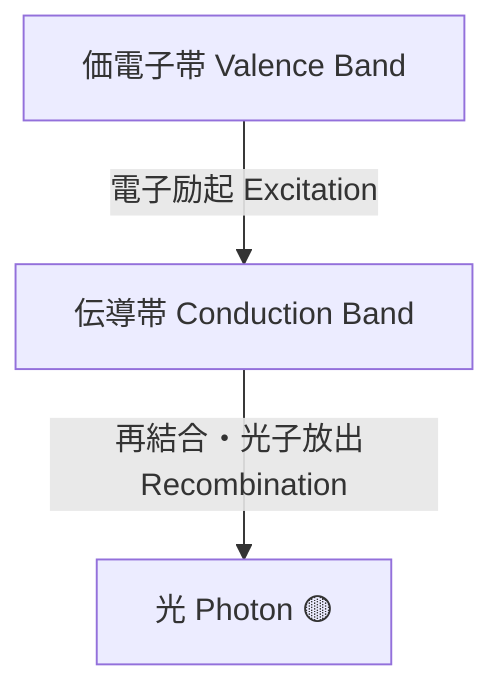

---

# 💡 光デバイス / Photonics Devices  
*Photonics Devices*

---

## 🔗 リンク / Links  

| Link | Badge |
|---|---|
| 🌐 View Site |  |
| 📂 View Repo |  |

---

> **概要 / Overview**  
> 光デバイスは、**発光・受光・光制御を担う半導体素子群**であり、光通信・センシング・AI加速・量子情報において不可欠です。  
> *Photonics devices are semiconductor components for emission, detection, and modulation of light, essential for communication, sensing, AI acceleration, and quantum information.*

---

## 📖 節構成 / Chapter Structure  

### 1. 基礎光デバイス / Fundamental Devices
- **LED / µLED**  
  - 発光原理：直接遷移半導体（GaAs, InGaN）  
  - 応用：照明、ディスプレイ、光インジケータ
- **半導体レーザ（LD, VCSEL, QD-LD）**  
  - キャビティ構造としきい値条件  
  - 通信、LiDAR、ストレージ、プロジェクタ  
- **フォトダイオード（PIN, APD）**  
  - 高速応答性、内部増倍機構  
  - 光通信、センシング、イメージング  

---

### 2. シリコンフォトニクス / Silicon Photonics
- **導波路（Si, SiN, SOI）**  
- **変調器（キャリア注入型、EO型）**  
- **光トランシーバ集積**  
  - データセンター用高速リンク  
  - AIチップ内部の光インターコネクト
  

---

### 3. 先端フォトニクス / Advanced Photonics
- フォトニック結晶レーザ  
- 量子ドットレーザ  
- 光子集積回路（PIC: Photonic Integrated Circuit）  
- 光AIアクセラレータ、光量子計算素子  

---

## 📌 今後の拡張 / Future Expansion
- LiDAR 向け光デバイス  
- 光メモリ素子（Phase-Change Photonic Memory）  
- 光スイッチ／光演算素子  
- 材料技術（InP, GaAs, SiC, GaN, 2D材料）とのクロスリンク  

---

## 👤 **著者・ライセンス / Author & License**

| **項目 / Item** | **内容 / Details** |
|-----------------|--------------------|
| **著者 / Author** | **三溝 真一**（Shinichi Samizo） |
| **GitHub** |  |
| **ライセンス / License** |    再配布・改変自由（教育目的） / *Free for educational use, redistribution, and modification*   商用利用は別途許可が必要 / *Commercial use requires separate permission* |

---

## ⬆️ 応用デバイスへ戻る / Back to Applied Devices

| Link | Badge |
|---|---|
| 🌐 **Back to Applied Devices** |  |
| 📂 **Back to Repo** |  |
