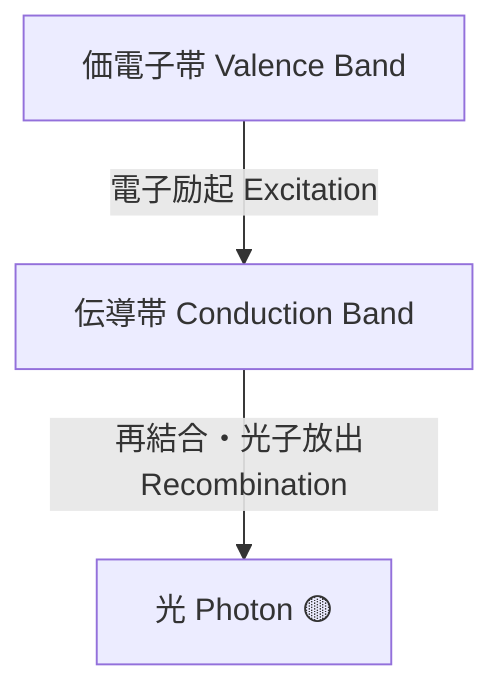
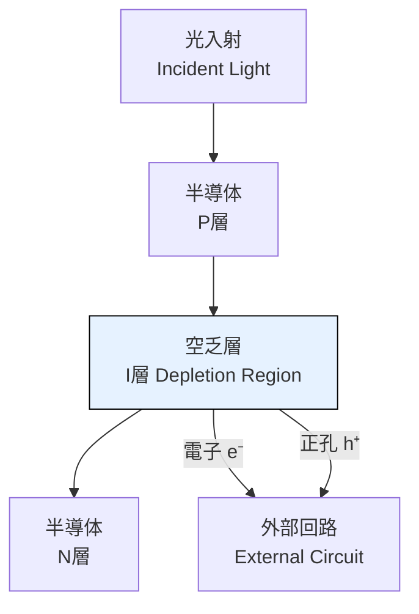
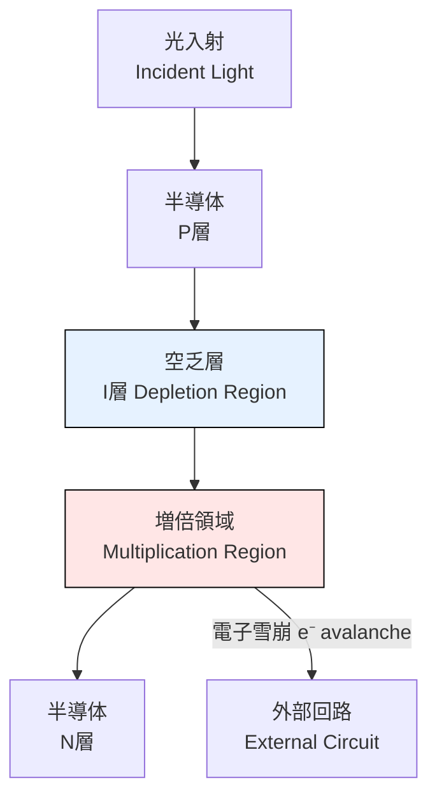
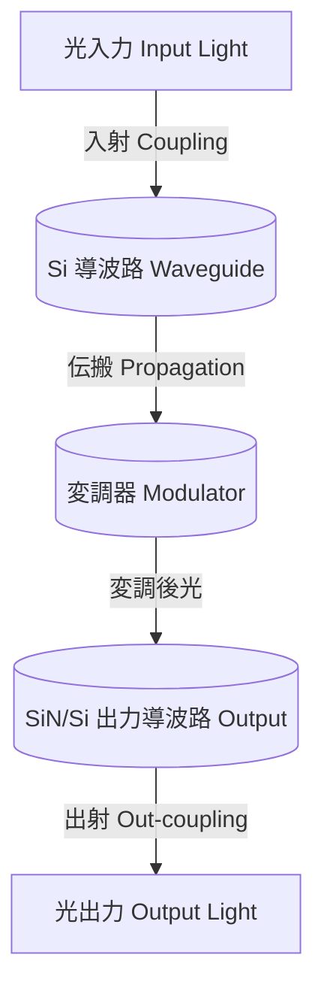
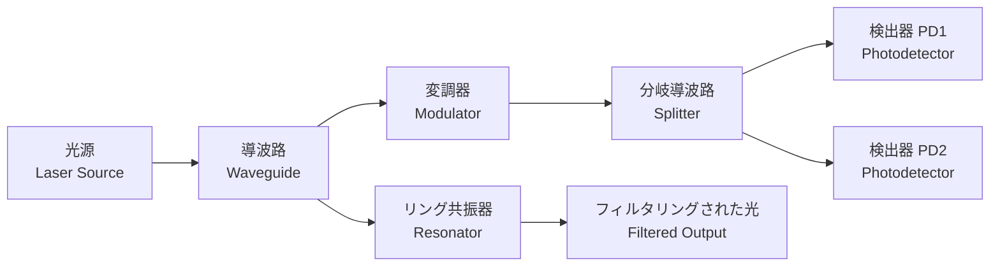
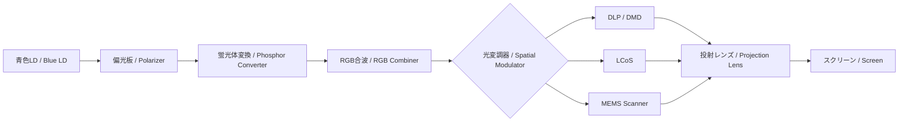
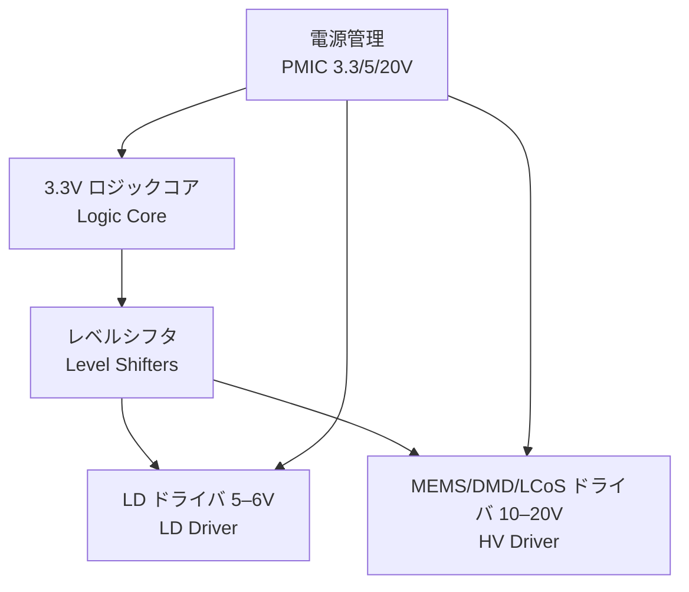

---

# 💡 光デバイス / Photonics Devices  
*Photonics Devices*

---

## 🔗 リンク / Links  

| Link | Badge |
|---|---|
| 🌐 **View Site** |  |
| 📂 **View Repo** |  |

---

> **概要 / Overview**  
> 光デバイスは、**発光・受光・光制御を担う半導体素子群**であり、光通信・センシング・AI加速・量子情報において不可欠です。  
> *Photonics devices are semiconductor components for emission, detection, and modulation of light, essential for communication, sensing, AI acceleration, and quantum information.*

---

## 📖 節構成 / Chapter Structure  

### 1️⃣ 基礎光デバイス / *Fundamental Devices*

- **💡 LED / µLED**  
  - 発光原理：**直接遷移半導体**（GaAs, InGaN）  
  - *Principle: Direct bandgap semiconductors*  
  - 応用：**照明、ディスプレイ、光インジケータ**  
  - *Applications: Lighting, display, optical indicators*

> **図：** LEDにおける価電子帯から伝導帯への励起と再結合による光子放出  
> *Band-to-band excitation and photon emission in LEDs*

---

- **🔦 半導体レーザ（LD, VCSEL, QD-LD） / Semiconductor Lasers**  
  - キャビティ構造と**しきい値条件**  
  - *Cavity structure and threshold condition*  
  - 応用：**通信、LiDAR、ストレージ、プロジェクタ**  
  - *Applications: Communication, LiDAR, storage, projectors*

---

- **📡 フォトダイオード（PIN, APD） / Photodiodes**  
  - 特徴：**高速応答性、内部増倍機構**  
  - *Features: High-speed response, internal gain*  
  - 応用：**光通信、センシング、イメージング**  
  - *Applications: Optical communication, sensing, imaging*

> **図：** PINフォトダイオードの構造と光電流生成  
> *PIN photodiode structure and photocurrent generation*

> **図：** APDの内部雪崩増倍機構  
> *Avalanche multiplication in APD*

---

### 2️⃣ シリコンフォトニクス / *Silicon Photonics*

- **導波路（Si, SiN, SOI） / Waveguides**  
- **変調器（キャリア注入型、EO型） / Modulators**  
- **光トランシーバ集積 / Optical Transceivers**  
  - 応用：**データセンター用高速リンク、AIチップ内光インターコネクト**  
  - *Applications: High-speed data links, AI chip interconnects*

> **図：** シリコンフォトニクス導波路と変調器  
> *Silicon photonics waveguide and modulation flow*

---

### 3️⃣ 先端フォトニクス / *Advanced Photonics*

- 🌐 **フォトニック結晶レーザ / Photonic Crystal Lasers**  
- 🔬 **量子ドットレーザ / Quantum Dot Lasers**  
- 🖧 **光子集積回路（PIC） / Photonic Integrated Circuits**  
- ⚡ **光AIアクセラレータ、光量子計算素子 / Photonic AI accelerators, quantum devices**

> **図：** 光子集積回路 (PIC) の基本構成  
> *Basic architecture of a Photonic Integrated Circuit (PIC)*

---

## 🎥 実応用例 / *Real-World Application*

### ピコプロジェクターシステム / *Pico Projector System*

- **小型固体光源 / Compact Solid-State Light Source**  
  - 青色LD（GaN）をベースに、偏光素子＋蛍光体変換でRGBを生成  
  - *Blue LD (GaN) with polarizer + phosphor converter to generate RGB*  

- **応用分野 / Applications**  
  - 📱 **スマホ用組込みプロジェクタ / Smartphone-embedded projector**  
  - 🚘 **車載HUD・レーザーヘッドライト / Automotive HUD & laser headlights**  
  - 🥽 **AR/VR用マイクロディスプレイ / AR/VR microdisplays**  
  - 🎥 **家庭用ポータブルプロジェクタ / Portable home projectors**  
  - 🏥 **医療用内視鏡・イメージング / Medical endoscopy & imaging**

---

### 📐 システム構成 / *System Architecture*

> **図：** ピコプロジェクターの光学系と変調器  
> *Optical path and modulation architecture of a pico projector*

---

### ⚙️ ピコプロSoC (0.35µm HV-CMOS)

- **3.3 V ロジック / Logic core**：映像信号処理・タイミング制御  
- **5–6 V LDドライバ / LD driver**：青色LD駆動  
- **10–20 V HVドライバ / HV driver**：MEMS / DMD / LCoS駆動  
- **電源管理 / PMIC**：3.3 V, 5 V, 20 V を生成  
- **1チップ化 / Single-chip integration** により小型化・低コスト化  

---

### 📊 ニーズ分析 / *Market & Educational Needs*

- **産業市場 / Industry**  
  - モバイル：スマホに搭載可能な「持ち歩ける大画面」  
  - 自動車：HUD・レーザーヘッドライト  
  - 映像・教育：家庭用小型プロジェクタ市場拡大  
  - 医療・産業：内視鏡、加工、検査  

- **教育研究 / Education**  
  - 半導体の **電子デバイス → 光デバイス → 応用システム** の流れを学習可能  
  - 「青色LDがなぜ重要か」を説明できる実例  
  - HV-CMOS混在回路と光学システムを統合的に学ぶ教材価値  

---

### 🔗 リンク / *Links*

| Link | Badge |
|---|---|
| 🌐 **View Pico Projector System** |  |
| 📂 **View Repo** |  |

---

## 📌 今後の拡張 / *Future Expansion*
- 🚘 **LiDAR 向け光デバイス / LiDAR photonics**  
- 💾 **光メモリ素子 / Photonic memories (e.g., phase-change)**  
- 🔀 **光スイッチ／光演算素子 / Optical switches & computing devices**  
- 🧪 **材料クロスリンク / Materials (InP, GaAs, SiC, GaN, 2D materials)**  

---

## 👤 **著者・ライセンス / Author & License**

| **項目 / Item** | **内容 / Details** |
|-----------------|--------------------|
| **著者 / Author** | **三溝 真一**（Shinichi Samizo） |
| **GitHub** |  |
| **ライセンス / License** |    📖 **再配布・改変自由（教育目的）** / *Free for educational use, redistribution, and modification*   💼 **商用利用は別途許可が必要** / *Commercial use requires separate permission* |

---

## ⬆️ 応用デバイスへ戻る / *Back to Applied Devices*

| Link | Badge |
|---|---|
| 🌐 **Back to Applied Devices** |  |
| 📂 **Back to Repo** |  |
