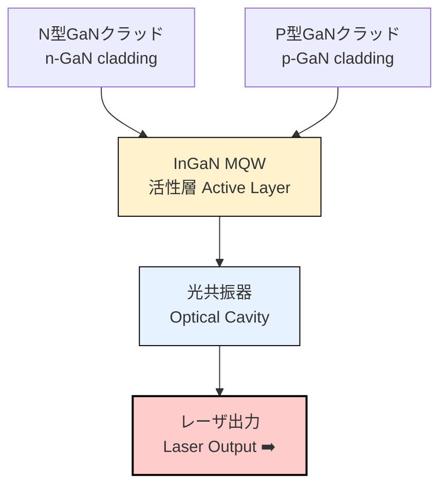

---

# 🔵 青色レーザーダイオード  
*Blue Laser Diode (GaN LD)*

---

## 📖 概要 / *Overview*

青色レーザーダイオード (Blue LD) は、**GaN系III-V族化合物半導体**を基盤とする  
**短波長レーザー光源**であり、Blu-ray、プロジェクタ、自動車照明、医療に不可欠なデバイスである。  
1990年代に GaN結晶成長とp型ドーピングのブレークスルーが達成され、  
2014年にはノーベル物理学賞が授与された。  

*Blue laser diodes (Blue LDs) are based on GaN III-V compound semiconductors,  
providing short-wavelength laser sources essential for Blu-ray, projectors, automotive lighting, and medical devices.  
Breakthroughs in GaN epitaxy and p-type doping in the 1990s enabled commercialization,  
culminating in the 2014 Nobel Prize in Physics.*

---

## 🧪 材料と原理 / *Materials & Principles*

- **材料 / Materials**: GaN, InGaN, AlGaN 系化合物半導体  
- **発振波長 / Wavelength**: 405–460 nm (青～青紫)  
- **特徴 / Features**: 高輝度, 高効率, 小型化可能  
- **バンドギャップ / Bandgap**: GaN ~3.4 eV → 青色光を実現  

👉 III-V族化合物半導体は**直接遷移型バンドギャップ**を持つため、発光効率が高い。  
特に GaN/InGaN 系は青色～緑色発光に不可欠である。  

*III-V compound semiconductors have direct bandgaps, making them efficient light emitters.  
GaN/InGaN systems are indispensable for blue-to-green emission.*

---

## 🏭 製造技術の難しさとブレークスルー  
*Fabrication Challenges & Breakthroughs*

青色LDの実用化は、多くの技術的困難を克服した成果であり、  
**赤﨑勇・天野浩・中村修二の3氏に2014年ノーベル物理学賞**が授与された。  

*The realization of blue LDs overcame major technical challenges,  
leading to the 2014 Nobel Prize in Physics for Isamu Akasaki, Hiroshi Amano, and Shuji Nakamura.*

---

### ⚡ 主な課題 / *Major Challenges*

1. **基板・結晶成長 / Substrate & Epitaxy**  
   - サファイア基板との格子不整合により欠陥密度が非常に高かった。  
   - 解決策：**低温バッファ層 (LT-GaN buffer layer)** を導入し、結晶品質を改善。  

2. **p型ドーピング / p-type Doping**  
   - MgドーピングしたGaNが水素によりパッシブ化し、p型導電性を示さなかった。  
   - 解決策：**高温アニールで水素を除去**し、p型GaNを実現。  

3. **InGaN多重量子井戸 (MQW) / InGaN MQWs**  
   - In組成とひずみ制御が難しく、波長安定性・発光効率の確保が課題。  
   - 解決策：高精度MOCVD制御により活性層を最適化。  

4. **光共振器形成 / Optical Cavity Fabrication**  
   - GaNは硬く化学的に安定 → 鏡面端面やリッジ導波路形成が困難。  
   - 解決策：ドライエッチング＋コーティング技術の導入。  

---

### 🏆 ノーベル賞の意義 / *Nobel Prize Significance*

- 高輝度・高効率な **白色LED照明** を可能にした。  
- Blu-ray, プロジェクタ, ディスプレイ, 自動車照明に応用。  
- 「人類に最も大きな利益をもたらした発明」として評価された。  

*Enabled high-efficiency white LEDs and revolutionized Blu-ray, projectors, displays, and automotive lighting.  
Recognized as an invention that brought great benefit to humanity.*

---

## ⚙️ デバイス構造模式図 / *Device Schematic*

> **図：** InGaN量子井戸活性層を用いたGaN系青色レーザーダイオード構造  
> *Structure of GaN-based blue laser diode with InGaN MQWs*

---

## 📊 応用分野 / *Applications*

- 📀 **Blu-ray ディスクシステム / Blu-ray Disc systems**  
- 🎥 **ピコプロジェクタ / Pico projectors**  
- 🚘 **自動車ヘッドライト / Automotive headlights**  
- 🖥 **ディスプレイ・照明 / Displays & lighting**  
- 🏥 **医療機器 / Medical devices**  

---

## 🔗 関連リンク / *Links*

| Link | Badge |
|---|---|
| 🎥 **Pico Projector System** |  |
| 📂 **Back to Photonics Devices** |  |
