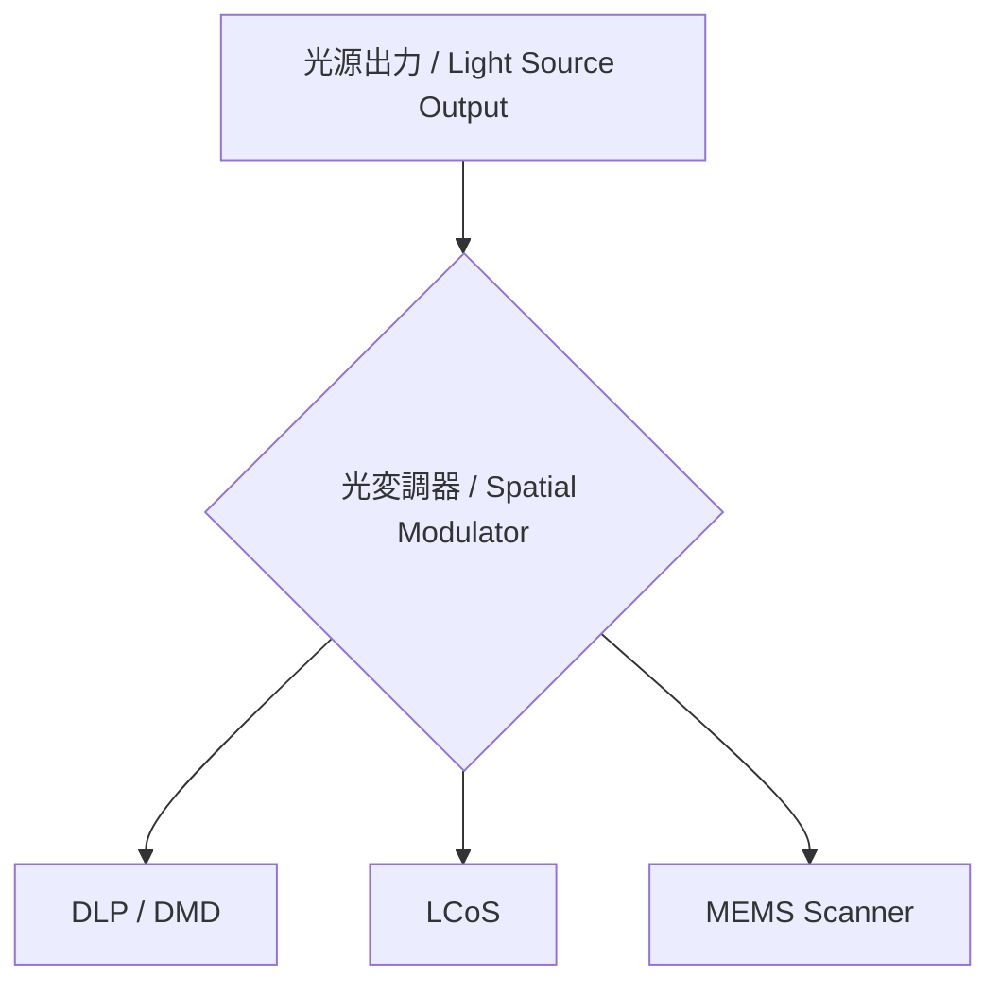
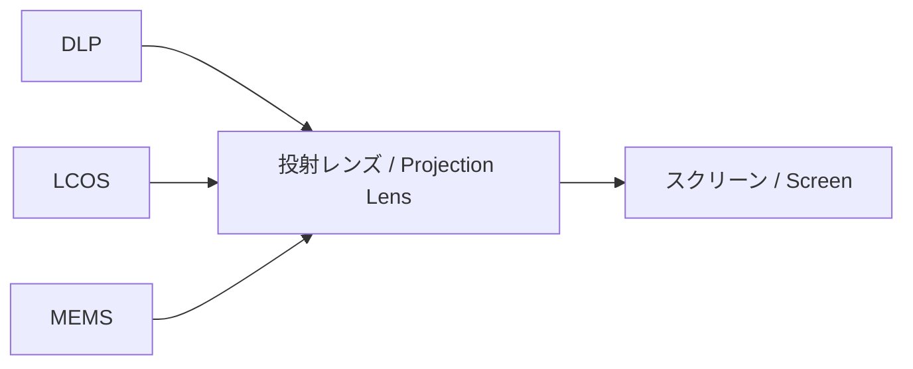
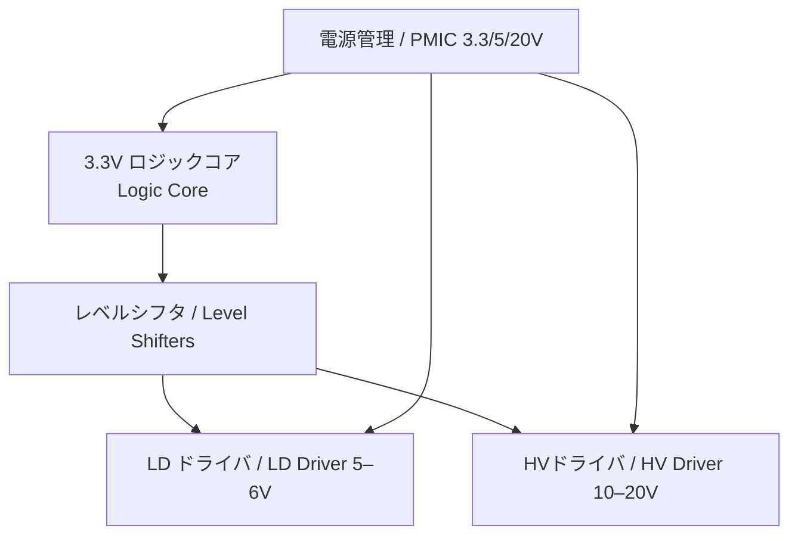

# 🎥 ピコプロジェクターシステム  
*Pico Projector System*

---

## 🔦 光源システム / Light Source
- **GaN系青色レーザダイオード / GaN-based Blue LD** を基本光源  
- **偏光素子 / Polarizer**＋**蛍光体変換 / Phosphor Converter** で **RGB成分 / RGB Components** を生成  
- 小型・高輝度・低消費電力で **小型固体光源 / Compact Solid-State Light Source** を実現  

---

## 🖥 光変調 / Spatial Modulation
- **方式の選択肢 / Modulation Options**  
  - 🎞 **DLP (DMD マイクロミラー / Digital Micromirror Device)**  
  - 🖼 **LCoS (液晶オンシリコン / Liquid Crystal on Silicon)**  
  - 🔦 **MEMS レーザスキャン / MEMS Laser Scanning**

---

## 🔭 投射光学系 / Projection Optics
- **投射レンズ / Projection Lens** でスクリーンへ映像を拡大  
- **レーザスキャン方式 / Laser Scanning** では **フォーカスフリー / Focus-Free** 投射が可能  

---

## 🧠 ピコプロ SoC (0.35µm HV-CMOS)
- **3.3 V ロジック / Logic Core**：ビデオ信号処理、タイミング制御  
- **5–6 V LDドライバ / LD Driver**：青LDを駆動  
- **10–20 V HVドライバ / High-Voltage Driver**：MEMS / DMD / LCoS を駆動  
- **電源管理 / PMIC**：3.3 V / 5 V / 20 V を生成  
- **1チップ化 / Single-Chip Integration** により、システムを小型・低コスト化  

---

## 🚀 応用 / Applications
- 📱 **スマホ組込み型ピコプロジェクタ / Smartphone-Embedded Pico Projector**  
- 🚘 **車載HUD・レーザーヘッドライト / Automotive HUD & Laser Headlights**  
- 🥽 **AR/VR用マイクロディスプレイ / AR/VR Microdisplay**  
- 🎥 **ポータブルプロジェクタ / Portable Projector**  
- 🏥 **医療用内視鏡・手術ナビゲーション / Medical Endoscopy & Surgical Navigation**

---

## 📊 ニーズ分析 / Market & Educational Needs

### 産業・市場ニーズ / *Industry & Market*
- **モバイル分野 / Mobile**：スマホ＋ピコプロで「持ち歩ける大画面 / Portable Large Screen」需要  
- **自動車分野 / Automotive**：HUDやレーザーヘッドライトで採用が進行  
- **映像・教育 / Entertainment & Education**：家庭用ポータブルプロジェクタ市場が拡大  
- **医療・産業 / Medical & Industrial**：内視鏡、HUD、加工用マイクロプロジェクション  

### 教育・研究ニーズ / *Education & Research*
- 半導体の **電子デバイス → 光デバイス / Electronic → Photonic Devices** への架け橋  
- 「**青色LDがなぜ重要か / Why Blue LD is Critical**」を理解する教材として必須  
- **SoC設計 (0.35 µm HV-CMOS)** と **光学システム / Optical System** の融合を学ぶ場が不足  
- 学習者に「**半導体 × 光 × 応用システム / Semiconductor × Photonics × System Applications**」を一望させる価値が高い  

---

## ✅ まとめ / Conclusion
- **ピコプロジェクターは“小型固体光源”を代表する応用システム / Pico Projector = Key Compact Solid-State Light Source Application**  
- 0.35 µm **HV-CMOS** を用いれば、**3.3 V / 20 V 混在 / Mixed-Voltage 3.3V/20V** で LD・MEMS 駆動を **1チップ化 / Single-Chip Integration** 可能  
- 教育的にも産業的にも **ニーズの強いテーマ / Strong Demand in Both Education & Industry**  
- 本ページを **光デバイス章の応用例 / Example in Photonics Devices Chapter**、または **独立テーマ / Independent Topic** として公開推奨  

---

## 👤 著者・ライセンス / Author & License
| Item | Details |
|------|---------|
| **Author** | 三溝 真一 (Shinichi Samizo) |
| **License** | 教育目的での自由利用可 / *Free for educational use*   商用利用は要許可 / *Commercial use requires permission* |
