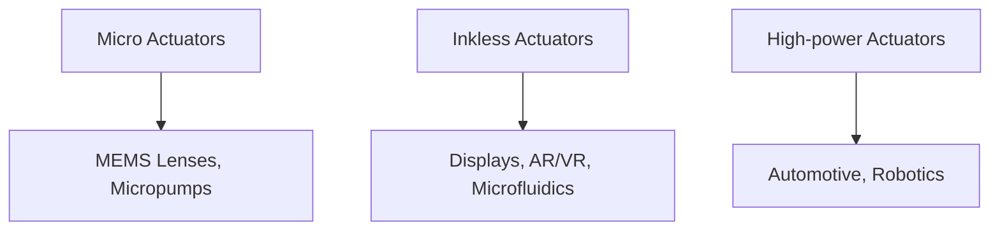

---

# ⚙️ 圧電アクチュエータ技術 / Piezoelectric Actuators  
*Piezoelectric Actuators – Thin-film, MEMS, Next Applications*

---

## 📖 概要 / Overview

圧電アクチュエータは、電気エネルギーを機械的変位や力に変換する素子です。  
*Piezoelectric actuators convert electrical energy into mechanical displacement or force.*  

従来の厚膜PZT素子に加えて、**薄膜・MEMSプロセスを利用した新型アクチュエータ**が注目されています。  
*Beyond traditional thick-film PZT devices, new thin-film and MEMS-based actuators are gaining attention.*  

---

## 🔬 主なタイプ / Major Types

### 🖨 マイクロアクチュエータ / Micro Actuators
- MEMS圧電薄膜を利用した駆動素子 *Actuators based on MEMS piezoelectric thin films*  
- 光学レンズ駆動、マイクロポンプ、精密ステージに応用 *Applied to optical lens driving, micropumps, precision stages*  

### 💧 インクレス駆動素子 / Inkless Actuators
- インクジェット以外の用途を意識した薄膜圧電素子 *Thin-film actuators designed beyond inkjet use*  
- 医療用マイクロ流体、ディスプレイ、AR/VRデバイスに応用 *Applications in medical microfluidics, displays, AR/VR devices*  

### ⚡ 高出力アクチュエータ / High-power Actuators
- KNN, BNTなど非鉛ペロブスカイトで高駆動力 *High drive force using lead-free perovskites such as KNN, BNT*  
- 車載・ロボティクス用途に適用可能 *Potential for automotive and robotics applications*  

---

## 📐 模式図 / Schematic

---

## ⚖️ 材料選択のポイント / Material Selection Points

| タイプ / Type | 推奨材料 / Recommended Materials | 特徴 / Features |
|---------------|--------------------------------|----------------|
| マイクロ / Micro | ScAlN, AlN | CMOS互換、小型化 *CMOS compatible, miniaturization* |
| インクレス / Inkless | ScAlN, PVDF | 柔軟、低電圧駆動 *Flexible, low-voltage operation* |
| 高出力 / High-power | KNN, BNT, PZT | 大変位、高駆動力 *Large displacement, high driving force* |

---

## 🔮 展望 / Future Directions

- **CMOS-MEMS統合 / CMOS-MEMS Integration**: SoCとの一体化 *Integration with SoC for compact systems*  
- **ナノ構造設計 / Nanostructure Design**: 応力緩和・高効率化 *Stress relaxation and efficiency improvement*  
- **新応用分野 / New Applications**: 医療デバイス、エネルギーハーベスティング、アクティブ光学素子 *Medical devices, energy harvesting, active optics*  

---

## 📚 関連リンク / Related Links

- [README](./README.md)  
- [materials.md](./materials.md)  
- [sensors.md](./sensors.md)  
- [rf-filters.md](./rf-filters.md)  

---

## 👤 著者・ライセンス / Author & License

| 項目 / Item | 内容 / Details |
|-------------|----------------|
| 著者 / Author | 三溝 真一（Shinichi Samizo） |
| GitHub | [Samizo-AITL](https://github.com/Samizo-AITL) |
| ライセンス / License | 教育目的での再配布・改変自由 / 商用利用は要許可 |
