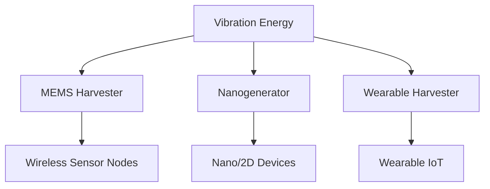

---

# 🔋 圧電エナジーハーベスティング / Piezoelectric Energy Harvesting  
*Piezoelectric Energy Harvesting – MEMS, Nano, IoT Applications*

---

## 📖 概要 / Overview

圧電エナジーハーベスティングは、**振動・圧力・運動エネルギーを電気に変換**する技術です。  
*Piezoelectric energy harvesting converts vibration, pressure, and motion into electrical energy.*  

電池交換不要のIoTデバイスやウェアラブル機器向けに重要性が高まっています。  
*It is becoming increasingly important for battery-free IoT devices and wearable electronics.*  

---

## 🔬 主な方式 / Major Approaches

### 🌉 MEMSハーベスタ / MEMS Harvesters
- Si基板上に圧電薄膜を形成し、微小構造で発電 *Thin-film piezoelectric layers on Si substrates for micro-scale power generation*  
- 無線センサーやマイクロシステムの電源に応用 *Applied to wireless sensors and microsystems*  

### 🧬 ナノジェネレータ / Nanogenerators
- ZnOナノワイヤや2D材料を利用 *Utilizing ZnO nanowires or 2D materials*  
- 超小型・フレキシブル電源に応用 *Applied to ultra-small, flexible power supplies*  

### 👕 ウェアラブル発電 / Wearable Harvesters
- PVDFフィルムを用いた衣服・皮膚装着型デバイス *Wearable devices using PVDF films*  
- バイオメカニカルエネルギー回収に応用 *Applied to biomechanical energy recovery*  

---

## 📐 模式図 / Schematic

---

## ⚖️ 材料選択のポイント / Material Selection Points

| タイプ / Type | 推奨材料 / Recommended Materials | 特徴 / Features |
|---------------|--------------------------------|----------------|
| MEMS | ScAlN, AlN | CMOS互換、微細加工適合 *CMOS compatible, MEMS ready* |
| ナノ / Nano | ZnO, MoS₂ | ナノ構造適合、柔軟 *Nano-structured, flexible* |
| ウェアラブル / Wearable | PVDF, PVDF-TrFE | 柔軟・印刷可能 *Flexible, printable* |

---

## 🔮 展望 / Future Directions

- **自立駆動IoT / Self-powered IoT**: センサーノードの電源供給 *Powering autonomous sensor nodes*  
- **バイオ応用 / Bio Applications**: 埋め込み医療機器のエネルギー回収 *Energy harvesting for implanted medical devices*  
- **集積化 / Integration**: SoC・MEMS回路との直接統合 *Direct integration with SoC and MEMS circuits*  

---

## 📚 関連リンク / Related Links

- [README](./README.md)  
- [materials.md](./materials.md)  
- [sensors.md](./sensors.md)  
- [actuators.md](./actuators.md)  
- [rf-filters.md](./rf-filters.md)  

---

## 👤 著者・ライセンス / Author & License

| 項目 / Item | 内容 / Details |
|-------------|----------------|
| 著者 / Author | 三溝 真一（Shinichi Samizo） |
| GitHub | [Samizo-AITL](https://github.com/Samizo-AITL) |
| ライセンス / License | 教育目的での再配布・改変自由 / 商用利用は要許可 |
