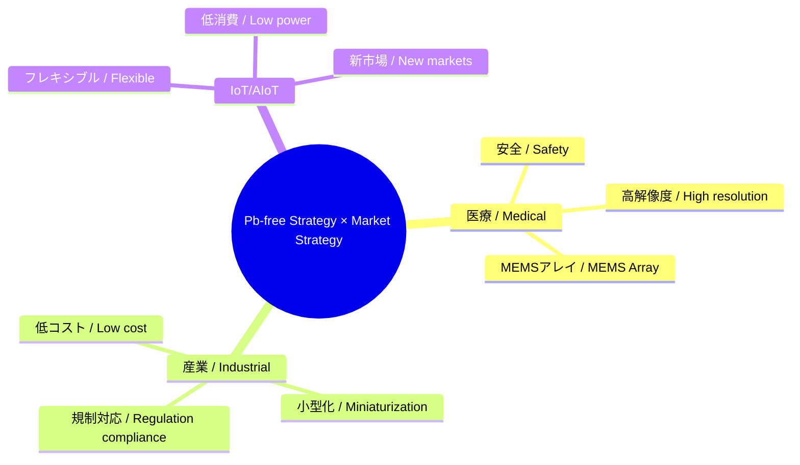

---

# 🔗 統合戦略マップ / Integrated Strategy Map  
*Integrated Strategy Map: Pb-free Advantage × Market Applications*

---

## 📖 概要 / Overview  

本ドキュメントでは、**Pbフリー戦略**と**市場戦略**を統合し、  
技術的強みと応用市場を結びつける「戦略マップ」を提示します。  

*This document integrates the Pb-free strategy and market strategy, presenting a strategic map that connects technological strengths with target application markets.*

---

## 🌍 Pbフリー戦略の強み / Strength of Pb-free Strategy  

- **医療安全 / Medical safety** → Pbフリー必須 (埋込・眼科・血管)  
- **環境規制 / Environmental regulation** → EU RoHS, REACH, FDA対応  
- **サステナブル価値 / Sustainable value** → ESG投資、グリーン医療  
- **差別化 / Differentiation** → 「Pbフリー MEMS 超音波」で世界初のポジション確立  

---

## 🧭 市場アプリケーション / Market Applications  

- **医療 / Medical** → ウェアラブル血流、眼科イメージング、埋込型超音波  
- **産業 / Industrial** → NDT、ロボット近接、流量計測  
- **IoT/AIoT** → フレキシブルセンサ、エナジーハーベスティング、環境モニタ  

---

## ⚖️ 統合ポジショニング / Integrated Positioning  

---

## 🎯 戦略まとめ / Strategic Summary  

- **医療**：Pbフリー + MEMSアレイ → 高解像度 & 規制適合で先行優位。  
  *Medical: Pb-free + MEMS arrays → high resolution & regulatory compliance advantage.*  

- **産業**：規制市場で「環境・安全」を武器に。  
  *Industrial: leverage “eco & safety” positioning in regulated markets.*  

- **IoT/AIoT**：フレキシブル × Pbフリーで新市場創出。  
  *IoT/AIoT: create new markets with flexible Pb-free devices.*  

---

## 📚 関連 / Links  

- [pbfree-strategy.md](./pbfree-strategy.md)  
- [market-strategy.md](./market-strategy.md)  
- [scaln-sige-sip.md](./scaln-sige-sip.md)  
- [roadmap.md](./roadmap.md)  

---

## 👤 著者・ライセンス / Author & License  

| 項目 / Item | 内容 / Details |
|---|---|
| 著者 / Author | 三溝 真一（Shinichi Samizo）   *Shinichi Samizo* |
| GitHub | [Samizo-AITL](https://github.com/Samizo-AITL) |
| ライセンス / License | 教育目的での再配布・改変自由 / 商用利用は要許可   *Free for educational use, redistribution, and modification / Commercial use requires permission* |
