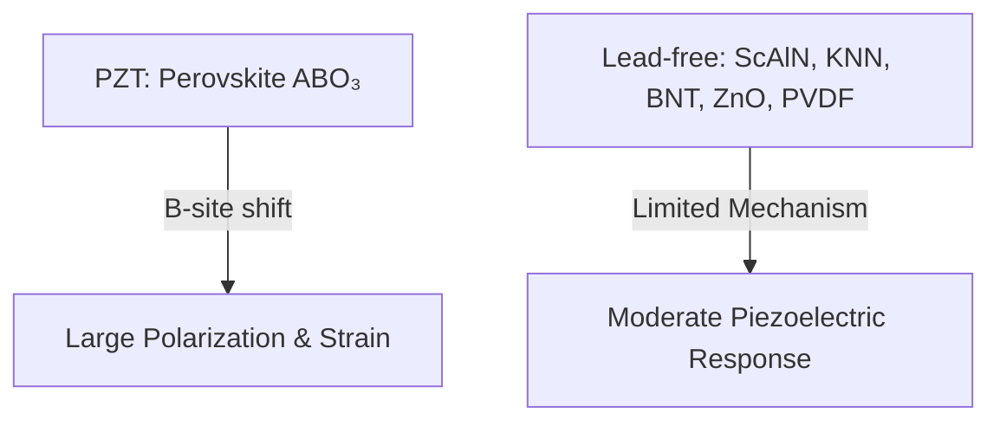

---

# 🧪 圧電材料技術 / Piezoelectric Materials  
*Piezoelectric Materials – PZT vs Lead-free Alternatives*

---

## 📖 概要 / Overview

圧電材料はデバイス性能を決定づける中核技術です。  
*Piezoelectric materials are core technologies that determine device performance.*  

従来は **PZT (Pb(Zr,Ti)O₃)** が圧倒的に利用されてきましたが、環境規制やPbフリー化の要請により、  
*Traditionally, PZT has been overwhelmingly used, but environmental regulations and Pb-free requirements have accelerated research on alternatives.*  

**非鉛材料（ScAlN, KNN, BNT, ZnO, PVDF など）** の研究開発が進んでいます。  
*Research on lead-free materials such as ScAlN, KNN, BNT, ZnO, and PVDF is progressing.*  

しかし現時点では、**PZTと同等の性能を完全に実現する非鉛材料は存在しません**。  
*However, no lead-free material has yet achieved performance equivalent to PZT.*  
用途に応じた「部分的解」が現実的なアプローチとなっています。  
*Application-specific partial solutions are currently the practical approach.*  

---

## 🏗 結晶構造と動作原理 / Crystal Structure & Mechanism

### ✅ PZT
- 結晶構造: **ペロブスカイト型 (ABO₃)**  
  *Crystal structure: Perovskite-type (ABO₃)*  
- **Bサイト (Ti/Zr)** カチオンが電界でシフトし、大きな分極と格子ひずみを生む  
  *B-site cations (Ti/Zr) shift under an electric field, creating large polarization and strain.*  
- Pb²⁺ の「ソフトモード効果」が格子を柔軟化 → 巨大な圧電応答 (d₃₃ ~100–500 pC/N)  
  *Pb²⁺ provides a soft-mode effect, enabling giant piezoelectric response.*  

### ❌ 非鉛材料
- **ペロブスカイト構造を安定に形成できない、または性能が劣る**  
  *Either cannot form a stable perovskite structure or show inferior performance.*  
- KNN, BNT はペロブスカイトだが、イオンサイズ不整合で結晶が不安定  
  *KNN and BNT are perovskites but unstable due to ionic size mismatch.*  
- ScAlN, ZnO は六方晶（ウルツ鉱型）であり、PZTのような大きな分極変位は得られない  
  *ScAlN and ZnO are hexagonal wurtzite-type, lacking the large polarization shift of PZT.*  
- PVDF は高分子で、分子双極子の配向に依存 → 圧電応答は小さい  
  *PVDF is a polymer relying on dipole alignment, resulting in small piezoelectric response.*  

---

## 🔬 材料一覧 / Materials

| 材料 / Material | 結晶構造 / Structure | Pbフリー / Pb-free | d₃₃値 (pC/N) | CMOS互換性 / CMOS Compatibility | 主な用途 / Applications |
|-----------------|----------------------|-------------------|--------------|---------------------------------|-------------------------|
| **PZT**         | ペロブスカイト *Perovskite* | ❌ | 100–500 | 低 *Low* | アクチュエータ, センサー *Actuators, Sensors* |
| **ScAlN**       | 六方晶 (ウルツ鉱型) *Hexagonal (Wurtzite)* | ✅ | 20–30 | 高 *High* | RF-BAW, MEMS |
| **KNN**         | ペロブスカイト *Perovskite* | ✅ | 100–300 | 中 *Medium* | アクチュエータ, グリーンデバイス *Actuators, Green devices* |
| **BNT系**       | ペロブスカイト *Perovskite* | ✅ | ~100 | 中 *Medium* | 高温センサー *High-temp sensors* |
| **ZnO**         | 六方晶 (ウルツ鉱型) *Hexagonal (Wurtzite)* | ✅ | 10–15 | 高 *High* | MEMS, ナノジェネレータ *Nano-generators* |
| **PVDF**        | 高分子 (β相) *Polymer (β-phase)* | ✅ | 5–10 | 高 *High* | フレキシブル, IoTセンサー *Flexible, IoT sensors* |

---

## ⚖️ 非鉛が難しい理由 / Why Lead-free is Difficult

1. **PZTの強さ / Why PZT is strong**  
   - 理想的なペロブスカイト構造 *Ideal perovskite structure*  
   - Bサイト変位による巨大分極 *Large polarization by B-site displacement*  
   - Pb²⁺ による格子柔軟化 *Pb²⁺ softens the lattice*  

2. **非鉛の制約 / Constraints of Lead-free**  
   - Pb²⁺ に匹敵する「ソフトモード安定化イオン」が存在しない  
     *No soft-mode stabilizing ion equivalent to Pb²⁺*  
   - ペロブスカイト型は不安定（KNN/BNT）、またはペロブスカイトを持たない（ScAlN/ZnO/PVDF）  
     *Lead-free either have unstable perovskite (KNN/BNT) or non-perovskite structures (ScAlN/ZnO/PVDF)*  
   - → 高性能化が難しい *→ Achieving high performance is difficult*  

---

## 📐 模式図 / Schematic

---

## 🔮 結論 / Conclusion

- **完全解 (PZTを完全に代替する非鉛材料)** は現状まだ存在しない。  
  *A complete solution (a lead-free that fully replaces PZT) does not exist yet.*  
- **部分的解**として、用途ごとに適材適所で非鉛材料が使われている：  
  *Partial solutions exist, where lead-free materials are used case by case:*  
  - RF → ScAlN / XBAR  
  - フレキシブル → PVDF / ZnO *Flexible → PVDF/ZnO*  
  - 高温センサー → KNN / BNT *High-temp sensors → KNN/BNT*  
- **長期的解**は、人工構造・新結晶系（超格子、Aurivillius相、2D材料など）に期待。  
  *Long-term solutions may come from artificial structures and new crystal systems (superlattices, Aurivillius phases, 2D materials).*  

---

## 📚 関連リンク / Related Links

- [README](./README.md)  
- [rf-filters.md](./rf-filters.md)  
- [sensors.md](./sensors.md)  

---

## 👤 著者・ライセンス / Author & License

| 項目 / Item | 内容 / Details |
|-------------|----------------|
| 著者 / Author | 三溝 真一（Shinichi Samizo） |
| GitHub | [Samizo-AITL](https://github.com/Samizo-AITL) |
| ライセンス / License | 教育目的での再配布・改変自由 / 商用利用は要許可 |
