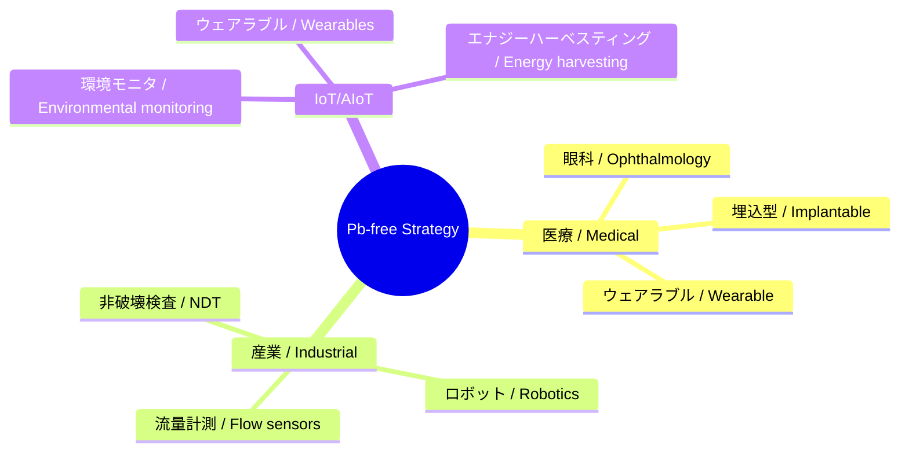

---

# 🌍 Pbフリー戦略 / Lead-free Strategy  
*Lead-free Strategy for Next-generation Piezoelectric Devices*

---

## 📖 概要 / Overview  

本ドキュメントは、**Pbフリー圧電デバイス戦略**を整理し、医療・産業・環境分野における差別化と競争優位を明確化します。  
*This document outlines the Pb-free piezoelectric device strategy, clarifying differentiation and competitive advantage in medical, industrial, and environmental fields.*

---

## 🎯 なぜPbフリーか / Why Pb-free?  

- **規制対応 / Regulation compliance**  
  EU RoHS、REACH、米FDAによりPb使用は厳格制限。  
  *Pb use strictly regulated by EU RoHS, REACH, and US FDA.*  

- **医療安全 / Medical safety**  
  体内応用・埋込デバイスではPbフリーが必須。  
  *Pb-free is mandatory for in-body and implantable devices.*  

- **環境・ESG / Environmental & ESG**  
  ESG投資やサステナブル医療に直結。  
  *Directly tied to ESG investment and sustainable healthcare.*  

---

## 🧪 候補材料 / Candidate Materials  

| 材料 / Material | 特徴（JP） | *Features (EN)* |
|-----------------|------------|-----------------|
| **ScAlN** | 高周波対応、CMOS互換、非鉛 | *High frequency, CMOS compatible, Pb-free* |
| **KNN (K,Na)NbO₃** | ペロブスカイト型、比較的高性能 | *Perovskite type, relatively high performance* |
| **BNT (Bi₀.₅Na₀.₅TiO₃系)** | 高温安定性、耐久性 | *High temperature stability, durability* |
| **ZnO** | ナノ構造形成容易、低コスト | *Easy nanostructuring, low cost* |
| **PVDF** | 高分子、柔軟性、フレキシブル基板対応 | *Polymer, flexible, compatible with flexible substrates* |

---

## 🏥 医療応用戦略 / Medical Strategy  

- **差別化要素**  
  - Pbフリー材料を前面に打ち出す。  
  - MEMSアレイ化で小型・高解像度を実現。  
  *Differentiate with Pb-free branding and MEMS array miniaturization.*  

- **応用例**  
  - 埋込型超音波センサ  
  - 眼科用高周波イメージング  
  - ウェアラブル血流・血圧計測  
  *Applications: implantable ultrasound, ophthalmic imaging, wearable blood flow/pressure monitoring.*  

---

## 🏭 産業応用戦略 / Industrial Strategy  

- **規制分野**：インフラ、環境、エネルギーでPb禁止傾向強まる。  
  *Regulated areas: infrastructure, environment, energy with Pb bans increasing.*  
- **応用例**：非破壊検査、ロボット近接センサ、流量センサ。  
  *Applications: NDT, robotic proximity sensing, flow sensors.*  

---

## 📡 IoT/AIoT戦略 / IoT & AIoT Strategy  

- **Pbフリー × フレキシブル × 低消費**をIoT部材の差別化軸に。  
  *Pb-free × flexible × low-power as differentiation axis for IoT components.*  
- **応用例**：環境モニタリング、ウェアラブル入力デバイス、低電力ハーベスティング。  
  *Applications: environmental monitoring, wearable input devices, low-power harvesting.*  

---

## ⚖️ 戦略ポジショニング / Strategic Positioning  

---

## 🎯 戦略まとめ / Strategic Summary  

- **Pbフリーは医療・安全市場で最大の差別化要素**。  
  *Pb-free is the strongest differentiation factor in medical and safety markets.*  
- **産業・環境で規制先行市場を狙う**。  
  *Target regulated markets in industry and environment.*  
- **IoT/AIoTではフレキシブル材料と組み合わせて新市場開拓**。  
  *Combine with flexible materials for new IoT/AIoT markets.*  

---

## 📚 関連 / Links  

- [materials.md](./materials.md)  
- [market-strategy.md](./market-strategy.md)  
- [scaln-sige-sip.md](./scaln-sige-sip.md)  
- [sensors.md](./sensors.md)  

---

## 👤 著者・ライセンス / Author & License  

| 項目 / Item | 内容 / Details |
|---|---|
| 著者 / Author | 三溝 真一（Shinichi Samizo）   *Shinichi Samizo* |
| GitHub | [Samizo-AITL](https://github.com/Samizo-AITL) |
| ライセンス / License | 教育目的での再配布・改変自由 / 商用利用は要許可   *Free for educational use, redistribution, and modification / Commercial use requires permission* |
