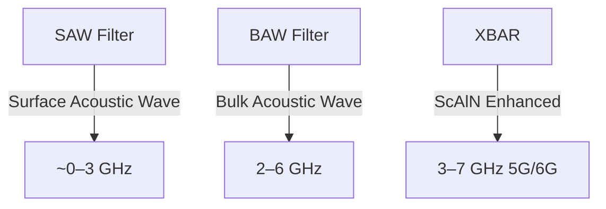

---

# 📡 RFフィルタ技術 / RF Filters  
*RF Filters – From SAW to BAW & XBAR*

---

## 📖 概要 / Overview

RFフィルタはスマートフォンやIoT機器の **RFフロントエンド**に不可欠な要素であり、  
周波数分離・帯域制御を担います。  
*RF filters are essential components in the RF front-end of smartphones and IoT devices, providing frequency separation and bandwidth control.*  

従来は **SAW (Surface Acoustic Wave) フィルタ** が主流でしたが、  
*Traditionally, SAW filters have been dominant,*  
高周波化（5G/6G, >3GHz）に伴い **BAW (Bulk Acoustic Wave) フィルタ**、さらに新興の **XBAR (Cross-sectional BAW, ScAlN系)** が注目されています。  
*With the move to higher frequencies (5G/6G, >3 GHz), BAW and the emerging XBAR (ScAlN-based) are attracting attention.*  

---

## 🔬 技術比較 / Technology Comparison

| 技術 / Technology | 主な材料 / Materials | 周波数帯 / Frequency Band | 特徴 / Features | 課題 / Challenges |
|-------------------|----------------------|---------------------------|-----------------|-------------------|
| **SAW** (Surface Acoustic Wave) | LiNbO₃, LiTaO₃ | ~0.6–2.5 GHz | 低コスト、小型、実績豊富 *Low-cost, compact, mature* | 高周波で特性劣化 *Performance degrades >3 GHz* |
| **BAW** (Bulk Acoustic Wave) | AlN, ScAlN | 2–6 GHz | 高周波対応、Q値高い *High-frequency capable, high Q* | 成膜・応力制御が難しい *Deposition and stress control challenges* |
| **XBAR** (Cross-sectional BAW) | ScAlN | 3–7 GHz | 高周波広帯域、Scドーピングで高性能化 *Wideband, Sc-doping enhanced* | 応力緩和、プロセス安定化課題 *Stress relaxation, process stability* |
| **次世代候補 / Future Candidates** | 超格子、複合構造 *Superlattices, composites* | >7 GHz | 6G以降への拡張可能性 *Potential for beyond-6G* | 研究段階 *Still in research phase* |

---

## 🏗 構造と動作原理 / Structure & Mechanism

### SAW (Surface Acoustic Wave)
- 表面弾性波を利用 *Uses surface acoustic waves*  
- 電極パターンで波を励起し、表面で伝搬 *Excited by electrodes, propagates along surface*  
- 小型・低コストだが、高周波域で損失大 *Compact and low-cost, but suffers loss at high frequencies*  

### BAW (Bulk Acoustic Wave)
- 厚み方向に弾性波が伝搬 *Wave propagates through thickness*  
- **FBAR (薄膜型BAW / Thin-film BAW)**, **SMR (反射鏡型BAW / Bragg reflector type)** が代表  
- AlN/ScAlN 薄膜で共振器を形成 *Resonators formed with AlN/ScAlN thin films*  

### XBAR (Cross-sectional BAW)
- BAWの改良型、新しいモード利用 *Improved BAW, new vibration mode*  
- **ScAlN薄膜の強圧電効果**を活用 *Utilizes strong piezoelectric effect of ScAlN*  
- 広帯域・高周波数領域（5G/6G）に対応可能 *Capable of wideband and high-frequency operation for 5G/6G*  

---

## 📐 模式図 / Schematics

---

## 🔮 展望 / Future Directions

- **6G, Beyond 7 GHz**: 超格子構造、異種材料集積 *Superlattice structures, heterogeneous integration*  
- **高性能化 / Performance Enhancement**: ScAlN高濃度化、ナノ構造応力緩和 *High Sc-doping, nanostructure stress relief*  
- **CMOS集積 / CMOS Integration**: RFフロントエンドSoCとの直接統合 *Direct integration with RF front-end SoCs*  
- **オープン基盤 / Open Knowledge Base**: 教材・研究用のデータベース化 *Databasing for education and research*  

---

## 📚 関連リンク / Related Links

- [README](./README.md)  
- [materials.md](./materials.md)  
- [sensors.md](./sensors.md)  

---

## 👤 著者・ライセンス / Author & License

| 項目 / Item | 内容 / Details |
|-------------|----------------|
| 著者 / Author | 三溝 真一（Shinichi Samizo） |
| GitHub | [Samizo-AITL](https://github.com/Samizo-AITL) |
| ライセンス / License | 教育目的での再配布・改変自由 / 商用利用は要許可 |
