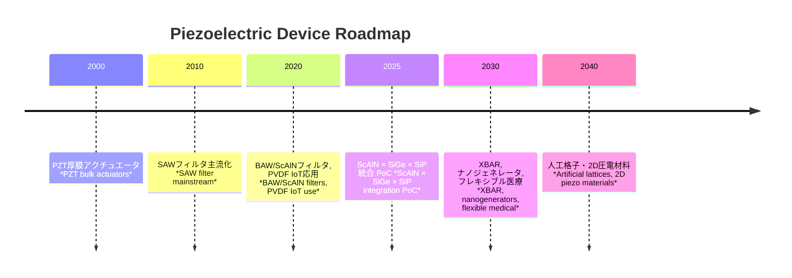

---

# 🛠 圧電デバイスロードマップ / Piezoelectric Devices Roadmap  
*Roadmap for Piezoelectric Devices – Materials × Structures × Applications*

---

## 📖 概要 / Overview

圧電デバイスの将来像を、**材料・構造・応用分野のマトリクス**として整理します。  
*The future vision of piezoelectric devices is organized as a matrix of materials, structures, and applications.*  

従来型（Pb系PZT中心）から、**非鉛・薄膜・集積化・フレキシブル**へと進化が進んでいます。  
*Evolution is underway from traditional Pb-based PZT to lead-free, thin-film, integrated, and flexible technologies.*  

---

## 🔬 マトリクス整理 / Matrix Overview

| 材料 / Material | 構造 / Structure | 応用 / Applications |
|----------------|----------------|----------------------|
| **PZT** | 厚膜バルク *Thick-film bulk* | アクチュエータ、超音波センサー *Actuators, Ultrasonic sensors* |
| **ScAlN** | 薄膜BAW/XBAR *Thin-film BAW/XBAR* | RFフィルタ、MEMSセンサー *RF filters, MEMS sensors* |
| **KNN/BNT** | バルク/セラミック *Bulk/Ceramic* | 高出力アクチュエータ、高温センサー *High-power actuators, High-temp sensors* |
| **ZnO** | ナノワイヤ/薄膜 *Nanowire/Thin-film* | ナノジェネレータ、MEMS *Nanogenerators, MEMS* |
| **PVDF** | フレキシブルフィルム *Flexible films* | ウェアラブル、IoT *Wearables, IoT* |

---

## 📐 技術進化の流れ / Technology Evolution

---

## 🔮 展望 / Future Directions

1. **短期 (〜2025) / Short-term (~2025)**  
   - ScAlN-BAW/XBARの商用展開  
   - PVDFセンサーのウェアラブル応用  
   - **ScAlN × SiGe × SiP 統合PoC**  

2. **中期 (〜2030) / Mid-term (~2030)**  
   - ナノジェネレータを用いた自立駆動IoT  
   - KNN/BNTの高出力アクチュエータ実用化  
   - 医療用PbフリーMEMS超音波の臨床応用  

3. **長期 (〜2040) / Long-term (~2040)**  
   - 人工格子・Aurivillius相・2D圧電材料による新デバイス  
   - 半導体SoCとの完全集積化  
   - 真のポストPZTプラットフォーム構築  

---

## 📚 関連リンク / Related Links

- [README](./README.md)  
- [materials.md](./materials.md)  
- [rf-filters.md](./rf-filters.md)  
- [sensors.md](./sensors.md)  
- [actuators.md](./actuators.md)  
- [energy-harvesting.md](./energy-harvesting.md)  
- [pbfree-strategy.md](./pbfree-strategy.md)  
- [market-strategy.md](./market-strategy.md)  
- [integrated-strategy-map.md](./integrated-strategy-map.md)  
- [scaln-sige-sip.md](./scaln-sige-sip.md)  

---

## 👤 著者・ライセンス / Author & License

| 項目 / Item | 内容 / Details |
|-------------|----------------|
| 著者 / Author | 三溝 真一（Shinichi Samizo）   *Shinichi Samizo* |
| GitHub | [Samizo-AITL](https://github.com/Samizo-AITL) |
| ライセンス / License | 教育目的での再配布・改変自由 / 商用利用は要許可   *Free for educational use, redistribution, and modification / Commercial use requires permission* |
