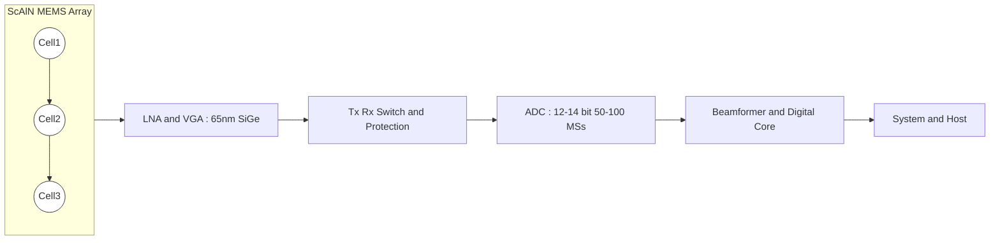

---

# 🔗 ScAlN Array × 65 nm SiGe for SiP Integration  
*ScAlN Ultrasonic MEMS Array × 65 nm SiGe CMOS × System‑in‑Package*

---

## 📖 概要 / Overview  
**Pbフリー ScAlN MEMS アレイ**と、**65 nm SiGe CMOS** を **SiP** で統合するための設計・実装ガイド。  
*Design and implementation guide for integrating a Pb‑free ScAlN MEMS array with 65 nm SiGe CMOS via SiP.*

- **医療・産業向けの超音波センサ**を想定（10–50 MHz）。  
  *Targeting medical and industrial ultrasonic sensing (10–50 MHz).*  
- **CMOS混載必須**：アレイ化に伴う微小信号を **SiGe LNA** で直近増幅。  
  *CMOS co‑integration is essential: micro‑signals from array cells require nearby SiGe LNA.*  
- **SiP**で歩留まり分離・短配線・小型化を両立。  
  *SiP delivers yield separation, short interconnects, and compact form factor.*  

---

## 🎯 目標仕様 / Target Specs  

| 項目 / Item | 仕様（例） / Example Spec |
|---|---|
| **周波数帯 / Band**   *Frequency band* | **10–50 MHz**（医療・NDT想定）   *10–50 MHz (medical / NDT)* |
| **アレイ規模 / Array size**   *Array size* | **64–256 ch**（1D/2D）   *64–256 channels (1D/2D)* |
| **ピッチ条件 / Pitch rule**   *Pitch rule* | **ピッチ ≤ λ/2**（媒体音速 *c*、周波数 *f*）   *Pitch ≤ λ/2 with λ = c/f* |
| **受信感度 / Rx sensitivity**   *Rx sensitivity* | **µV〜mV レベル → LNA必須**   *µV–mV level → LNA required* |
| **封止 / Hermeticity**   *Hermeticity* | **薄膜キャップ or WLP**（医療は気密推奨）   *Thin‑film cap or WLP (hermetic for medical)* |
| **パッケージ / Package**   *Package* | **SiP**（MEMSダイ＋SiGeダイのフリップチップ）   *SiP with flip‑chip MEMS + SiGe dies* |

---

## 📏 アレイ設計の要点 / Array Design Essentials  

**ピッチと波長 / Pitch vs Wavelength**  
*For tissue c ≈ 1540 m/s:*  
- **10 MHz** → λ ≈ 154 µm → **ピッチ ≤ 77 µm**  
*10 MHz → λ ≈ 154 µm → pitch ≤ 77 µm*  
- **20 MHz** → λ ≈ 77 µm → **ピッチ ≤ 38.5 µm**  
*20 MHz → λ ≈ 77 µm → pitch ≤ 38.5 µm*  
- **40 MHz** → λ ≈ 38.5 µm → **ピッチ ≤ 19.25 µm**  
*40 MHz → λ ≈ 38.5 µm → pitch ≤ 19.25 µm*  

**セル構造 / Cell structure**  
- **PMUT系（膜共振）**：薄膜多層（電極/ScAlN/電極）＋キャビティ。  
  *PMUT‑like (plate resonance): thin‑film stack with cavity.*  
- **BAW/XBAR系（高周波向け）**：音響ミラー or 空洞で高Q化。  
  *BAW/XBAR‑like: acoustic mirror or cavity for high Q.*  

---

## 🏗 アーキテクチャ / System Architecture  

**ポイント / Notes**  
- **差動配線 / Differential routing** と **ガードリング / Guard rings**。  
  *Differential routing and guard rings.*  
- **最短配線 / Minimum interconnect length**：MEMS→LNA。  
  *Minimize MEMS‑to‑LNA interconnect.*  
- **PGS付きスパイラル / Spiral with PGS**（必要時）。  
  *Spiral inductors with patterned ground shield (if needed).*  

---

## 🧩 SiP 統合フロー / SiP Integration Flow  

1. **MEMSダイ製造 / Fabricate MEMS die**（ScAlN成膜 → 電極 → エッチ → キャビティ/ミラー → キャップ/WLP）。  
   *ScAlN deposition → electrodes → etch → cavity/mirror → cap/WLP.*  
2. **SiGeダイ調達 / Source SiGe die**（65 nm、LNA/VGA/スイッチ/ADC内蔵 or 近傍）。  
   *Procure 65 nm SiGe die (LNA/VGA/switch/ADC on‑die or nearby).*  
3. **フリップチップ実装 / Flip‑chip assembly**（バンプ、アンダーフィル、再配線）。  
   *Flip‑chip bumps, underfill, redistribution if needed.*  
4. **封止 / Sealing**（薄膜キャップ＋外周樹脂、医療は**気密**推奨）。  
   *Thin‑film cap plus perimeter polymer; hermetic for medical.*  
5. **電気・音響テスト / E‑A test**（ESD、Sパラ、BVD、パルス応答、ノイズ）。  
   *ESD, S‑params, BVD fit, pulse response, noise.*  

---

## ⚙️ アナログ前段 / Analog Front‑end  

| ブロック / Block | 役割 / Role | 設計要点 / Design Notes |
|---|---|---|
| **LNA/チャージアンプ**   *LNA / charge amp* | 微小電荷→電圧変換、SNR向上 | **高インピーダンス入力**, **低ノイズ**, **差動** |
| **T/Rスイッチ & 保護**   *T/R switch & protection* | 送受切替、過大圧保護 | **低オン抵抗**, **ESD対策**, **クランプ** |
| **VGA/AGC**   *VGA / AGC* | ダイナミックレンジ拡大 | **可変ゲイン**, **帯域確保** |
| **ADC** | ビームフォーミング用デジタル化 | **12–14bit**, **50–100 MS/s** 目安 |

---

## 🧪 信頼性・試験 / Reliability & Test  

- **電気**：HBM/MM/CDM、Sパラ、IL/Q、BVDパラメータ。  
  *Electrical: ESD models, S‑params, IL/Q, BVD fitting.*  
- **音響**：場指向性、送受感度、帯域、クロストーク。  
  *Acoustic: beam pattern, Tx/Rx sensitivity, bandwidth, crosstalk.*  
- **環境**：85/85、温度サイクル、滅菌プロセス互換。  
  *Environmental: 85/85, temp cycling, sterilization compatibility.*  

---

## ⚠️ リスクと対策 / Risks & Mitigations  

- **Sc濃度と応力**：高Scでクラック → **対称スタック**・応力調整。  
  *High Sc may crack → symmetric stack and stress tuning.*  
- **粗さ/段差によるQ低下**：**平坦化**・電極Ra管理。  
  *Q loss from roughness/steps → planarity and electrode Ra control.*  
- **湿気劣化**：**薄膜キャップ＋周辺封止**の二重化。  
  *Moisture degradation → dual sealing (thin‑film + perimeter).*  
- **配線ノイズ**：**最短配線・差動**・GND分割。  
  *Interconnect noise → shortest routing, differential, ground partition.*  

---

## 🌍 Pbフリー全面アピール / Lead‑free Advantage  

- **人体に鉛を入れない** → 医療での安心・規制適合。  
  *No lead inside the human body → safety and regulatory fit.*  
- **グリーン設計** → ESG/サステナブルに直結。  
  *Green design → aligned with ESG/sustainability.*  

---

## 🔗 関連 / Links  

- [scaln-on-cmos.md](./scaln-on-cmos.md)  
- [scaln-sige-sip.md](./scaln-sige-sip.md)  
- [scaln-ultrasonic-array.md](./scaln-ultrasonic-array.md)  
- [pbfree-strategy.md](./pbfree-strategy.md)  
- [market-strategy.md](./market-strategy.md)  

---

## 👤 著者・ライセンス / Author & License  

| 項目 / Item | 内容 / Details |
|---|---|
| 著者 / Author | 三溝 真一（Shinichi Samizo）   *Shinichi Samizo* |
| GitHub | [Samizo-AITL](https://github.com/Samizo-AITL) |
| ライセンス / License | 教育目的での再配布・改変自由 / 商用利用は要許可   *Free for educational use, redistribution, and modification / Commercial use requires permission* |
