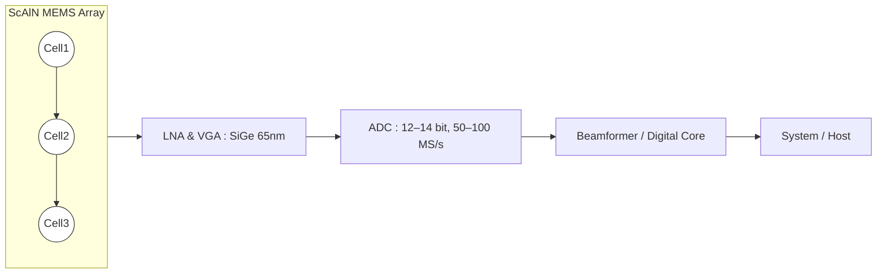

---

# 🔊 ScAlN MEMS アレイ × SiGe/65 nm CMOS × SiP 統合  
*ScAlN MEMS Array × SiGe/65 nm CMOS × System‑in‑Package Integration*

---

## 🌍 Pbフリー全面アピール / Lead-free Advantage  

**「人体に鉛を入れない」**  
*No lead inside the human body*  

**「規制クリア済み」**  
*Pre-aligned with medical and environmental regulations*  

**「次世代グリーン医療デバイス」**  
*Next-generation green medical device platform*  

- **医療規制適合**：EU RoHS, REACH, FDA → Pb使用制限を回避。  
  *Medical compliance: EU RoHS, REACH, FDA → avoid Pb restrictions.*  
- **環境価値**：グリーン医療・ESG投資に直結。  
  *Environmental value: directly aligned with green healthcare and ESG investment.*  
- **差別化**：PZT依存の大手に対し、世界初の「Pbフリー MEMS 超音波」を前面に出せる。  
  *Differentiation: Position as the world’s first “Pb-free MEMS ultrasonic” against PZT incumbents.*  

---

## 📖 概要 / Overview  
本ドキュメントでは、**ScAlN MEMS アレイ**と **SiGe/65 nm CMOS** を **SiP (System‑in‑Package)** で統合する現実的プラットフォームを整理する。  
*This document outlines a practical platform integrating ScAlN MEMS arrays with SiGe/65 nm CMOS using System‑in‑Package (SiP) technology.*

- **Pbフリー**：医療・安全分野で必須。  
  *Lead‑free: essential for medical and safety applications.*  
- **高周波対応**：超音波 (10–50 MHz), RF BAW/XBAR (sub‑6G)。  
  *High‑frequency support: ultrasonic (10–50 MHz), RF BAW/XBAR (sub‑6G).*  
- **高感度**：SiGe CMOS LNA/VGA で微小信号を検出。  
  *High sensitivity: detect micro‑signals with SiGe CMOS LNA/VGA.*  
- **高信頼性**：SiP で歩留まり分離、短配線でSNR確保。  
  *High reliability: SiP yield separation, short interconnect for SNR.*  

---

## 🧠 採用理由 / Rationale  

1. **ScAlN MEMS アレイ**  
   *ScAlN MEMS Array*  
   - Pbフリー材料、環境規制に対応。  
     *Lead‑free material, compliant with environmental regulations.*  
   - 高周波帯での圧電性能が優れる。  
     *Superior piezoelectric performance at high frequency.*  
   - CMOS後工程MEMS化も可能。  
     *Post‑CMOS MEMS integration possible.*  

2. **SiGe / 65 nm CMOS**  
   *SiGe / 65 nm CMOS*  
   - LNA, VGA, Txドライバに最適。  
     *Ideal for LNA, VGA, Tx drivers.*  
   - 雑音指数 (NF) の改善、ADC/デジタル統合も容易。  
     *Improved NF, easy integration of ADC/digital.*  
   - 0.18 µmより高性能、28 nm FinFETより低コスト。  
     *Higher performance than 0.18 µm, lower cost than 28 nm FinFET.*  

3. **SiP (System‑in‑Package)**  
   *SiP (System‑in‑Package)*  
   - MEMSとCMOSを別ダイで最適化しつつ、短配線で統合。  
     *Optimize MEMS and CMOS separately, integrate with short interconnect.*  
   - 歩留まりリスクを分離し、量産性を確保。  
     *Separate yield risk, ensure manufacturability.*  
   - 将来的なモノリシック統合へのステップアップが可能。  
     *Scalable to monolithic integration in the future.*  

---

## 🏗 アーキテクチャ / Architecture  

---

## 📐 特徴 / Key Features  

| 項目 / Item | 内容 / Details |
|---|---|
| 材料 / Material   *Material* | ScAlN 薄膜 (Pbフリー, CMOS互換)   *ScAlN thin film (Pb‑free, CMOS compatible)* |
| 周波数 / Frequency   *Frequency* | 超音波 10–50 MHz, RF sub‑6G   *Ultrasonic 10–50 MHz, RF sub‑6G* |
| 集積度 / Integration   *Integration* | 64–256 ch アレイ   *64–256 channel array* |
| 検出回路 / Sensing Circuit   *Sensing Circuit* | 高インピーダンス LNA, チャージアンプ   *High‑impedance LNA, charge amplifier* |
| CMOSノード / CMOS Node   *CMOS Node* | SiGe / 65 nm   *SiGe / 65 nm* |
| パッケージ / Package   *Package* | SiP (System‑in‑Package)   *SiP (System‑in‑Package)* |
| 将来拡張 / Roadmap   *Roadmap* | モノリシック統合, 28 nm RF‑CMOS   *Monolithic integration, 28 nm RF‑CMOS* |

---

## ⚖️ メリット / Advantages  

- **医療適合**：非鉛、滅菌・バイオ互換性に対応。  
  *Medical compliance: lead‑free, sterilization and bio‑compatibility supported.*  
- **高感度**：SiGe/65 nm CMOS による低雑音・高ゲイン。  
  *High sensitivity: low noise and high gain with SiGe/65 nm CMOS.*  
- **高信頼性**：SiP で歩留まり分離、パッケージ内で短配線化。  
  *High reliability: yield separation and short interconnect in package.*  
- **量産性**：成熟ノードとMEMSを組み合わせ、コスト最適化。  
  *Manufacturability: mature node + MEMS, cost‑optimized.*  
- **拡張性**：将来的にモノリシック統合や先端ノードへ移行可能。  
  *Scalability: future monolithic integration and advanced nodes possible.*  

---

## 🏗 製造・調達・統合 / Manufacturing, Procurement & Integration  

| 🔧 **項目 / Item** | 📝 **内容 / Details** |
|---|---|
| 🧪 **ScAlN MEMS アレイの製造**   *Fabrication of ScAlN MEMS Array* | **基板準備**：Si基板   *Si substrate preparation*    **下部電極**：Mo/TiN/AlCu   *Bottom electrode (Mo/TiN/AlCu sputtering & patterning)*    **ScAlN成膜**：250–350 °C, Sc=0.1–0.3   *ScAlN sputtering at 250–350 °C, Sc fraction 0.1–0.3*    **上部電極**：Mo/Al薄膜   *Top electrode (Mo/Al thin film)*    **共振器形成**：ICPエッチ (Cl₂/BCl₃/Ar)   *Resonator definition via ICP etch*    **空洞/ミラー**：FBAR or SMR (SiO₂/SiN λ/4)   *Cavity (FBAR) or Acoustic mirror (SMR, SiO₂/SiN λ/4 stack)*    **キャップ&封止**：薄膜 or WLP   *Thin-film cap or Wafer-Level Packaging*    **管理項目**：Ra<2–3 nm, 熱≦400 °C, 応力制御   *Ra<2–3 nm, ≤400 °C thermal budget, stress management* |
| ⚙️ **SiGe / 65 nm CMOS 調達**   *Procurement of SiGe / 65 nm CMOS* | **供給元**：GF (SiGe BiCMOS), TowerJazz, TSMC RF   *Suppliers: GF (SiGe BiCMOS), TowerJazz, TSMC RF*    **利点**：高性能LNA/VGA/Tx, PDK完備, コスト性能バランス良好   *Advantages: High-performance LNA/VGA/Tx, rich PDK, balanced cost-performance*    **方針**：設計は内製, 製造は外部ファウンドリ供給   *Policy: Design in-house, wafer supply from external foundries* |
| 📦 **SiP 統合**   *SiP Integration* | **方式**：Flip-chip / 2.5Dインターポーザ / Module SiP   *Modes: Flip-chip / 2.5D interposer / Module SiP*    **統合フロー**：MEMS製造 → CMOS調達 → パッケージ統合 (Flip-chip/TSV) → 気密封止 (Cap/WLP) → テスト&キャリブレーション   *Integration flow: MEMS fabrication → CMOS procurement → Package integration (Flip-chip/TSV) → Hermetic sealing (Cap/WLP) → Test & calibration*    **利点**：歩留まり分離, 短配線による高SNR, プロトタイプ開発が速い   *Advantages: Yield separation, high SNR with short interconnect, fast prototyping* |

---

## 🧭 推奨ロードマップ / Suggested Roadmap  

1. **Phase 1**：ScAlN MEMS アレイ単体評価 (感度, 周波数, BW, Q)。  
   *Phase 1: Standalone ScAlN MEMS array evaluation (sensitivity, frequency, BW, Q).*  
2. **Phase 2**：SiP統合 (ScAlN MEMS + SiGe/65 nm LNA/ADC)。  
   *Phase 2: SiP integration (ScAlN MEMS + SiGe/65 nm LNA/ADC).*  
3. **Phase 3**：医療・産業応用 (安全規格, 滅菌試験, 長期信頼性)。  
   *Phase 3: Medical/industrial applications (safety standards, sterilization, long-term reliability).*  
4. **Phase 4**：将来的にモノリシック統合や28 nm RF-CMOSへ展開。  
   *Phase 4: Migration to monolithic integration or 28 nm RF-CMOS.*  

---

## 📚 関連 / Links  

- [scaln-on-cmos.md](./scaln-on-cmos.md)  
- [scaln-ultrasonic-array.md](./scaln-ultrasonic-array.md)  
- [sensors.md](./sensors.md)  
- [materials.md](./materials.md)  

---

## 👤 著者・ライセンス / Author & License  

| 項目 / Item | 内容 / Details |
|---|---|
| 著者 / Author | 三溝 真一（Shinichi Samizo）   *Shinichi Samizo* |
| GitHub | [Samizo-AITL](https://github.com/Samizo-AITL) |
| ライセンス / License | 教育目的での再配布・改変自由 / 商用利用は要許可   *Free for educational use, redistribution, and modification / Commercial use requires permission* |
