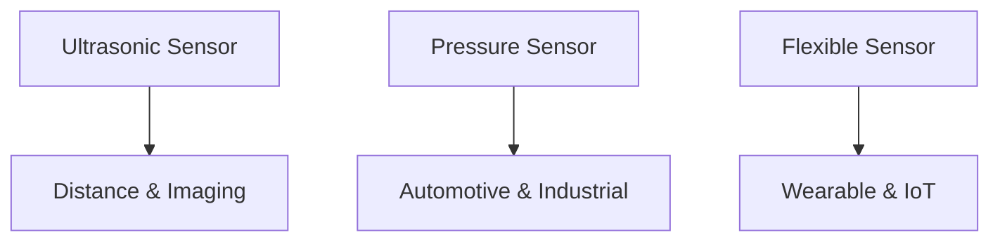

---

# 🎛 圧電センサー技術 / Piezoelectric Sensors  
*Piezoelectric Sensors – Ultrasonic, Pressure, Flexible*

---

## 📖 概要 / Overview

圧電センサーは、機械的エネルギーを電気信号に変換する素子です。  
*Piezoelectric sensors convert mechanical energy into electrical signals.*  

応用は広く、**超音波センサー、圧力センサー、加速度センサー、フレキシブルウェアラブル**にまで及びます。  
*Applications range from ultrasonic, pressure, and acceleration sensors to flexible wearables.*  

---

## 🔬 主なタイプ / Major Types

### 📡 超音波センサー / Ultrasonic Sensors
- 圧電素子で超音波を送受信 *Transmit and receive ultrasound via piezoelectric transducers*  
- 距離測定、流量計測、医用イメージングに利用 *Used in distance sensing, flow measurement, and medical imaging*  
- MEMS化により小型・低消費電力化が進行中 *Miniaturization and low power consumption advancing through MEMS integration*  

### 🕹 圧力・振動センサー / Pressure & Vibration Sensors
- 外力で電荷発生 → 検出回路で読み出し *External force generates charges, read out by circuits*  
- 車載、産業機器、安全システムに応用 *Applications in automotive, industrial, and safety systems*  
- 高温動作にはKNN/BNT系材料が有効 *KNN/BNT materials suitable for high-temperature operation*  

### 👕 フレキシブルセンサー / Flexible Sensors
- PVDFやZnOナノワイヤを用いた柔軟基板デバイス *Flexible substrates using PVDF or ZnO nanowires*  
- ウェアラブルデバイス、ヘルスケア、IoT向け *Wearables, healthcare, and IoT applications*  
- 印刷技術やロール・トゥ・ロール製造と親和性高い *Compatible with printing and roll-to-roll manufacturing*  

---

## 📐 模式図 / Schematic

---

## ⚖️ 材料選択のポイント / Material Selection Points

| 応用 / Application | 推奨材料 / Recommended Materials | 特徴 / Features |
|--------------------|--------------------------------|----------------|
| 超音波 / Ultrasonic | PZT, ScAlN | 高感度、医療用途で実績 *High sensitivity, proven in medical* |
| 圧力 / Pressure | KNN, BNT | 高温安定性 *High thermal stability* |
| フレキシブル / Flexible | PVDF, ZnO | 柔軟・印刷可能 *Flexible, printable* |

---

## 🔮 展望 / Future Directions

- **CMOS集積 / CMOS Integration**: センサー回路と同一チップ化 *On-chip integration with sensor circuits*  
- **高周波超音波 / High-frequency Ultrasound**: MEMS ScAlNで医用分解能向上 *Medical imaging resolution enhanced by MEMS ScAlN*  
- **フレキシブルIoT / Flexible IoT**: PVDF系でウェアラブルの普及加速 *PVDF-based sensors to accelerate wearable IoT adoption*  

---

## 📚 関連リンク / Related Links

- [README](./README.md)  
- [materials.md](./materials.md)  
- [rf-filters.md](./rf-filters.md)  

---

## 👤 著者・ライセンス / Author & License

| 項目 / Item | 内容 / Details |
|-------------|----------------|
| 著者 / Author | 三溝 真一（Shinichi Samizo） |
| GitHub | [Samizo-AITL](https://github.com/Samizo-AITL) |
| ライセンス / License | 教育目的での再配布・改変自由 / 商用利用は要許可 |
