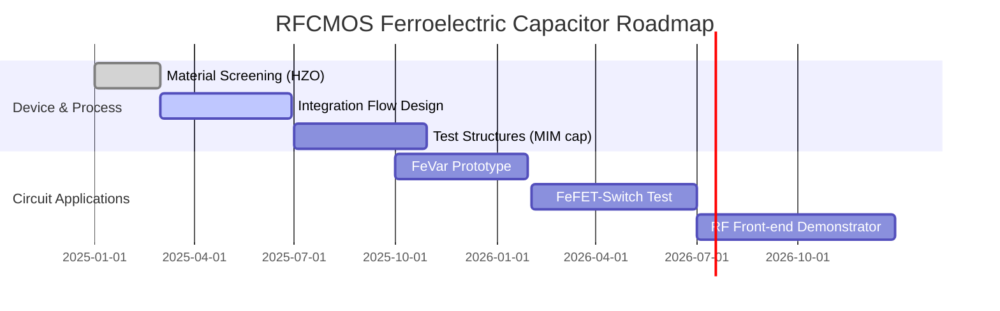

---

# 📡 0.18µm RFCMOS Capacitor Formation — 実現型フロー  
*0.18µm RFCMOS Capacitor Formation — Realization-oriented Flow*

---

## 🧭 概要 / Overview  

本資料は **0.18µm FeRAMプロセス**をベースに、  
実際のRF CMOSプロセスとの整合性を考慮して「キャパシタ形成工程」を再設計したものです。  

*This document reconstructs the **capacitor formation flow** based on the 0.18µm FeRAM process, optimized for compatibility with actual RFCMOS technology.*  

- PZT系ではなく **HfZrO₂ (HZO) 強誘電膜** を採用  
- **水素シンター耐性**があるため、CMOS標準BEOLと整合  
- **再構成可能RFデバイス (FeVar, FeFET-Switch)** への実装を視野に入れた流れ  

---

## 🔽 RFCMOSキャパシタ形成工程（実現型） / *RFCMOS Capacitor Formation Steps (Realization-oriented)*  

| 工程 / Step | 処理内容 / Description |
|-------------|--------------------|
| **TI1-SP（下部電極）** | TiNスパッタ下部電極（バリア＋導電性）。 *Bottom TiN electrode (barrier + conductive).* |
| **HZO-ALD** | HfZrO₂薄膜をALD堆積（厚さ5–10nm）。 *HfZrO₂ layer by ALD, 5–10nm.* |
| **HZO-ANL** | RTA 400–450℃ O₂ / N₂雰囲気で結晶化（正方晶/斜方晶）。 *RTA at 400–450℃ in O₂/N₂ for crystallization (tetragonal/orthorhombic).* |
| **CAP-TUN** | TiN/TiAlNキャップ層による界面制御。 *TiN/TiAlN cap layer for interface control.* |
| **TI2-SP（上部電極）** | TiNまたはTaN上部電極。配線接続のバッファ機能。 *Top electrode (TiN/TaN), acts as wiring buffer.* |
| **RFCAP-PH/ET** | キャパシタパターン形成（Ar RIE/IBE）。 *Patterning by Ar-RIE or IBE.* |

📘 **解説 / Explanation**  
- **HfZrO₂はCMOS標準の420℃水素シンターに耐性** → BEOLと完全整合。  
- **キャップ層 (TiN/TiAlN)** を用いて結晶相安定化と界面リーク低減を実現。  
- 実装ターゲットは **不揮発Varactor (FeVar)** や **FeFET-Switch**。  

---

## ⚖️ 従来PZTとの比較 / *Comparison with Conventional PZT*  

| 項目 / Item | PZT FeRAM | HfZrO₂ RFCMOS |
|-------------|-----------|---------------|
| CMOS互換性 | 低（H₂耐性なし、専用工程必要） | 高（標準BEOL対応） |
| 結晶化温度 | 高温（600–700℃） | 低温（400–450℃） |
| 保護膜 | 必須（AlOx二重層など） | 原則不要 |
| 応用性 | メモリキャパシタ限定 | RF可変素子 / FeFET / 不揮発Varactor |

---

## 🗓️ 実現ロードマップ / *Realization Roadmap*  

---

## 🔗 関連リンク / *Related Links*  

| リンク / Link | 内容 / Description |
|---|---|
| 📘 [0.18µm FeRAM Process Flow（完全版）](https://samizo-aitl.github.io/Edusemi-v4x/d_chapter1_memory_technologies/doc_FeRAM/feram_full_process_table) | FeRAMプロセスフロー完全版 *Full FeRAM process flow* |
| 📘 [Proposal CMOS混載型RFデバイス](./proposal.md) | CMOS混載型RFデバイス提案 *Proposal of CMOS-integrated RF devices* |
| 📘 [0.18µm RFCMOS Process Flow](./018um_rfcapacitor_extracted.md) | RFCMOSキャパシタ派生版プロセス *RFCMOS-derived capacitor flow* |
| 🔬 [0.18µm CMOSロジックプロセス](https://samizo-aitl.github.io/Edusemi-v4x/chapter3_process_evolution/docs/0.18um_Logic_ProcessFlow) | CMOSロジックプロセス教材 *CMOS logic process educational model* |

---

## 👤 Author & License  

| 項目 / Item | 詳細 / Details |
|---|---|
| **著者 / Author** | 三溝 真一（Shinichi Samizo） |
| **Email** |  |
| **X** |  |
| **GitHub** |  |
| **ライセンス / License** |    再配布・改変自由 / *Free to use, modify, redistribute (non-commercial)* |
