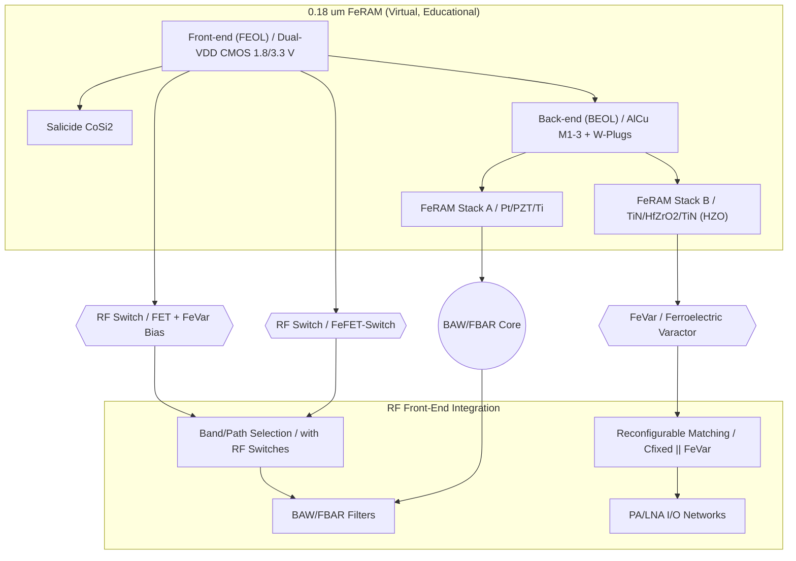

---

# 📡 RF・可変素子 / RF & Tunable Devices  

---

## 🔗 リンク / Links  

| Link | Badge |
|---|---|
| 🌐 View Site |  |
| 📂 View Repo |  |

---

# Part 1️⃣ 現行RFデバイスの紹介 / Current RF Devices  

## 📘 概要 / Overview
現行のRF通信モジュールは、スマートフォン・IoT・車載を中心に巨大市場を形成しており、  
**FBAR/BAWフィルタ**や**SOI RFスイッチ**を核とする **RFフロントエンドモジュール（FEM）** が標準構成です。  
*Current RF modules form a major market around smartphones, IoT, and automotive, with FBAR/BAW filters and SOI RF switches as the core of RF FEMs.*  

---

## 🔑 主な構成要素 / Key Components  

| デバイス / Device | 現状技術 / Current Tech | 主要プレーヤー / Major Players | 特徴 / Characteristics |
|---|---|---|---|
| **BAW/FBAR フィルタ** | AlN, ScAlN ベース薄膜共振器 | Murata, Broadcom, Qorvo, Skyworks | 高Q, 高周波対応, 量産済 |
| **RFスイッチ** | SOI-CMOSベースFETスイッチ | Qorvo, Skyworks, pSemi | 挿入損失小, 既に標準化 |
| **チューナブル素子** | MEMS可変C, GaAs Varactor（限定） | niche | 実用は少数、主に研究レベル |
| **RF FEMモジュール** | Filter + Switch + LNA/PA | Murata, Broadcom, Qualcomm | 複合SiP, アンテナ直結 |

---

## 📈 市場トレンド / Market Trends
- **多バンド化によるフィルタ爆発**：スマホは数十個のBAW/FBARフィルタを搭載  
- **高周波化 (5G FR1/FR2, 6G準備)**：3–6 GHz帯 → mmWave帯へ  
- **小型・低コスト化**：アンテナ直結SiP, Antenna-in-Package化が進展  
- **課題**：  
  - 固定特性で柔軟性がない  
  - フィルタ数増加によるコスト・サイズ増  
  - 挿入損失・熱信頼性の制約  

---

# Part 2️⃣ CMOS混載型RFデバイスの提案 / Proposal: CMOS-integrated RF Devices  

## 🧭 起点：0.18 µm FeRAM 仮想プロセス  
本提案は、三溝真一による **教育目的の仮想プロセスモデル**  
「0.18 µm FeRAM プロセス」を基盤として、RFデバイスへの応用展開を行うものです。  
*Based on Shinichi Samizo’s educational “0.18 µm FeRAM virtual process,” this proposal expands into RF devices.*  

---

## 🔄 提案デバイス群 / Proposed Devices

| デバイス / Device | 提案内容 / Proposal | 差別化ポイント / Differentiation |
|---|---|---|
| **FeVar (Ferroelectric Varactor)** | HfO₂系強誘電体を用いた不揮発可変キャパシタ | 再構成可能, 不揮発設定保持 |
| **FeFET-Switch** | HZO局所ゲートスタックを利用したRFスイッチ | CMOS互換, 低コスト集積 |
| **BAW/FBAR (Edu ver.)** | PZT/HfO₂薄膜共振器を用いた教育モデル | 薄膜積層の共振利用, 教育起点の簡易設計 |

---

## 📚 系譜図 / Process Lineage

---

## 📊 市場展開シナリオ / Market Deployment

- **ターゲット応用**  
  - IoT：アンテナ自動調整・不揮発設定保持  
  - Automotive：V2X・高温補償RF  
  - 6G：再構成可能RFフロントエンド  
- **提供形態**  
  - RF IPセル（FeVar, Switch, FilterのPDK）  
  - リファレンス回路（Matching, Path Select）  
  - 教育評価基板（Sパラ測定, 実演）  

---

## 🗂️ 著者・ライセンス / Author & License

| 項目 / Item | 詳細 / Details |
|---|---|
| **著者 / Author** | 三溝 真一（Shinichi Samizo） |
| **Email** |  |
| **X** |  |
| **GitHub** |  |
| **ライセンス / License** |    再配布・改変自由（教育目的） / *Free for educational use*   商用利用は別途許可 / *Commercial use requires separate permission* |

---

## ⬆️ Applied Devices へ戻る / Back to Applied Devices

| Link | Badge |
|---|---|
| 🌐 **カテゴリへ戻る** |  |
| 📂 **リポジトリへ戻る** |  |
