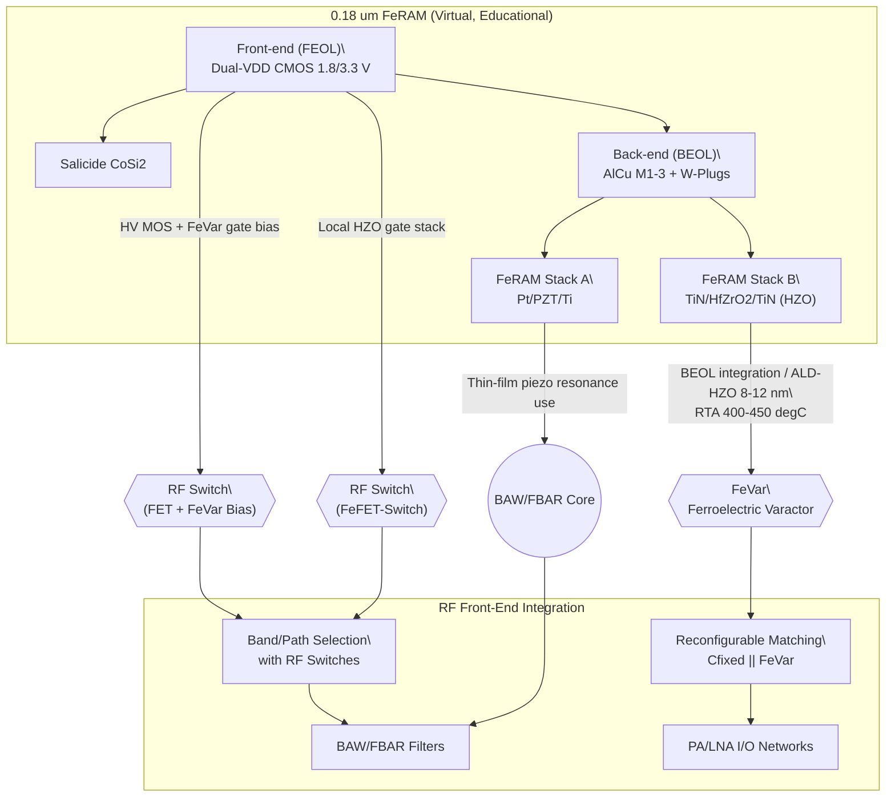
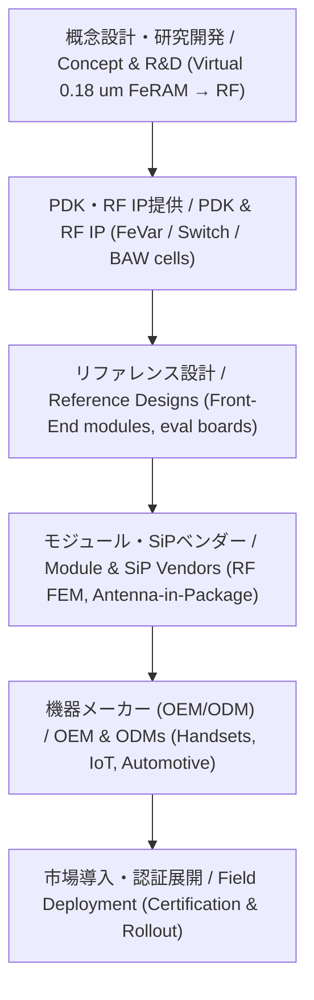
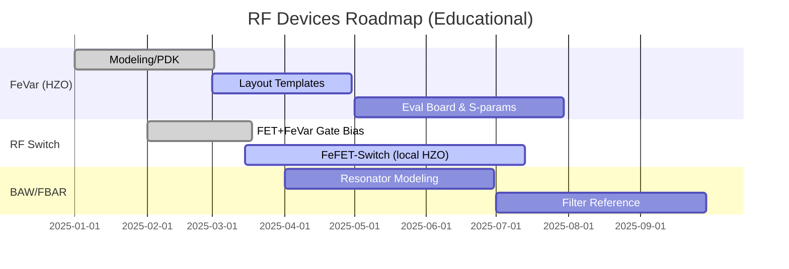

---

# 📡 RF・可変素子 / RF & Tunable Devices  
*RF & Tunable Devices*

---

## 🔗 リンク / Links  

| Link | Badge |
|---|---|
| 🌐 View Site |  |
| 📂 View Repo |  |

---

## 📘 概要 / Overview  
*Overview*

本カテゴリでは、**RF通信・高周波回路で利用される可変素子・スイッチングデバイス**を整理します。  
*This category covers tunable devices and switching elements used in RF communication and high-frequency circuits.*

例として：  
- **強誘電体可変キャパシタ（FeVar, HfO₂系など）**  
- **RFスイッチ（FeFET, MEMS, SOI-CMOSベース）**  
- **FBAR / BAWフィルタ（AlN, ScAlN, HfO₂ベース）**  
- **再構成可能RFフロントエンド**  

---

## 🔄 0.18 µm FeRAM からの展開 / Expansion from 0.18 µm FeRAM

本カテゴリは、三溝真一による **教育目的の仮想プロセスモデル**  
「0.18 µm FeRAM プロセス」を基盤として、RF領域へ応用展開されます。  
*This category builds on the **virtual process model for educational purposes** “0.18 µm FeRAM process” proposed by Shinichi Samizo,  
and expands it toward RF devices.*

- **強誘電キャパシタ（Pt/PZT/Ti, HfO₂系）** → RFフロントエンド用の可変キャパシタ（FeVar）  
- **高耐圧MOS + FeRAMキャパシタ統合** → RFスイッチ素子（FeFET, Reconfigurable Switch）  
- **PZT薄膜積層の共振利用** → FBAR/BAWフィルタへ応用  

> ⚠️ **注意 / Note**  
> ここで参照する「0.18 µm FeRAM プロセス」は、教育目的で設計された**仮想プロセス**であり、  
> 実在の製品・企業機密・製造フローとは一切関係ありません。  
> *The “0.18 µm FeRAM process” referenced here is a **virtual process for educational purposes** and is not related to any actual product, proprietary process, or confidential information.*

---

## 🧭 図解：0.18 µm FeRAM → RFデバイス系譜  
*Process lineage from the 0.18 µm FeRAM virtual process to RF devices*

---

## 📚 サブトピック / Sub-topics  
*Sub-topics*

| デバイス / Device | 概要（JP） | *Summary (EN)* | Link |
|---|---|---|---|
| 🧩 **Ferroelectric Varactors** | HfO₂系強誘電体を用いた可変キャパシタ | *HfO₂-based ferroelectric tunable capacitors* | [ferroelectric-varactors](./ferroelectric-varactors.md) |
| 🔀 **RF Switches** | FeFET/MEMS/SOIによるRFスイッチ | *RF switches using FeFET, MEMS, or SOI* | [rf-switches](./rf-switches.md) |
| 📡 **BAW/FBAR Devices** | AlN/ScAlNやHfO₂を用いた高周波フィルタ | *High-frequency filters using AlN/ScAlN or HfO₂* | [baw-fbar](./baw-fbar.md) |

---

## 🧩 市場への展開 / Market Deployment  

### 1) バリューチェーンと供給形態  
*Value chain & deliverables*

- **教育起点の強み**：仮想プロセス → 実装テンプレ → 参照設計 という流れを一気通貫で提示可能  
- **提供形態**：  
  - RF 可変素子 IP セット（FeVar/スイッチのセル＋モデル）  
  - リファレンス・マッチネット（周波数別テンプレ）  
  - 評価基板（Sパラ測定・P1dB/IIP3実演）

---

### 2) アプリケーション・マップ  
*Application map*

| Segment | Use-case | Goal Specs (目安) | Note |
|---|---|---|---|
| **Smartphone RF FEM** | Band selection, tunable matching | IL ≤ 0.5 dB（switch）, Q@2–6 GHz > 30（FeVar） | 多バンド最適化・小型化 |
| **Wi-Fi (2.4/5/6 GHz)** | Antenna tuning / reconfig | S11 ≤ −10 dB、IIP3高め | 筐体差の補正 |
| **IoT (Sub-GHz/2.4 GHz)** | Antenna trimming | 低電力・不揮発設定保持 | バッテリ寿命重視 |
| **Automotive (V2X/Telematics)** | Harsh temp drift comp. | −40〜125 °Cドリフト補償 | 信頼性・AEC-Q |
| **Infrastructure (Sub-6/FR1)** | Reconfigurable front-end | 高IP3、耐電力 | PA側整合補助 |

---

### 3) TRL（技術成熟度）とロードマップ（教育モデル）
*TRL & roadmap (educational model)*

- **TRL 目安**：FeVar（5–6） → Switch（4–5） → BAW/FBAR（3–4）  
- **マイルストーン**：PDK公開 → 参照設計 → 評価基板 → 認証支援  

---

## 👤 **著者・ライセンス / Author & License**

| **項目 / Item** | **内容 / Details** |
|-----------------|--------------------|
| **著者 / Author** | 三溝 真一（Shinichi Samizo） |
| **Email** |  |
| **X** |  |
| **GitHub** |  |
| **ライセンス / License** |    再配布・改変自由（教育目的） / *Free for educational use, redistribution, and modification*   商用利用は別途許可が必要 / *Commercial use requires separate permission* |

---

## ⬆️ Applied Devices へ戻る / Back to Applied Devices  

| Link | Badge |
|---|---|
| 🌐 **カテゴリへ戻る / Back to Category** |  |
| 📂 **リポジトリへ戻る / Back to Repo** |  |
