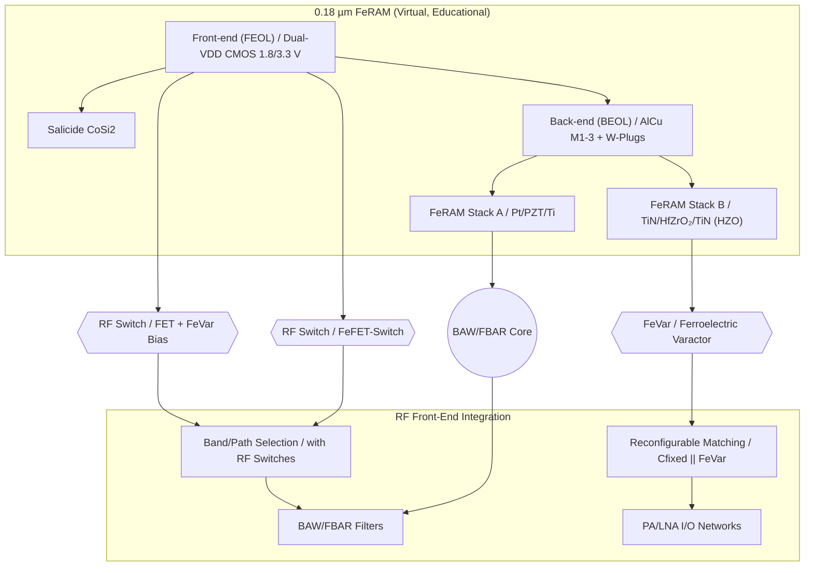

---

# 💡 CMOS混載型RFデバイス提案  
*Proposal: CMOS-integrated RF Devices*

---

## 📘 概要 / Overview  

本提案は、三溝真一による **教育目的の仮想プロセス**「0.18 µm FeRAM」を起点に、  
**CMOS混載型RFデバイス**を応用展開するものです。  

*This proposal expands the virtual educational 0.18 µm FeRAM process into CMOS-integrated RF devices.*

---

## 🔄 提案デバイス群 / Proposed Devices  

| デバイス / Device | 提案内容 / Proposal | 差別化ポイント / Differentiation |
|---|---|---|
| **FeVar (Ferroelectric Varactor)** | HfO₂系強誘電体を用いた不揮発可変キャパシタ | 再構成可能, 不揮発設定保持 |
| **FeFET-Switch** | HZO局所ゲートスタックを利用したRFスイッチ | CMOS互換, 低コスト集積 |
| **BAW/FBAR (Edu ver.)** | PZT/HfO₂薄膜共振器を用いた教育モデル | 薄膜積層の共振利用, 教育起点の簡易設計 |

---

## 📚 系譜図 / Process Lineage  

---

## 📊 市場展開シナリオ / Market Deployment  

- **ターゲット応用**  
  - IoT：アンテナ自動調整・不揮発設定保持  
  - Automotive：V2X・高温補償RF  
  - 6G：再構成可能RFフロントエンド  
- **提供形態**  
  - RF IPセル（FeVar, Switch, FilterのPDK）  
  - リファレンス回路（Matching, Path Select）  
  - 教育評価基板（Sパラ測定, 実演）  

---

## 👤 Author & License  

| 項目 / Item | 詳細 / Details |
|---|---|
| **著者 / Author** | 三溝 真一（Shinichi Samizo） |
| **Email** |  |
| **X** |  |
| **GitHub** |  |
| **ライセンス / License** |    再配布・改変自由（教育目的） / *Free for educational use*   商用利用は別途許可 / *Commercial use requires separate permission* |
