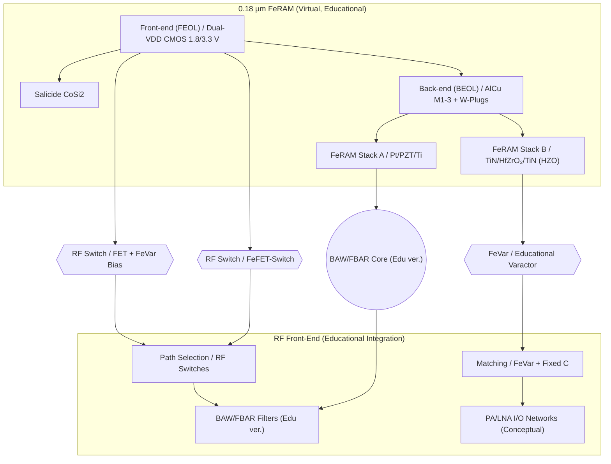

---

# 💡 CMOS混載型RFデバイス提案（教育モデル）  
*Proposal: CMOS-integrated RF Devices (Educational Model)*

---

## 📘 概要 / Overview  

本提案は、三溝真一による **教育目的の仮想プロセス**「0.18 µm FeRAM」を起点に、  
**CMOS混載型RFデバイス**を教材として展開するものです。  

*This proposal expands the virtual educational 0.18 µm FeRAM process into CMOS-integrated RF devices for learning purposes.*  

👉 実在の製品・企業・製造プロセスとは無関係です。  
👉 The contents are **purely educational models**, unrelated to actual products or proprietary processes.  

---

## 🔄 提案デバイス群 / Proposed Educational Models  

| デバイス / Device | 教育モデル内容 / Educational Focus | 学習ポイント / Learning Focus |
|---|---|---|
| **FeVar (Ferroelectric Varactor)** | HfO₂系強誘電体を用いた不揮発可変キャパシタの概念モデル | 不揮発設定保持・再構成可能回路の原理 |
| **FeFET-Switch** | HZO局所ゲートスタックを利用したCMOS互換RFスイッチ | CMOS整合性・集積化の考え方 |
| **BAW/FBAR (Edu ver.)** | PZT/HfO₂薄膜共振器の教育用近似モデル | 薄膜積層による共振・フィルタ応用の理解 |

---

## 📚 系譜図 / Process Lineage  

---

## 📖 学習の背景 / *Educational Background*  

- 現行のRFフロントエンドは **FBAR/BAW + SOIスイッチ** を中心に構成される。  
- 本教材では、それらの技術を「教育的観点で再現・簡略化」し、  
  **CMOS混載のメリット**を理解することを目的とする。  

*Today’s RF front-ends rely heavily on FBAR/BAW + SOI switches.  
This educational model simplifies and reinterprets these technologies to illustrate the concept of CMOS integration.*  

---

## ⚖️ 学習用比較表 / *Comparison for Learning*  

| 技術 / Technology | 教育的特徴 / Educational Focus | 制約 / Limitations |
|---|---|---|
| **SOI-CMOS Switch** | 実際のFEMで広く使用されている | 本教材では概念のみ扱う |
| **GaAs FET** | 高周波特性の参考技術 | 高コスト実装は教材対象外 |
| **MEMS Switch** | 超低損失の例として紹介 | 信頼性・寿命議論は割愛 |
| **Varactor** | アンテナチューニングに応用 | 外付け実装の例示のみ |
| **本提案 (FeVar/FeFET)** | CMOS互換・教育起点の理解 | 実用プロセス検証は対象外 |

---

## 🗓️ ロードマップ（教育モデル） / *Educational Roadmap*  

- **TRL目安（教育モデル）**  
  - FeVar：TRL 4（回路シミュレーション教材段階）  
  - FeFET Switch：TRL 3（素子概念モデル段階）  
  - BAW/FBAR：TRL 2–3（モデル化段階）  

---

## 📝 まとめ / *Conclusion (Educational)*  

- **教育的意義**: FeRAM派生デバイスを通じて「ロジック＋メモリ＋RF統合設計」の基礎を学ぶ。  
- **教材化の狙い**: CMOS互換性を持つ強誘電体素子を例に、再構成可能RFの基本概念を理解する。  
- **今後の展望**: HfZrO₂採用など、CMOS整合性が高い新材料による教育効果の強化。  

---

## 🔗 関連教材リンク / *Related Educational Links*  

| リンク / Link | 内容 / Description |
|---|---|
| 📘 [0.18µm FeRAM Process Flow（完全版）](https://samizo-aitl.github.io/Edusemi-v4x/d_chapter1_memory_technologies/doc_FeRAM/feram_full_process_table) | FeRAMプロセスフロー完全版（教育モデル） *Full FeRAM process flow (educational model)* |
| 📘 [FeRAM特有工程の詳細解説](https://samizo-aitl.github.io/Edusemi-v4x/d_chapter1_memory_technologies/doc_FeRAM/0.18um_FeRAM_ProcessFlow) | PZTキャパシタ・AlOx保護膜・水素還元対策の詳細 *Detailed FeRAM-specific steps: capacitor, AlOx, H₂ mitigation* |
| 📘 [0.18µm RFCMOS Process Flow（教育モデル）](./018um_rfcmos_processflow.md) | RFCMOS派生版プロセスフロー（教育モデル） *Derived RFCMOS process flow (educational model)* |
| 🔬 [0.18µm CMOSロジックプロセス](https://samizo-aitl.github.io/Edusemi-v4x/chapter3_process_evolution/docs/0.18um_Logic_ProcessFlow) | 0.18µm CMOSロジックプロセス教材 *0.18µm CMOS logic process (educational)* |
| 📐 [MOSトランジスタの特性と信頼性](https://samizo-aitl.github.io/Edusemi-v4x/chapter4_mos_characteristics/) | MOS特性と信頼性に関する教材 *MOS transistor characteristics and reliability* |
| 💾 [メモリ技術教材集](https://samizo-aitl.github.io/Edusemi-v4x/d_chapter1_memory_technologies/) | SRAM / DRAM / FeRAM / MRAM / 3DNAND の教育資料 *Memory technology education materials* |

---

## 👤 Author & License  

| 項目 / Item | 詳細 / Details |
|---|---|
| **著者 / Author** | 三溝 真一（Shinichi Samizo） |
| **Email** |  |
| **X** |  |
| **GitHub** |  |
| **ライセンス / License** |    再配布・改変自由（教育目的） / *Free for educational use*   商用利用は別途許可 / *Commercial use requires separate permission* |
