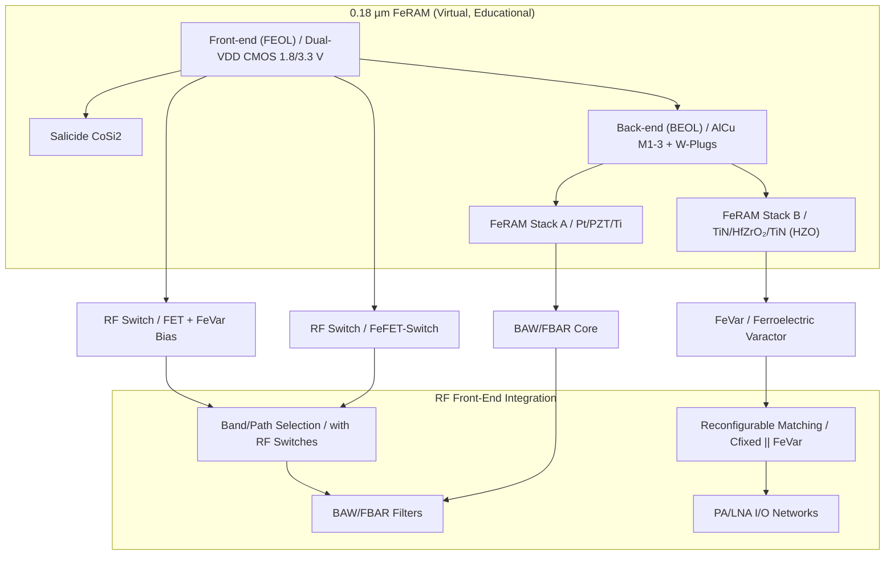
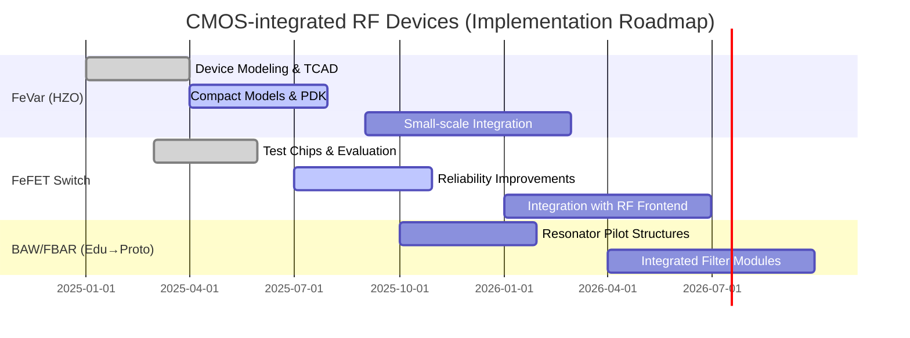

---

# 💡 CMOS混載型RFデバイス提案  
*Proposal: CMOS-integrated RF Devices*

---

## 🔗 リンク / *Links*  

| Link | Badge |
|---|---|
| 🌐 **View Site** |  |
| 📂 **View Repo** |  |

---

## 📘 概要 / *Overview*  

本提案は、三溝真一による **教育目的の仮想プロセス「0.18 µm FeRAM」** を起点に、  
**CMOS混載型RFデバイス**を実現することを目指すものです。  

*This proposal aims to realize CMOS-integrated RF devices, expanding from the educational virtual process “0.18 µm FeRAM”.*  

👉 実在の製品・企業・製造プロセスとは無関係ですが、実現可能性を追求した設計指針を含みます。  
👉 *This work is independent of actual products or proprietary processes, but explores practical design directions.*  

---

## 🔄 提案デバイス群 / *Proposed Devices*  

| デバイス / Device | 内容 / Description | 特徴 / Differentiation |
|---|---|---|
| **FeVar (Ferroelectric Varactor)** | HfO₂系強誘電体を用いた不揮発可変キャパシタ | 再構成可能・不揮発制御  *Reconfigurable, non-volatile control* |
| **FeFET-Switch** | HZO局所ゲートを利用したCMOS互換RFスイッチ | CMOS整合・低コスト  *CMOS-compatible, cost-efficient* |
| **BAW/FBAR (Edu ver.)** | PZT/HfO₂薄膜共振器 | 薄膜積層共振を応用  *Thin-film stack resonance* |

---

## 📚 系譜図 / *Process Lineage*  

---

## 🏭 産業的背景 / *Industrial Background*  

現行のRFフロントエンドは **FBAR/BAW + SOIスイッチ** に依存し、  
**多バンド化による部品点数増大・コスト増**が大きな課題です。  

*Today’s RF front-ends rely on FBAR/BAW + SOI switches, facing issues of component count increase and rising costs due to multi-band expansion.*  

欧州・米国・日本では、**再構成可能RF** が6Gの研究テーマとして進展中。  
CMOS内に可変素子を統合することで、**コスト削減・小型化・低消費電力化**が可能となります。  

---

## ⚖️ 競合技術との比較 / *Comparison with Existing Approaches*  

| 技術 / Technology | 特徴 / Characteristics | 課題 / Challenges | 市場適用率 / *Market Adoption* |
|---|---|---|---|
| **SOI-CMOS Switch** | 標準スマホFEMで実績多数  *Proven in smartphone FEM* | 多バンドでチップ肥大・コスト増  *Chip size/cost explosion in multi-band* | ★★★★☆  *Very High (Mainstream)* |
| **GaAs FET** | 高周波特性良好  *Excellent RF performance* | 高コスト・電源制約  *Costly, power supply constraints* | ★★★☆☆  *Medium (Legacy use, niche in PA)* |
| **MEMS Switch** | 超低損失・高アイソレーション  *Ultra-low loss, high isolation* | 信頼性・寿命課題  *Reliability, lifetime issues* | ★★☆☆☆  *Low (Limited adoption)* |
| **外付けVaractor** | アンテナチューニングで利用  *Used in antenna tuning* | 実装負荷・集積困難  *Integration challenges* | ★★☆☆☆  *Low (Discrete adoption only)* |
| **本提案 (FeVar/FeFET)** | CMOS互換・不揮発制御・小型化  *CMOS-compatible, non-volatile, compact* | 実証・量産性未確立  *Not yet mass-proven* | ★☆☆☆☆  *Emerging (Research/Prototype)* |

---

## 📉 部品点数削減の効果 / *Effect of Component Reduction*  

- スマホFEMでは数十〜百個のフィルタ・スイッチが必要。  
  *Current FEMs require tens to over 100 filters/switches.*  
- **可変キャパシタ（FeVar）**と**不揮発RFスイッチ（FeFET-SW）**を導入することで、  
  フィルタバンクとスイッチ数を半減可能。  
  *By introducing FeVar and FeFET-SW, filter banks and switches could be halved.*  
- **小型化・低コスト化・低損失**が期待される。  
  *Expected results: reduced size, lower cost, and lower insertion loss.*  

---

## ⚖️ RFCMOSのメリット・デメリット / *Pros & Cons of RFCMOS*  

### ✅ メリット / *Advantages*  
- CMOS互換：SoC集積可能  
  *CMOS-compatible, enabling SoC integration*  
- コスト削減：GaAs, SOIより低コスト  
  *Cheaper than GaAs and SOI*  
- 低消費電力：不揮発制御により待機電力削減  
  *Non-volatile control reduces standby power*  

### ❌ デメリット / *Disadvantages*  
- 高周波特性：GaAs, MEMSに劣る  
  *Weaker RF performance compared to GaAs, MEMS*  
- 電力耐性：PA用途に制約  
  *Limited for PA applications*  
- プロセス未成熟：量産実証不足  
  *Immature process, not yet mass-proven*  

### 🔧 改善方法 / *Improvements*  
- **HfZrO₂導入**：水素耐性強化、CMOS整合性改善  
  *HfZrO₂ for better hydrogen resistance and CMOS compatibility*  
- **3D構造導入**：GAA/FinFETベースで高周波特性強化  
  *3D GAA/FinFET structures to enhance RF performance*  
- **ハイブリッド材料**：高Q誘電体＋強誘電体の組合せ  
  *Hybrid dielectrics for higher Q-factor and reconfigurability*  

---

## 🚀 実現のための技術課題と改善策 / *Challenges & Enhancements for Realization*  

| 項目 / Item | 課題 / Challenge | 改善策 / Enhancement |
|---|---|---|
| **メモリ搭載 / Memory Integration** | RF設定が揮発的で、再起動時に再調整が必要  *RF settings are volatile and require reconfiguration on restart* | FeRAM/FeFETによる**不揮発制御メモリ搭載**で設定保持、SoC統合  *Integrate non-volatile control memory (FeRAM/FeFET) for persistent settings and SoC integration* |
| **Q値改善 / Q-factor Enhancement** | HfZrO₂単層ではQ値が不足し、高周波特性に制約  *Single HfZrO₂ layer has insufficient Q-factor, limiting RF performance* | **高Q誘電体 (Al₂O₃, AlN, SiO₂等)とのハイブリッド積層**や**3Dキャパシタ構造**導入  *Hybrid stacks with high-Q dielectrics (Al₂O₃, AlN, SiO₂, etc.) and adoption of 3D capacitor structures* |
| **干渉対策 / Crosstalk Mitigation** | デジタル/アナログ/RFの干渉により特性劣化  *Digital/analog/RF interference degrades performance* | **シールド配線・ガードリング**、**低k/超低k絶縁体**採用、ロジック/RF分離レイアウト  *Shielded interconnects, guard rings, low-k/ultra-low-k dielectrics, and layout separation of logic and RF* |
| **電力耐性 / Power Handling** | 高出力PA用途では耐圧不足  *Insufficient breakdown voltage for high-power PA applications* | **厚膜HfZrO₂層**＋**電極最適化**で耐圧強化  *Thicker HfZrO₂ layers and optimized electrodes to improve breakdown voltage* |
| **小型化 / Miniaturization** | フィルタ・スイッチ数が多く実装負荷大  *Excessive number of filters/switches increases packaging complexity* | **FeVarによる可変C**と**FeFET-SW**で部品数半減、**SiP/3Dパッケージ化**  *FeVar-based tunable capacitors and FeFET switches reduce parts count, with SiP/3D packaging for further miniaturization* |
| **動的制御 / Dynamic Control** | 周波数・負荷変動に即応困難  *Difficult to respond to frequency/load variations in real time* | **FeFET制御によるダイナミックバイアス最適化**で応答性強化  *Dynamic bias optimization via FeFET control to enhance responsiveness* |

📘 **解説 / Notes**  
- FeRAM由来の**不揮発特性**がRFフロントエンド設定保持に直結。  
  *Non-volatile characteristics derived from FeRAM directly enable persistent RF frontend configuration.*  
- **ハイブリッド誘電体**と**3D構造**は高周波・高Qを実現する鍵。  
  *Hybrid dielectrics and 3D structures are key to achieving high frequency and high Q-factor.*  
- 干渉対策はSoC集積の必須課題であり、**レイアウト・材料・回路協調**で改善可能。  
  *Crosstalk mitigation is critical for SoC integration and can be addressed by co-optimization of layout, materials, and circuit design.*
  
---

## 🗓️ 実現型ロードマップ / *Implementation Roadmap*  

- **FeVar**: TRL 4–6 （デバイスモデリング→小規模集積）  
- **FeFET-Switch**: TRL 3–5 （試作→信頼性改善→RF統合）  
- **BAW/FBAR**: TRL 3–4 （教育モデル→試作共振器）  

---

## 🔗 関連教材リンク / *Related Links*  

| リンク / Link | 内容 / Description |
|---|---|
| 📘 [0.18µm FeRAM Process Flow — 完全版](https://samizo-aitl.github.io/Edusemi-v4x/d_chapter1_memory_technologies/doc_FeRAM/feram_full_process_table) | FeRAMプロセスフロー完全版（教育モデル） *Full FeRAM process flow (educational model)* |
| 📘 [FeRAM特有工程の詳細解説](https://samizo-aitl.github.io/Edusemi-v4x/d_chapter1_memory_technologies/doc_FeRAM/0.18um_FeRAM_ProcessFlow) | PZTキャパシタ・AlOx保護膜・水素還元対策 *FeRAM-specific steps: capacitor, AlOx, H₂ mitigation* |
| 📘 [0.18µm RFCMOS Process Flow（派生版）](./018um_rfcapacitor_extracted.md) | RFCMOS派生プロセスフロー *Derived RFCMOS process flow* |
| 🔬 [0.18µm CMOSロジックプロセス](https://samizo-aitl.github.io/Edusemi-v4x/chapter3_process_evolution/docs/0.18um_Logic_ProcessFlow) | 0.18µm CMOSロジックプロセス教材 *0.18µm CMOS logic process (educational)* |
| 📐 [MOSトランジスタの特性と信頼性](https://samizo-aitl.github.io/Edusemi-v4x/chapter4_mos_characteristics/) | MOS特性と信頼性教材 *MOS transistor characteristics and reliability* |
| 💾 [メモリ技術教材集](https://samizo-aitl.github.io/Edusemi-v4x/d_chapter1_memory_technologies/) | SRAM / DRAM / FeRAM / MRAM / 3DNAND 教材 *Memory technologies* |

---

## 👤 Author & License  

| 項目 / Item | 詳細 / Details |
|---|---|
| **著者 / Author** | 三溝 真一（Shinichi Samizo） |
| **Email** |  |
| **X** |  |
| **GitHub** |  |
| **ライセンス / License** |    再配布・改変自由（教育目的） / *Free for educational use*   商用利用は別途許可 / *Commercial use requires separate permission* |
