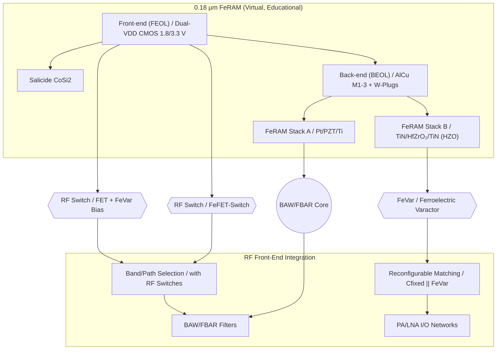
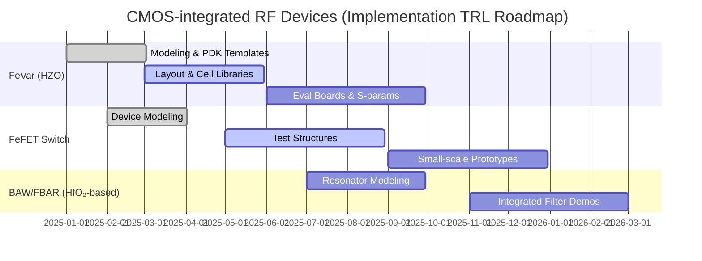

---

# 💡 CMOS混載型RFデバイス提案  
*Proposal: CMOS-integrated RF Devices*

---

## 📘 概要 / Overview  

本提案は、三溝真一による **教育目的の仮想プロセス**「0.18 µm FeRAM」を起点に、  
**CMOS混載型RFデバイス**を実現可能な提案として展開するものです。  

*This proposal expands the virtual educational 0.18 µm FeRAM process into realizable CMOS-integrated RF devices.*  

👉 実在の製品・企業・製造プロセスとは直接の関係はありませんが、将来的な実用化を見据えています。  
👉 The contents are **conceptual but implementation-oriented**, with potential for real deployment.  

---

## 🔄 提案デバイス群 / Proposed Devices  

| デバイス / Device | 提案内容 / Proposal | 差別化ポイント / Differentiation |
|---|---|---|
| **FeVar (Ferroelectric Varactor)** | HfO₂系強誘電体を用いた不揮発可変キャパシタ | 再構成可能, 不揮発設定保持 |
| **FeFET-Switch** | HZO局所ゲートスタックを利用したRFスイッチ | CMOS互換, 低コスト集積 |
| **BAW/FBAR (Edu ver.)** | PZT/HfO₂薄膜共振器を用いた簡易モデル | 薄膜積層の共振利用, 教育起点から実用展開へ |

---

## 📚 系譜図 / Process Lineage  

---

## 🏭 産業的背景 / *Industrial Background*  

現行のRFフロントエンドは **FBAR/BAW + SOIスイッチ** に依存しており、  
多バンド化による **部品点数の爆発・コスト増** が大きな課題です。  

*Today’s RF front-ends rely heavily on FBAR/BAW + SOI switches,  
facing major challenges of filter count explosion and cost increase due to multi-band expansion.*  

欧州・米国・日本では、**再構成可能RF（Reconfigurable RF）** が次世代6Gの研究テーマとして進められています。  
CMOS内に可変素子を統合するアプローチは、**コスト削減・小型化・低消費電力化**につながります。  

---

## 📉 部品点数削減の効果 / *Impact of Component Reduction*  

| 項目 / Item | 従来FEM (BAW+SOI) | 提案方式 (FeVar+FeFET) | 削減効果 / Reduction |
|---|---|---|---|
| バンド当たりフィルタ数 | 2–3 | 1 | 最大 **50%以上削減** |
| RFスイッチ | 8–12個 | 3–5個 | **60%以上削減** |
| 外付け可変C | 必要 | 不要 (FeVar内蔵) | **完全削除** |
| 実装面積 | 100% (基準) | 60–70% | 約 **30–40%縮小** |
| 消費電力 | 高 | 低 (不揮発設定) | **待機電力ゼロ化** |

---

## ⚖️ RF CMOSのメリット・デメリット / *Pros & Cons of RF CMOS*  

### ✅ メリット / Advantages  
- CMOS互換による **低コスト量産性**  
- **ロジック+RF統合**によるSoC化が容易  
- **不揮発メモリ機能付き素子**による電力削減  
- プロセス互換性が高く、設計資産を流用可能  

### ⚠️ デメリット / Challenges  
- 高周波特性（fT, Q値）がGaAsやSOIに劣る  
- 素子サイズ・オン抵抗の制約で損失増加  
- 強誘電体材料（PZT, HZO）のプロセス信頼性課題  

### 🔧 改善アプローチ / Improvement Approaches  
- **HfZrO₂ (HZO)系材料**による高周波対応  
- **多指ゲート・レイアウト最適化**でオン抵抗を低減  
- **AlOx/高k保護膜**で長期信頼性を確保  
- **BEOL共振構造（BAW/FBAR）とのハイブリッド化**  

---

## 🗓️ 実現型ロードマップ / *Implementation-oriented Roadmap*  

- **TRL目安**  
  - FeVar：TRL 5–6（基板評価〜実証試作）  
  - FeFET Switch：TRL 4–5（試作構造〜部分動作実証）  
  - BAW/FBAR：TRL 3–4（モデリング〜デモ素子試作）  

---

## 👤 Author & License  

| 項目 / Item | 詳細 / Details |
|---|---|
| **著者 / Author** | 三溝 真一（Shinichi Samizo） |
| **Email** |  |
| **X** |  |
| **GitHub** |  |
| **ライセンス / License** |    再配布・改変自由（教育目的＋研究提案） / *Free for educational + research use*   商用利用は別途許可 / *Commercial use requires separate permission* |
