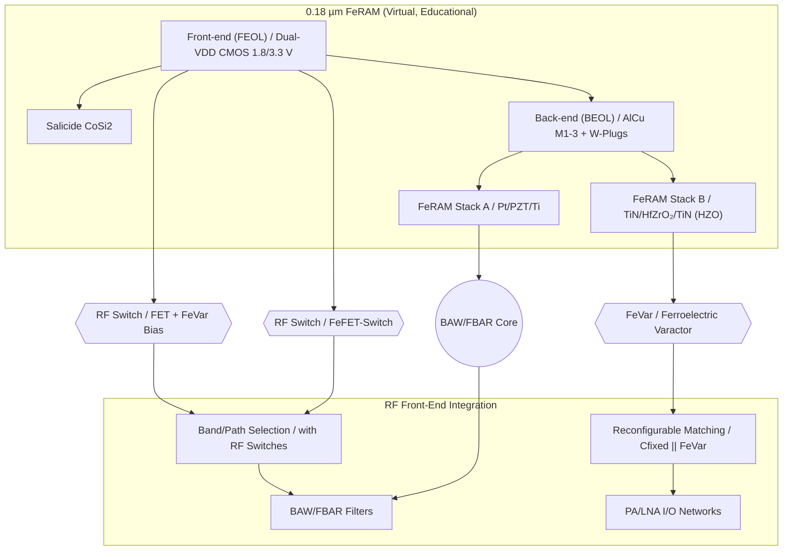
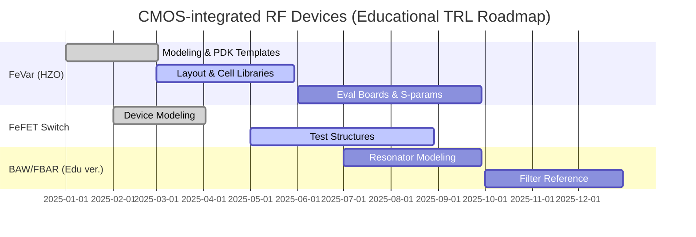

---

# 💡 CMOS混載型RFデバイス提案  
*Proposal: CMOS-integrated RF Devices*

---

## 📘 概要 / Overview  

本提案は、三溝真一による **教育目的の仮想プロセス**「0.18 µm FeRAM」を起点に、  
**CMOS混載型RFデバイス**を応用展開するものです。  

*This proposal expands the virtual educational 0.18 µm FeRAM process into CMOS-integrated RF devices.*  

---

## 🔄 提案デバイス群 / Proposed Devices  

| デバイス / Device | 提案内容 / Proposal | 差別化ポイント / Differentiation |
|---|---|---|
| **FeVar (Ferroelectric Varactor)** | HfO₂系強誘電体を用いた不揮発可変キャパシタ | 再構成可能, 不揮発設定保持 |
| **FeFET-Switch** | HZO局所ゲートスタックを利用したRFスイッチ | CMOS互換, 低コスト集積 |
| **BAW/FBAR (Edu ver.)** | PZT/HfO₂薄膜共振器を用いた教育モデル | 薄膜積層の共振利用, 教育起点の簡易設計 |

---

## 📚 系譜図 / Process Lineage  

---

## 🏭 産業的背景 / *Industrial Background*  

現行のRFフロントエンドは **FBAR/BAW + SOIスイッチ** に依存しており、  
多バンド化による **部品点数の爆発・コスト増** が大きな課題です。  

*Today’s RF front-ends rely heavily on FBAR/BAW + SOI switches,  
facing major challenges of filter count explosion and cost increase due to multi-band expansion.*  

欧州・米国・日本では、**再構成可能RF（Reconfigurable RF）** が次世代6Gの研究テーマとして進められています。  
CMOS内に可変素子を統合するアプローチは、**コスト削減・小型化・低消費電力化**につながります。  

---

## ⚖️ 競合技術との比較 / *Comparison with Existing Approaches*  

| 技術 / Technology | 特徴 / Characteristics | 課題 / Challenges |
|---|---|---|
| **SOI-CMOS Switch** | 標準スマホFEMで実績多数 | 多バンド化でチップ肥大・コスト増 |
| **GaAs FET** | 高周波特性良好 | 高コスト・電源制約 |
| **MEMS Switch** | 超低損失・高アイソレーション | 信頼性・寿命・応答速度 |
| **外付けVaractor** | アンテナチューニングに利用 | 実装負荷、集積化が難しい |
| **本提案 (FeVar/FeFET)** | CMOS互換・不揮発制御・小型化 | 実証段階、量産性未確立 |

---

## 🗓️ ロードマップ（教育モデル） / *Educational Roadmap (TRL)*  

- **TRL目安**  
  - FeVar：TRL 4–5（回路シミュレーション〜基板評価）  
  - FeFET Switch：TRL 3–4（素子モデリング〜試作構造）  
  - BAW/FBAR (Edu ver.)：TRL 3（モデリング段階）  

*Estimated TRL levels: FeVar (4–5), FeFET Switch (3–4), BAW/FBAR Edu (3).*  

---

## 👤 Author & License  

| 項目 / Item | 詳細 / Details |
|---|---|
| **著者 / Author** | 三溝 真一（Shinichi Samizo） |
| **Email** |  |
| **X** |  |
| **GitHub** |  |
| **ライセンス / License** |    再配布・改変自由（教育目的） / *Free for educational use*   商用利用は別途許可 / *Commercial use requires separate permission* |
