---

# 💡 CMOS混載型RFデバイス提案  
*Proposal: CMOS-integrated RF Devices*

---

## 🔗 リンク / Links  

| Link | Badge |
|---|---|
| 🌠View Site |  |
| 📂 View Repo |  |

---

## 📘 概要 / Overview  

本提案は、三溝真一による **教育目的の仮想プロセス**「0.18 µm FeRAM」を起点に、  
**CMOS混載型RFデバイス**を実現可能な技術として展開するものです。  

*This proposal expands the virtual educational 0.18 µm FeRAM process into CMOS-integrated RF devices with practical feasibility in mind.*  

👉 実在の製品・企業・製造プロセスとは直接の関係はありませんが、実現を目指した研究・教材です。  
👉 This content is **aimed at realization and education**, not a description of any existing proprietary process.  

---

## 🔄 提案デバイス群 / Proposed Devices  

| デバイス / Device | 提案内容 / Proposal | 差別化ポイント / Differentiation |
|---|---|---|
| **FeVar (Ferroelectric Varactor)** | HfO₂系強誘電体を用いた不揮発可変キャパシタ | 再構成可能, 不揮発設定保持 |
| **FeFET-Switch** | HZO局所ゲートスタックを利用したRFスイッチ | CMOS互換, 低コスト集積 |
| **BAW/FBAR (Edu ver.)** | PZT/HfO₂薄膜共振器を用いた教育モデル | 薄膜積層の共振利用, 教育起点の簡易設計 |

---

## 📚 系譜図 / Process Lineage  

```mermaid
flowchart TB
  subgraph FE["0.18 µm FeRAM (Virtual, Educational)"]
    GATE["Front-end (FEOL) / Dual-VDD CMOS 1.8/3.3 V"] --> SALI["Salicide CoSi2"]
    BEOL["Back-end (BEOL) / AlCu M1-3 + W-Plugs"]
    CAP1["FeRAM Stack A / Pt/PZT/Ti"]
    CAP2["FeRAM Stack B / TiN/HfZrO₂/TiN (HZO)"]
    GATE --> BEOL --> CAP1
    BEOL --> CAP2
  end

  CAP2 --> FeVar{{"FeVar / Ferroelectric Varactor"}}
  GATE --> RFSW1{{"RF Switch / FET + FeVar Bias"}}
  GATE --> RFSW2{{"RF Switch / FeFET-Switch"}}
  CAP1 --> BAW(("BAW/FBAR Core"))

  subgraph RF["RF Front-End Integration"]
    MATCH["Reconfigurable Matching / Cfixed || FeVar"]
    PATHSEL["Band/Path Selection / with RF Switches"]
    FILTER["BAW/FBAR Filters"]
    LNA["PA/LNA I/O Networks"]
  end

  FeVar --> MATCH --> LNA
  RFSW1 --> PATHSEL --> FILTER
  RFSW2 --> PATHSEL
  BAW --> FILTER
```

---

## 🏭 産業的背景 / *Industrial Background*  

現行のRFフロントエンドは **FBAR/BAW + SOIスイッチ** に依存しており、  
多バンド化による **部品点数の爆発・コスト増** が大きな課題です。  

*Today’s RF front-ends rely heavily on FBAR/BAW + SOI switches,  
facing major challenges of filter count explosion and cost increase due to multi-band expansion.*  

欧州・米国・日本では、**再構成可能RF（Reconfigurable RF）** が次世代6Gの研究テーマとして進められています。  
CMOS内に可変素子を統合するアプローチは、**コスト削減・小型化・低消費電力化**につながります。  

---

## ⚖️ 競合技術との比較 / *Comparison with Existing Approaches*  

| 技術 / Technology | 特徴 / Characteristics | 課題 / Challenges |
|---|---|---|
| **SOI-CMOS Switch** | 標準スマホFEMで実績多数 | 多バンド化でチップ肥大・コスト増 |
| **GaAs FET** | 高周波特性良好 | 高コスト・電源制約 |
| **MEMS Switch** | 超低損失・高アイソレーション | 信頼性・寿命・応答速度 |
| **外付けVaractor** | アンテナチューニングに利用 | 実装負荷、集積化が難しい |
| **本提案 (FeVar/FeFET)** | CMOS互換・不揮発制御・小型化 | 実証段階、量産性未確立 |

---

## 📉 部品点数削減の効果 / *Effect of Reduced Component Count*  

```mermaid
flowchart LR
    EXT[従来FEM: 外付けFBAR + SOI Switch + Varactor] -->|部品点数多, 実装面積大| LIMITS[高コスト・高消費電力]
    INT[提案: CMOS内蔵 FeVar/FeFET + 教育BAW] -->|集積化, 実装簡素化| BENEFIT[低コスト・低消費電力・小型化]
```

- **従来**: 外付け部品の組合せにより、モジュールが大型化・高コスト化。  
- **提案**: CMOS内にFeVar/FeFETを混載し、部品点数を削減することで **低コスト・小型・低消費電力** を実現。  

---

## ➕ RF CMOSのメリットとデメリット / *Pros & Cons of RF CMOS*  

| 項目 / Item | メリット / Pros | デメリット / Cons | 改善策 / Improvements |
|---|---|---|---|
| **コスト** | CMOS互換プロセスで低コスト | 量産立ち上げに初期投資 | 教育・研究用PoCから段階的拡大 |
| **集積度** | ロジック・メモリ・RF一体化 | 熱・干渉問題 | 局所シールド・材料工夫 |
| **性能** | 再構成可能, 不揮発設定保持 | Q値・損失の課題 | HfO₂材料, 構造最適化 |
| **電力** | 不揮発制御で低消費電力 | 大信号動作で歪み懸念 | 回路補償・適応制御 |

---

## 🗓️ 実現ロードマップ / *Realization Roadmap*  

- **FeVar**: 2025年前半にPDK化 → 2025年後半に基板評価へ。  
- **FeFET Switch**: 2025年試作構造 → FEM統合試験。  
- **BAW/FBAR**: 2026年にモデル構築 → フィルタ協調設計。  

---

## 👤 Author & License  

| 項目 / Item | 詳細 / Details |
|---|---|
| **著者 / Author** | 三溝 真一（Shinichi Samizo） |
| **Email** |  |
| **X** |  |
| **GitHub** |  |
| **ライセンス / License** |    再配布・改変自由（教育・研究目的） / *Free for educational & research use*   商用利用は別途許可 / *Commercial use requires separate permission* |
