---

# 📡 0.18µm RFCMOSデバイス検討  
*0.18µm RFCMOS Devices — Review*

---

## 🔗 リンク / *Links*  

| Link | Badge |
|---|---|
| 🌠**View Site** |  |
| 📂 **View Repo** |  |

---

## 📘 概要 / *Overview*  

本資料は、三溝真一による **教育目的の仮想プロセス「0.18 µm FeRAM」** を起点に、  
**CMOS混載型RFデバイス**の実現性を検討した内容です。  

*This review examines the feasibility of CMOS-integrated RF devices, expanded from the educational virtual process “0.18 µm FeRAM”.*  

👉 実在の製品・企業・製造プロセスとは無関係ですが、実現可能性を追求した検討要素を含みます。  
👉 *This work is independent of actual products or proprietary processes, but explores practical feasibility aspects.*  

---

## 🔄 対象デバイス群 / *Target Devices*  

| デバイス / Device | 内容 / Description | 特徴 / Differentiation |
|---|---|---|
| **FeVar (Ferroelectric Varactor)** | HfO₂系強誘電体を用いた不揮発可変キャパシタ | 再構成可能・不揮発制御  *Reconfigurable, non-volatile control* |
| **FeFET-Switch** | HZO局所ゲートを利用ã—ãŸCMOS互æ›RFスイッム| CMOSæ•´åˆãƒ»ä½ã‚³ã‚¹ãƒˆ  *CMOS-compatible, cost-efficient* |
| **BAW/FBAR** | PZT/HfO₂薄膜共振器 | 薄膜積層共振を応用  *Thin-film stack resonance* |

---

## 📚 系譜図 / *Process Lineage*  

```mermaid
flowchart TB
  subgraph FE["0.18 µm FeRAM (Virtual, Educational)"]
    GATE["Front-end (FEOL) / Dual-VDD CMOS 1.8/3.3 V"] --> SALI["Salicide CoSi2"]
    BEOL["Back-end (BEOL) / AlCu M1-3 + W-Plugs"]
    CAP1["FeRAM Stack A / Pt/PZT/Ti"]
    CAP2["FeRAM Stack B / TiN/HfZrO₂/TiN (HZO)"]
    GATE --> BEOL --> CAP1
    BEOL --> CAP2
  end

  CAP2 --> FeVar["FeVar / Ferroelectric Varactor"]
  GATE --> RFSW1["RF Switch / FET + FeVar Bias"]
  GATE --> RFSW2["RF Switch / FeFET-Switch"]
  CAP1 --> BAW["BAW/FBAR Core"]

  subgraph RF["RF Front-End Integration"]
    MATCH["Reconfigurable Matching / Cfixed || FeVar"]
    PATHSEL["Band/Path Selection / with RF Switches"]
    FILTER["BAW/FBAR Filters"]
    LNA["PA/LNA I/O Networks"]
  end

  FeVar --> MATCH --> LNA
  RFSW1 --> PATHSEL --> FILTER
  RFSW2 --> PATHSEL
  BAW --> FILTER
```

---

## 🏭 産業的背景 / *Industrial Background*  

現行のRFフロントエンドは **FBAR/BAW + SOIスイッチ** に依存し、 
**多バンド化による部品点数増大・コスト増**が大きな課題です。  

*Today’s RF front-ends rely on FBAR/BAW + SOI switches, facing issues of component count increase and rising costs due to multi-band expansion.*  

欧州・米国・日本では、**再構成可能RF** が6Gの研究テーマとして進展中。  
CMOS内に可変素子を統合することで、**コスト削減・小型化・低消費電力化**が可能となります。  

---

## ⚖️ 競合技術との比較 / *Comparison with Existing Approaches*  

| 技術 / Technology | 特徴 / Characteristics | 課題 / Challenges | 市場適用率 / *Market Adoption* |
|---|---|---|---|
| **SOI-CMOS Switch** | 標準スマホFEMで実績多数  *Proven in smartphone FEM* | 多バンドでチップ肥大・コスト増  *Chip size/cost explosion in multi-band* | ★★★★☆  *Very High (Mainstream)* |
| **GaAs FET** | 高周波特性良好  *Excellent RF performance* | 高コスト・電源制約  *Costly, power supply constraints* | ★★★☆☆  *Medium (Legacy use, niche in PA)* |
| **MEMS Switch** | 超低損失・高アイソレーション  *Ultra-low loss, high isolation* | 信頼性・寿命課題  *Reliability, lifetime issues* | ★★☆☆☆  *Low (Limited adoption)* |
| **外付けVaractor** | アンテナチューニングで利用  *Used in antenna tuning* | 実装負荷・集積困難  *Integration challenges* | ★★☆☆☆  *Low (Discrete adoption only)* |
| **本検討 (FeVar/FeFET)** | CMOS互換・不揮発制御・小型化  *CMOS-compatible, non-volatile, compact* | 実証・量産性未確立  *Not yet mass-proven* | ★☆☆☆☆  *Emerging (Research/Prototype)* |

---

## 📉 部品点数削減の効果 / *Effect of Component Reduction*  

- スマホFEMでは数十〜百個のフィルタ・スイッチが必要。  
  *Current FEMs require tens to over 100 filters/switches.*  
- **可変キャパシタ（FeVar）**と**不揮発RFスイッチ（FeFET-SW）**を導入することで、  
  フィルタバンクとスイッチ数を半減可能。  
  *By introducing FeVar and FeFET-SW, filter banks and switches could be halved.*  
- **小型化・低コスト化・低損失**が期待される。  
  *Expected results: reduced size, lower cost, and lower insertion loss.*  

---

## ⚖️ RFCMOSのメリット・デメリット / *Pros & Cons of RFCMOS*  

### ✅ メリット / *Advantages*  
- CMOS互換：SoC集積可能  
  *CMOS-compatible, enabling SoC integration*  
- コスト削減：GaAs, SOIより低コスト  
  *Cheaper than GaAs and SOI*  
- 低消費電力：不揮発制御により待機電力削減  
  *Non-volatile control reduces standby power*  

### ❌ デメリット / *Disadvantages*  
- 高周波特性：GaAs, MEMSに劣る  
  *Weaker RF performance compared to GaAs, MEMS*  
- 電力耐性：PA用途に制約  
  *Limited for PA applications*  
- プロセス未成熟：量産実証不足  
  *Immature process, not yet mass-proven*  

### 🔧 改善方法 / *Improvements*  
- **HfZrO₂導入**：水素耐性強化、CMOS整合性改善  
  *HfZrO₂ for better hydrogen resistance and CMOS compatibility*  
- **3D構造導入**：GAA/FinFETベースで高周波特性強化  
  *3D GAA/FinFET structures to enhance RF performance*  
- **ハイブリッド材料**：高Q誘電体＋強誘電体の組合せ  
  *Hybrid dielectrics for higher Q-factor and reconfigurability*  

---

## 🚀 実現のための技術課題と改善策 / *Challenges & Enhancements for Realization*  

| 項目 / Item | 課題 / Challenge | 改善策 / Enhancement |
|---|---|---|
| **メモリ搭載 / Memory Integration** | RF設定が揮発的で、再起動時に再調整が必要  *RF settings are volatile and require reconfiguration on restart* | FeRAM/FeFETによる**不揮発制御メモリ搭載**で設定保持、SoC統合  *Integrate non-volatile control memory (FeRAM/FeFET) for persistent settings and SoC integration* |
| **Q値改善 / Q-factor Enhancement** | HfZrO₂単層ではQ値が不足し、高周波特性に制約  *Single HfZrO₂ layer has insufficient Q-factor, limiting RF performance* | **高Q誘電体 (Al₂O₃, AlN, SiO₂等)とのハイブリッド積層**や**3Dキャパシタ構造**導入  *Hybrid stacks with high-Q dielectrics (Al₂O₃, AlN, SiO₂, etc.) and adoption of 3D capacitor structures* |
| **干渉対策 / Crosstalk Mitigation** | デジタル/アナログ/RFの干渉により特性劣化  *Digital/analog/RF interference degrades performance* | **シールド配線・ガードリング**ã€**低k/超低k絶縁体**採用、ロジック/RF分離レイアウト  *Shielded interconnects, guard rings, low-k/ultra-low-k dielectrics, and layout separation of logic and RF* |
| **電力耐性 / Power Handling** | 高出力PA用途では耐圧不足  *Insufficient breakdown voltage for high-power PA applications* | **厚膜HfZrO₂層**＋**電極最適化**で耐圧強化  *Thicker HfZrO₂ layers and optimized electrodes to improve breakdown voltage* |
| **小型化 / Miniaturization** | フィルタ・スイッチ数が多く実装負荷大  *Excessive number of filters/switches increases packaging complexity* | **FeVarによる可変C**と**FeFET-SW**で部品数半減、**SiP/3Dパッケージ化**  *FeVar-based tunable capacitors and FeFET switches reduce parts count, with SiP/3D packaging for further miniaturization* |
| **動的制御 / Dynamic Control** | 周波数・負荷変動に即応困難  *Difficult to respond to frequency/load variations in real time* | **FeFET制御によるダイナミックバイアス最適化**で応答性強化  *Dynamic bias optimization via FeFET control to enhance responsiveness* |

---

## 📝 結論 / *Conclusion*  

本検討で示した **FeVar / FeFET / RFCMOS統合** は、教育的には「ロジック＋メモリ＋RF統合設計」の理解を深める上で有用ですが、  
現状の技術水準では **商用FEMに適用する実現性は困難** と評価されます。  

- **理由 / Reasons**  
  - GaAs・SOI・BAW主流技術に対して周波数特性・Q値が劣る  
  - 電力耐性や信頼性の量産実証不足  
  - 部品点数削減効果は期待できるが、製造歩留まり・市場採用に壁  

👉 **教育的意義は高いが、商用展開は限定的**  
   → IoT小規模無線、センサー集積回路、再構成可能RFの研究用途などに活用可能。  

*In conclusion, while FeVar/FeFET/RFCMOS integration has high educational value, its practical realization in commercial FEMs is currently difficult.  
It may find niche applications in IoT, sensors, and reconfigurable RF research, but large-scale adoption remains unlikely.*  

---

## 🔗 関連教材リンク / *Related Links*  

| リンク / Link | 内容 / Description |
|---|---|
| 📘 [0.18µm FeRAM Process Flow — 完全版](https://samizo-aitl.github.io/Edusemi-v4x/d_chapter1_memory_technologies/doc_FeRAM/feram_full_process_table) | FeRAMプロセスフロー完全版（教育モデル） *Full FeRAM process flow (educational model)* |
| 📘 [FeRAM特有工程の詳細解説](https://samizo-aitl.github.io/Edusemi-v4x/d_chapter1_memory_technologies/doc_FeRAM/0.18um_FeRAM_ProcessFlow) | PZTキャパシタ・AlOx保護膜・水素還元対策 *FeRAM-specific steps: capacitor, AlOx, H₂ mitigation* |
| 🔬 [0.18µm CMOSロジックプロセス](https://samizo-aitl.github.io/Edusemi-v4x/chapter3_process_evolution/docs/0.18um_Logic_ProcessFlow) | 0.18µm CMOSロジックプロセス教材 *0.18µm CMOS logic process (educational)* |
| 📠[MOSトランジスタã®ç‰¹æ€§ã¨ä¿¡é ¼æ€§](https://samizo-aitl.github.io/Edusemi-v4x/chapter4_mos_characteristics/) | MOS特性ã¨ä¿¡é ¼æ€§æ•™æ *MOS transistor characteristics and reliability* |
| 💾 [メモリ技術教材集](https://samizo-aitl.github.io/Edusemi-v4x/d_chapter1_memory_technologies/) | SRAM / DRAM / FeRAM / MRAM / 3DNAND 教材 *Memory technologies* |

---

## 👤 Author & License  

| 項目 / Item | 詳細 / Details |
|---|---|
| **著者 / Author** | 三溝 真一（Shinichi Samizo） |
| **Email** |  |
| **X** |  |
| **GitHub** |  |
| **ライセンス / License** |    再配布・改変自由（教育目的） / *Free for educational use*   商用利用は別途許可 / *Commercial use requires separate permission* |
