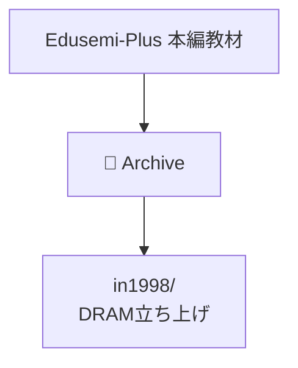

# 🗂️ Edusemi-Plus Archive

> 本ディレクトリは、**Edusemi-Plus教材**の補完資料として、  
> 半導体技術・設計思想・産業史の文脈で重要な**技術記録・エピソード・ドキュメント**を保存するアーカイブ領域です。

---

## 📘 目的

- **技術史的価値を持つ資料の保管**
- 教材本編に収まりきらない**体験知・設計思考・工程知識**の記録
- ChatGPT等を用いた**教材生成・プロンプト設計・演習化**の素材とする

---

## 📂 サブディレクトリ構成

| ディレクトリ | 内容 |
|--------------|------|
| [`in1998/`](./in1998/) | 1998年の64M DRAM立ち上げ記録（0.25μm世代、三溝真一） |
| `early_PoC/` | 2000年代のPoC実装・構成設計メモ（予定） |
| `tech_interviews/` | 技術者ヒアリング記録・設計思考プロンプト（予定） |
| `legacy_nodes/` | 0.35μm〜0.18μm時代の工場プロセス資料（計画中） |

---

## 🧭 活用方針

- **教材本体（Edusemi-Plus）とリンクして解説を補足**
- 技術者育成用に「**構造だけでなくプロセスを設計する力**」を伝える
- 重要な不良解析・工程改善・判断記録を**ケーススタディ化**

---

## 📌 注意

- 一部ドキュメントは **記録中（未完）** の状態で保存されています
- 教材公開前提のため、**機密情報や企業名依存の記述は控えています**
- 必要に応じて `.md` から `.pdf`, `.zip` 等への変換・加工を行う予定です

---

## 👤 著者・記録提供者

- 三溝 真一（Shinichi Samizo）  
  DRAM開発・MEMS・プロセス設計・教育教材開発に従事

---

---
