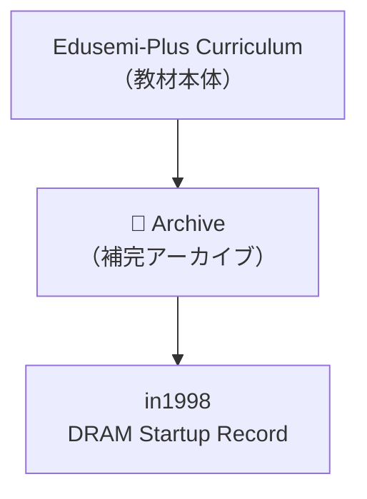

# 🗂️ Edusemi-Plus Archive  
**（エデュセミ・プラス技術アーカイブ）**

> 本ディレクトリは、**Edusemi-Plus教材**の補完資料として、  
> 半導体技術・設計思想・産業史の文脈で重要な  
> **技術記録・エピソード・ドキュメント**を保存するアーカイブ領域です。

> This directory serves as a **technical archive** to complement the **Edusemi-Plus curriculum**,  
> preserving critical records, episodes, and documents in the context of **semiconductor technology**,  
> **design philosophy**, and **industrial history**.

---

## 📘 目的 | Purpose

- **技術史的価値を持つ資料の保管**  
- **体験知・設計思考・工程知識**の記録  
- ChatGPTなどによる**教材生成・プロンプト演習素材**としての活用  

- Preserve materials of **historical and technical significance**  
- Record **tacit knowledge**, **design reasoning**, and **process engineering insights**  
- Provide resources for **educational generation and prompt-based exercises** using ChatGPT and other tools

---

## 📂 サブディレクトリ構成 | Directory Structure

| ディレクトリ / Directory | 内容 / Description |
|--------------------------|---------------------|
| [`in1998/`](./in1998/) | 64M DRAM立ち上げ記録（1998年, 0.25μm, 三溝真一） 📄 [DRAM_Startup_64M_1998.md](./in1998/DRAM_Startup_64M_1998.md)
| [`in1998/`](./in1998/) | 64M DRAM立ち上げ記録（1998年, 0.25μm, 三溝真一） 64M DRAM ramp-up record (1998, 0.25μm node, by Shinichi Samizo) |
| `early_PoC/` | 2000年代のPoC設計メモ（予定） Early 2000s PoC design notes (planned) |
| `tech_interviews/` | 技術者ヒアリング・設計対話記録（予定） Technical interviews and design dialogues (planned) |
| `legacy_nodes/` | レガシーノード（0.35μm〜0.18μm）資料（計画中） Legacy node (0.35μm–0.18μm) process archives (planned) |

---

## 🧭 活用方針 | Utilization Policy

- **Edusemi-Plus本編との補完関係を重視**  
- **構造設計＋プロセス設計の統合力**を伝える教材化  
- **失敗・改善の記録をケーススタディとして再構成**

- Complements the **main Edusemi-Plus content**  
- Highlights the integration of **structural and process design thinking**  
- Reconstructs real-world **failures and improvements** into case-based learning modules

---

## 📌 注意事項 | Notes

- 一部資料は **記録中（未完）** の状態で保存されています  
- 教材公開前提のため、**機密・企業固有情報は含みません**  
- `.md` から `.pdf`, `.zip` への形式変換も対応予定です

- Some documents are in **draft or in-progress** status  
- No proprietary or confidential information is included  
- Format conversions to `.pdf`, `.zip`, etc. are planned as needed

---

## 👤 著者・提供者 | Author & Contributor

**三溝 真一（Shinichi Samizo）**  
- DRAM開発・MEMS・薄膜プロセス・教育教材設計に従事  
- Developer of DRAM, MEMS, thin-film processes, and educational content

---

---

> 本アーカイブは、**半導体技術の構造と意思決定の“記憶”**を残すためのものです。  
> The purpose of this archive is to preserve the “**memory of structure and decision-making**” in semiconductor technology.
