# 🗂️ Edusemi-Plus Archive  
**（エデュセミ・プラス 技術アーカイブ）**

> 本ディレクトリは、**Edusemi-Plus教材**を補完する目的で、  
> 半導体技術・設計思想・産業史の文脈における  
> **重要な技術記録・エピソード・ドキュメント**を保存するアーカイブ領域です。  
>
> This directory complements the **Edusemi-Plus curriculum**,  
> serving as an archive for significant **technical records**, **design episodes**, and **industrial documentation**  
> in the context of **semiconductor technology**, **design philosophy**, and **technological history**.

---

## 📘 目的 | Purpose

- **技術史的価値を持つ資料の保管**  
- **体験知・設計思考・工程知識**の記録  
- ChatGPTなどによる**教材生成・プロンプト演習素材**としての活用  

- Preserve materials of **historical and technical significance**  
- Record **tacit knowledge**, **design reasoning**, and **process engineering insights**  
- Enable use as **educational generation and prompt-based exercises** via ChatGPT and related tools

---

## 📂 サブディレクトリ構成 | Directory Structure

| ディレクトリ / Directory | 内容 / Description |
|--------------------------|---------------------|
| [`in1998/`](./in1998/) | 64M DRAM立ち上げ記録（1998年, 0.25μm, 三溝真一） 📄 [DRAM_Startup_64M_1998.md](./in1998/DRAM_Startup_64M_1998.md) |
| `early_PoC/` | 2000年代のPoC設計メモ（予定） Early 2000s PoC design notes (planned) |
| `tech_interviews/` | 技術者ヒアリング・設計対話記録（予定） Technical interviews and design dialogues (planned) |
| `legacy_nodes/` | レガシーノード（0.35μm〜0.18μm）資料（計画中） Legacy node (0.35μm–0.18μm) process archives (planned) |

---

## 🧭 活用方針 | Utilization Policy

- **Edusemi-Plus本編との補完関係を重視**  
- **構造設計 × プロセス設計**の統合的理解を促す教材化  
- 実践現場の**失敗と改善**をケーススタディとして再構成  

- Designed to **complement the main Edusemi-Plus curriculum**  
- Emphasizes the integration of **structural and process design thinking**  
- Reconstructs real-world **failures and improvements** into case-based educational content

---

## 📌 注意事項 | Notes

- 一部資料は **記録途中・未完** の状態で保存されています  
- **企業固有・機密情報は一切含まれていません**  
- `.md → .pdf`, `.zip` 等の形式変換にも対応予定です  

- Some documents are in **draft or in-progress** status  
- No **proprietary or confidential information** is included  
- Format conversion to `.pdf`, `.zip`, etc. is planned as needed

---

## 👤 著者・提供者 | Author & Contributor

**三溝 真一（Shinichi Samizo）**  
- DRAM開発、MEMS、薄膜プロセス、教育教材設計に従事  
- Developer of DRAM, MEMS, thin-film processes, and educational frameworks

---

### 📊 構造図 | Structure Diagram

```mermaid
flowchart TD
    EdusemiPlus[Edusemi-Plus Curriculum<br>（教材本体）]
    Archive[📂 Archive<br>（補完アーカイブ）]
    in1998[in1998<br>DRAM Startup Record]
    EdusemiPlus --> Archive --> in1998
```

---

> このアーカイブは、半導体技術における  
> **「構造と意思決定の記憶」** を未来に残すことを目的としています。  
>
> This archive aims to preserve the **“memory of structure and decision-making”** in semiconductor development.

---
