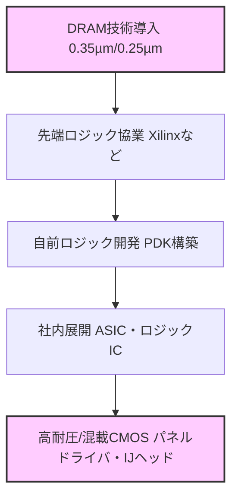

---

# 🏭 セイコーエプソン酒田事業所 8インチライン稼働と第2世代DRAM立ち上げ（1997）  
**Seiko Epson Sakata Fab 8-inch Line Ramp-up & 2nd Gen DRAM Startup (1997)**  

---

⚠️ **免責事項 / Disclaimer**  

| 日本語 | English |
|--------|---------|
| 本記録は1997年当時の業務経験に基づく教育・アーカイブ資料です。企業機密や現行製品情報は含まれていません。 | This document is based on the author's work experience in 1997, reconstructed for educational and archival purposes, and contains no proprietary or current product data. |

---

## 🧭 背景と配属 | Background & Assignment

**日本語**  
1997年、筆者はセイコーエプソンに入社し、ゴールデンウィーク後に山形県の**酒田事業所**へ配属された。  
当時の酒田事業所は、**0.35μm世代ベースの8インチライン立ち上げ**を開始したばかりで、筆者はまず**スパッタ装置 Endura**の導入に関与し、その後すぐに**0.35μmロジック配線モジュールの立ち上げ**にも携わった。  

この8インチラインの技術導入戦略は、単なるDRAM量産だけでなく、複数の先端技術を同時に吸収する多角的なものであった。  
- **DRAM**：0.35μm以降のプロセス技術導入（第2世代〜第3世代64M DRAM）  
- **先端ロジック**：Xilinxロジック製品のファンドリ受託による最新ロジックプロセス導入  
- **社内ロジック製品展開**：獲得した配線モジュールやプロセス技術を社内ASIC・ロジックICへ展開  
- **フラッシュメモリ**：Lattice案件やSST社とのファンドリ契約によるフラッシュメモリ技術の並行導入  

**English**  
In 1997, the author joined Seiko Epson and was assigned to the **Sakata plant** in Yamagata Prefecture after the Golden Week holiday.  
At that time, Sakata Fab had just begun the **0.35 μm-based 8-inch production line ramp-up**, and the author was first involved in the installation of the **Endura sputtering system**, then quickly engaged in the **ramp-up of the 0.35 μm logic interconnect module**.  

The technology acquisition strategy for the 8-inch line was multifaceted, aiming to absorb multiple advanced technologies in parallel:  
- **DRAM**: Introduction of 0.35 μm and beyond process technologies (2nd to 3rd Gen 64M DRAM)  
- **Advanced logic**: Adoption of latest logic processes via foundry production for Xilinx  
- **In-house logic products**: Application of acquired interconnect module and process know-how to internal ASIC and logic IC development  
- **Flash memory**: Parallel introduction of flash memory processes through foundry collaborations with Lattice and SST  

> 💡 **筆者の推測**：DRAMはあくまで0.35µm以降のプロセス技術導入が目的で、事業の主眼はロジック製品やファンドリ展開にあったと考えられる。当時は世界最先端の技術水準で、TSMCと同等レベルだったが、後に国策レベルの投資差で大きく差が開いた。

---

## 🌐 セイコーエプソン8インチ立ち上げの意義 | Strategic Significance & Investment Rationale

1980年代、日本は世界半導体市場のトップに立ち、DRAMシェアで米国を凌駕していた。  
しかし1990年代に入ると、日米半導体協定や韓国・台湾勢の台頭により、日本のDRAM事業は急速に衰退していった。  
その衰退期に、あえてセイコーエプソンは**巨額投資で8インチラインを立ち上げ**、業界最先端を目指した。  

その意義は「単なるDRAM量産」ではなく、**DRAMを通じて最先端プロセス技術を吸収し、自社強みに展開すること**にあった。  

- **DRAM技術導入**：三菱からの技術供与をベースに0.35→0.25µm世代を習得  
- **先端ロジック吸収**：Xilinx等のファブレスと協業し、配線だけでなくトランジスタ技術まで獲得  
- **自前PDK構築**：プロセス設計キットを内製化し、社内ASIC展開へ  
- **混載高耐圧デバイス**：携帯向けパネルドライバやインクジェットヘッド駆動ICなど、差別化製品に応用  

👉 投資の本質は「DRAM事業」ではなく、**先端技術を自前化して独自デバイスへ展開する戦略的布石**であった。  

---

## 📦 技術供与と展開計画 | Technology Transfer & Deployment Plan

**日本語**  
酒田Fabの投資目的は、将来的には**先端ロジック、社内ASIC、ファンドリ、高耐圧混載**へと技術を広げることにあった。  
しかし**1997年当時、ラインを本格稼働させ、Fabを維持できるだけの量産品目はDRAMしか存在しなかった**。  

- **Xilinx先端ロジック案件**：開発は進んでいたが、量産規模には至らず。  
- **社内ロジックや混載案件**：まだ構想・試作段階にあり、当面は主力になれなかった。  
- **ファンドリビジネス**：市場は立ち上がり途上で、十分な需要を見込めなかった。  

このため、**DRAMの立ち上げ成功がFab運営の前提条件であり、同時に将来展開の扉を開くカギ**となっていた。  
DRAMを安定生産できなければ、Fabは稼働率を確保できず、次のロジックや混載への展開も実現できなかったのである。  

**English**  
The Sakata Fab investment was ultimately aimed at expanding into **advanced logic, in-house ASICs, foundry services, and high-voltage mixed-signal devices**.  
However, in **1997 the only product capable of sustaining full-scale mass production and keeping the Fab operational was DRAM**.  

- **Xilinx logic projects**: progressing in development, but not yet scalable to mass production.  
- **In-house logic and mixed-signal devices**: still in concept or prototype stage, not ready to become a mainstay.  
- **Foundry services**: an emerging business, with insufficient demand to fill the Fab.  

Therefore, **the success of DRAM ramp-up was the foundation upon which the Fab’s operation and future roadmap depended**.  
Without stable DRAM production, the Fab could not achieve the utilization needed to move forward into logic, foundry, or mixed-signal development.  

---

## 🚀 DRAM立ち上げと第2世代（0.35μm）64M DRAMの難航 | Ramp-up Challenges

**展開計画 | Deployment Plan**  
酒田8インチラインの立ち上げは、**三菱電機 熊本工場からの技術供与**を受けて進められた。  
当初のロードマップは以下のとおりである。  

**Japanese**  
- 0.5µm **16M DRAM**  
- 0.35µm **64M DRAM（第2世代）**  
- 0.25µm **64M DRAM（第3世代）**  

**English**  
- 0.5 µm **16M DRAM**  
- 0.35 µm **64M DRAM (2nd Generation)**  
- 0.25 µm **64M DRAM (3rd Generation)**  

**日本語**  
まず0.5µm 16M DRAMの立ち上げは順調に進み、酒田8インチラインの初期稼働を支えた。  
続いて本命となる**0.35µm 64M DRAM（第2世代）**の開発が進められ、1997年秋頃から本格フェーズへ移行した。  

しかし、投入した試作ロットは**30ロット以上に及ぶも形状が安定せず**、SEMで寸法を測定することすら困難な状態が続いた。  
この第2世代64M DRAMの立ち上げは、酒田Fabにとって**量産稼働の成否を左右する最重要課題**であり、現場は大きな重圧を受けていた。  
熊本工場では既に実績があるにもかかわらず、酒田では同じ装置・レシピでも結果が再現できず、原因不明の状態が続いた。  

**English**  
The Sakata 8-inch line was launched with **technology transfer from Mitsubishi Electric’s Kumamoto Fab**.  
The initial roadmap was as follows: 0.5 µm 16M DRAM → 0.35 µm 64M DRAM (2nd Gen) → 0.25 µm 64M DRAM (3rd Gen).  

The 0.5 µm 16M DRAM ramp-up proceeded smoothly, supporting the early operation of the Sakata line.  
Next came the critical **0.35 µm 64M DRAM (2nd Gen)**, which entered its full-scale ramp-up phase in autumn 1997.  

However, even after processing **over 30 trial lots**, the patterns were unstable, and CD-SEM measurements were almost impossible due to deformed shapes.  
This project was positioned as the **highest-priority task for the Semiconductor Division**, placing tremendous pressure on the team.  
Although the process had been proven at the Kumamoto Fab with identical equipment and recipes, the results could not be reproduced at Sakata, leaving the cause unresolved.  

---

## 🔍 原因究明と解決 | Root Cause & Resolution

**日本語**  
詳細調査の結果、唯一の違いが**洗浄工程フロー**にあることが判明した。  

| 工程比較 | 三菱電機 熊本工場 | セイコーエプソン 酒田工場 |
|----------|------------------|---------------------------|
| 洗浄工程 | 硫酸過水 → アンモニア過水 → 塩酸過水 | アンモニア過水 → 塩酸過水（※硫酸過水なし） |

酒田では**硫酸過水工程が省略**されており、その結果、成膜前の表面状態が変化し、  
プラズマ処理との相互作用で**層間膜厚のばらつき**が発生していた。  

最終的に、熊本工場のプロセスを**酒田へ完全移植（鏡写し）**する対応が取られた。  
これにより問題は解消し、ようやく第2世代64M DRAMの量産化に成功。  
その後の**0.25µm世代（第3世代）64M DRAM**や、並行して進められていた先端ロジック技術への展開に繋がった。  

**English**  
Detailed investigation revealed the sole difference lay in the **cleaning process flow**:  

| Process Comparison | Mitsubishi Kumamoto Fab | Seiko Epson Sakata Fab |
|--------------------|-------------------------|------------------------|
| Cleaning Process   | H₂SO₄/H₂O₂ → NH₄OH/H₂O₂ → HCl/H₂O₂ | NH₄OH/H₂O₂ → HCl/H₂O₂ (**No H₂SO₄/H₂O₂ step**) |

At Sakata, the omission of the **sulfuric acid/hydrogen peroxide step** altered the wafer surface condition,  
causing **film thickness variation dependent on single-wafer plasma processes**.  

Ultimately, the issue was resolved by **fully mirroring the Kumamoto Fab’s process flow at Sakata**.  
This measure enabled successful mass production of the 2nd Gen 64M DRAM and paved the way for the **0.25 µm 3rd Gen DRAM** as well as parallel advanced logic technology projects.  

---

## ✅ 成果と次世代への布石 | Results & Next Steps

この難航期を通じて、筆者はDRAMプロセス全体を把握し、  
翌年後半からの**0.25μm 第3世代64M DRAM立ち上げ**への準備が整った。  

---

## 📅 翌年のプロジェクト | Next Year’s Project

**日本語**  
64M DRAM（第2世代・0.35μm）は、**1997年秋頃から1998年前半**にかけて立ち上げが行われた。  
その後、**1998年後半から第3世代（0.25μm）64M DRAM**の立ち上げが開始された。  
この第3世代プロジェクトは、本ページで記した経験と知見を基盤としている。

➡ [1998年：0.25μm 第3世代64M DRAM立ち上げ記録](../in1998/DRAM_Startup_64M_1998.md)

**English**  
The 64M DRAM (2nd Gen, 0.35 μm) ramp-up took place from **autumn 1997 to the first half of 1998**.  
Subsequently, in the latter half of 1998, the **0.25 μm 3rd Generation 64M DRAM** ramp-up began.  
This 3rd Gen project was built on the experience and knowledge described on this page.

➡ [1998: 0.25 μm 3rd Generation 64M DRAM Startup Record](../in1998/DRAM_Startup_64M_1998.md)

