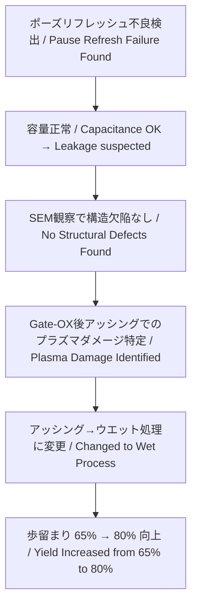

# 📘 64M DRAM 第3世代（0.25μm）立ち上げ記録 （1998）  
**📘 64M DRAM 3rd Generation (0.25 μm) Startup Record (1998)**  

---

> 🗓️ **背景リンク / Background Link**  
> 本プロジェクトの基盤となった **8インチライン立ち上げと第2世代（0.35μm）DRAM立ち上げの経緯** は以下を参照。  
> **[1997年：セイコーエプソン酒田事業所8インチライン稼働](../in1997/Epson_Sakata_8inch_Line.md)**

---

⚠️ **免責事項 / Disclaimer**  

| 日本語 | English |
|--------|---------|
| 本記録は1998年当時の技術移管・立ち上げ業務の体験に基づく教育資料です。エプソン社におけるDRAMは主力製品ではなく、本記録には現在の事業機密や設計情報は含まれません。 | This document is based on the author's actual experience during a technology transfer and ramp-up in 1998. At Epson, DRAM was not a core product. This archive contains no proprietary or confidential design data. |

---

## 🧭 プロジェクト概要 | Project Overview

| 項目 / Item             | 内容 / Details                                                |
|------------------------|---------------------------------------------------------------|
| 製品名 / Product       | 64M DRAM（第3世代 / 0.25μm）                                  |
| 年度 / Year            | 1998年 / 1998                                                 |
| 担当者 / Role          | 三溝真一（Shinichi Samizo, 技術担当 / Technical Engineer）         |
| 移管元 / Transfer Fab   | 三菱電機 熊本工場 KD棟（Mother Fab） / Mitsubishi Electric Kumamoto Fab (KD Building) |
| 立ち上げ先 / Ramp-up Site | セイコーエプソン 酒田工場 T棟 / Seiko Epson Sakata Fab (T Building) |

---

## 🏗️ プロセス立ち上げの役割と戦略 | Role & Ramp-up Strategy

**日本語**  
0.25μm世代DRAMの量産立ち上げに技術担当として参画。特にKD工場から提供された**フロッピー2枚分のプロセス条件**をT工場に展開し、工程流動を可能にした。  
その後、不良解析・歩留まり改善・信頼性評価にも関与した。

**English**  
Participated in the 0.25 μm 64M DRAM mass production ramp-up as a technical engineer. Specifically deployed **two floppy disks worth of process parameters** from the KD Fab to the T Fab, enabling smooth wafer process flow.  
Subsequently engaged in **failure analysis, yield improvement, and reliability evaluation** during the production transition.

---

## 📊 フェーズ別の解析と改善 | Phase-by-Phase Analysis & Improvements

| フェーズ / Phase | 日本語 | English |
|-----------------|--------|---------|
| 🔹 本番ロット投入 | 信頼性評価用に **3ロット投入（Burn-in付き）** | Introduced **3 lots for reliability evaluation (with burn-in)** |
| 📉 初回歩留まり | 約 **65%**、主不良は **ポーズリフレッシュ不良** | Initial yield around **65%**, main defect was **Pause Refresh failure** |
| 🔍 不良解析 | **Pause Refresh条件でのビットエラー原因を調査** | Investigated the cause of bit errors under **Pause Refresh test conditions** |
| ⚡ 容量確認 | **セル容量は正常 → SNコンタクト〜N+/P-Well間リーク疑い** | Cell capacitance was normal → suspected leakage between SN contact and N+/P-Well |
| 🧐 SEM観察 | SNコンタクト構造に大きな欠陥なし（THB領域含む） | SEM observation revealed no major defects in SN contact structure (including THB area) |
| 📌 原因特定 | **Gate-OX後のアッシングによるプラズマダメージ** | Identified **plasma damage during post-Gate-OX ashing** |
| 🛠️ 改善処置 | アッシング → ウエット処理に変更しダメージを抑制 | Changed ashing to wet cleaning to suppress damage |
| ✅ 結果 | 歩留まり **約80%に向上**、信頼性試験クリアし量産へ | Yield improved to **about 80%**, passed reliability tests and moved to mass production |

---

### 🔄 改善プロセス因果関係 | Improvement Process Flow

---

## 🧪 ポーズリフレッシュ不良とは | What is Pause Refresh Failure?

| 日本語 | English |
|--------|---------|
| DRAMの電荷保持性を評価するため、リフレッシュを一時停止後にセル読み出しを行う試験で現れる不良。 | A DRAM failure mode detected by halting refresh operations temporarily and then reading the cell to assess charge retention. |

➡ 詳細は [Bin分類資料（Bin5）](./dram_wafer_test_binclass_0.25um.md) を参照 / See [Bin Classification Data (Bin5)](./dram_wafer_test_binclass_0.25um.md).

---

## 📎 関連資料 | Related Materials

- **[DRAMメーカー比較 (1998)](DRAM_Maker_Comparison_1998.md)** – 各社DRAM技術動向 / Technology trends among DRAM makers
- **[DRAMセル構造比較](DRAM_Cell_Structure_Comparison.md)** – セルアーキテクチャの差異 / Differences in DRAM cell architectures
- **[DRAM技術年表](DRAM_Cell_Technology_Chronology.md)** – 世代別プロセス変遷 / Process evolution by generation
- **[0.25μm Bin分類](dram_wafer_test_binclass_0.25um.md)** – 不良モード別分類 / Failure mode classification

---

## 🔗 関連アーカイブ：VSRAM（2001年） | Related Archive: VSRAM (2001)

📄 [**VSRAM_2001.md**](../in2001/VSRAM_2001.md)  
> 🚀 **29歳時に推進したモバイル向け擬似SRAM**  
> **Developed at age 29, this pseudo-SRAM for mobile applications** was adopted in the world’s first camera-equipped mobile phone (by SHARP), leveraging DRAM process technology.

---

## 📅 技術アーカイブ年表 | Technical Archive Timeline

- [1997年：セイコーエプソン酒田事業所8インチライン稼働](../in1997/Epson_Sakata_8inch_Line.md) – 本プロジェクトの製造基盤 / Manufacturing foundation for this project
- **1998年：0.25μm DRAM立ち上げ（本ページ） / This page**
- [2001年：VSRAM課題対策](../in2001/VSRAM_2001.md) – VSRAM development issues and solutions

---

📘 **本記録は教育・アーカイブ目的で再構成されたものであり、企業機密とは一切関係ありません。**  
📘 **This record has been reconstructed for educational and archival purposes, and contains no corporate confidential information.**
